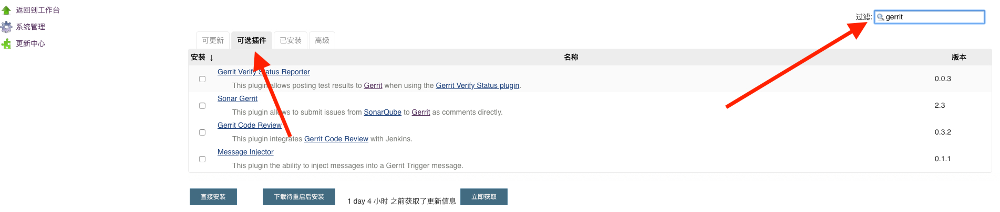
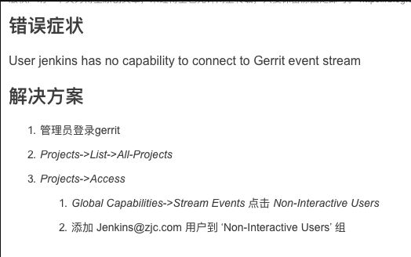

- [Gerrit + Jenkins](#%08gerrit--jenkins)
  - [Jenkins配置](#jenkins%e9%85%8d%e7%bd%ae)
  - [Gerrit配置](#gerrit%e9%85%8d%e7%bd%ae)
  
# Gerrit + Jenkins

+ 链接

  - https://www.cnblogs.com/kevingrace/p/5651447.html
  - https://blog.csdn.net/vector090/article/details/19482491
  - https://www.cnblogs.com/276815076/p/7299860.html

## Jenkins配置

  登录Jenkins页面

+ 工作台 -> 系统管理 -> 插件管理 -> 可选插件 

  安装以下两个插件

    -  Gerrit trigger 
    -  Git plugin

  

+ 工作台 -> 系统管理 -> Gerrit Trigger

  

  Add New Server 

  

  

  详细配置如下

  

  遇到了以下错误，解决方法如图：

  

  

  Gerrit Reporting Values 配置：用于Jenkins向Gerrit传信息

  在Jenkins项目配置里

  

  

   Gerrit Trigger 详细配置

   

  

  shell脚本中可以使用一些自带的变量

  

  在gerrit的project配置里，给用户加上verified权限

  

## Gerrit配置

  + 需要gerrit安装 verified label 功能。

    查看是否有这个功能，可以登录gerrrit。

    在 Projects -> list -> all-projects -> access -> edit -> add permission 看看里面是否有`verified`选项

    

    如果没有的话，需要给Gerrit加上这个功能。方法如下

    

    给`All-Projectes`工程加上功能之后，所有子工程也都有这个功能了(需要restart服务)。加上之后再看：

    

+ 给工程加上verified label 功能。方法如下

  Projects -> Access -> Edit(新版UI没有edit功能，旧版UI才有) -> Reference: refs/heads/* 项

  

  添加`Label Verified`功能，增加一个Group，名字是`Non-Interactive Users`。保存更改

  

  注意： 需要把Jenkin用户加到`Non-Interactive Users`组内。

  

+ 一次完整code review示例

  + clone 工程

          git clone ssh://wenbo.sun@10.99.57.65:29418/jenkinsTest.git

  + 安装git review

          brew install git-review

    使用
    
    - 本地修改后，将修改提交到work space
    - 将修改提到gerrit
    
          git review

  + 推送本地更改到gerrit

          git push origin <branch name>

  + 在Gerrit平台上review code

---

+ 测试工程Jenkins下载地址  https://10.99.33.133/ota/jenkinsTest/develop/debug/jenkinsTest_V1++_2018122917-30-48.ipa
