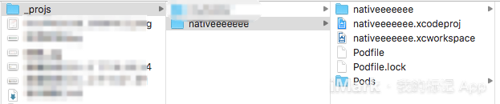
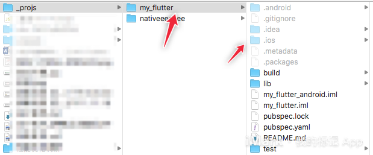
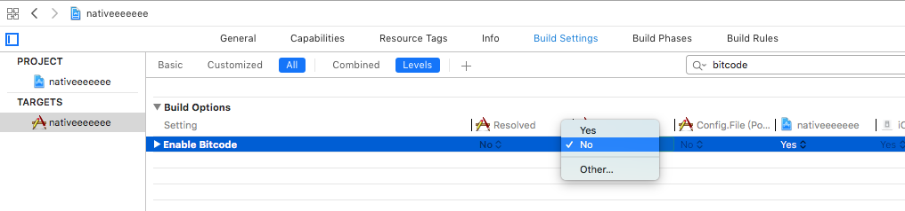
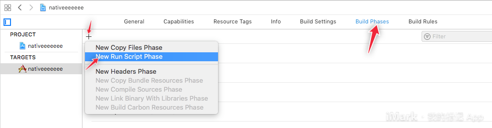
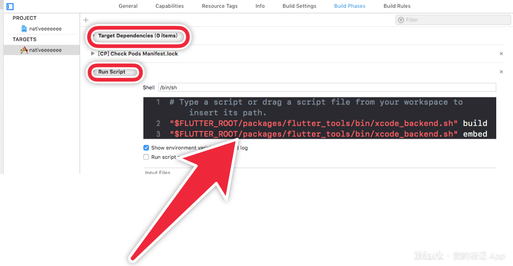
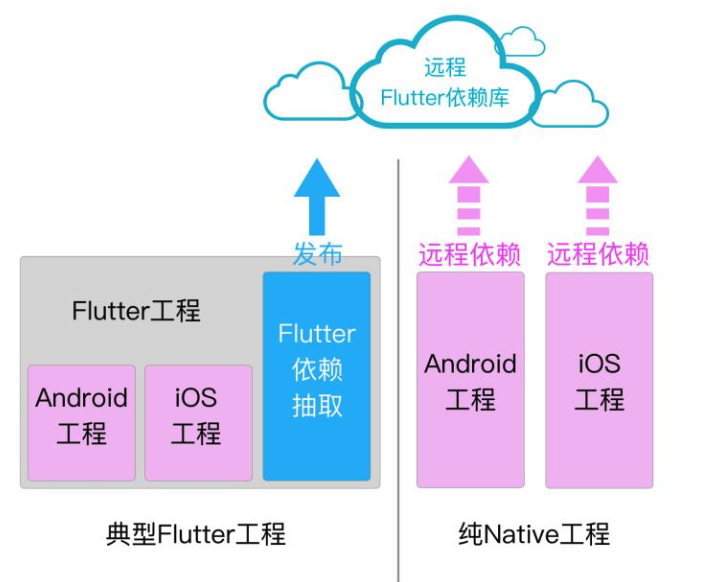
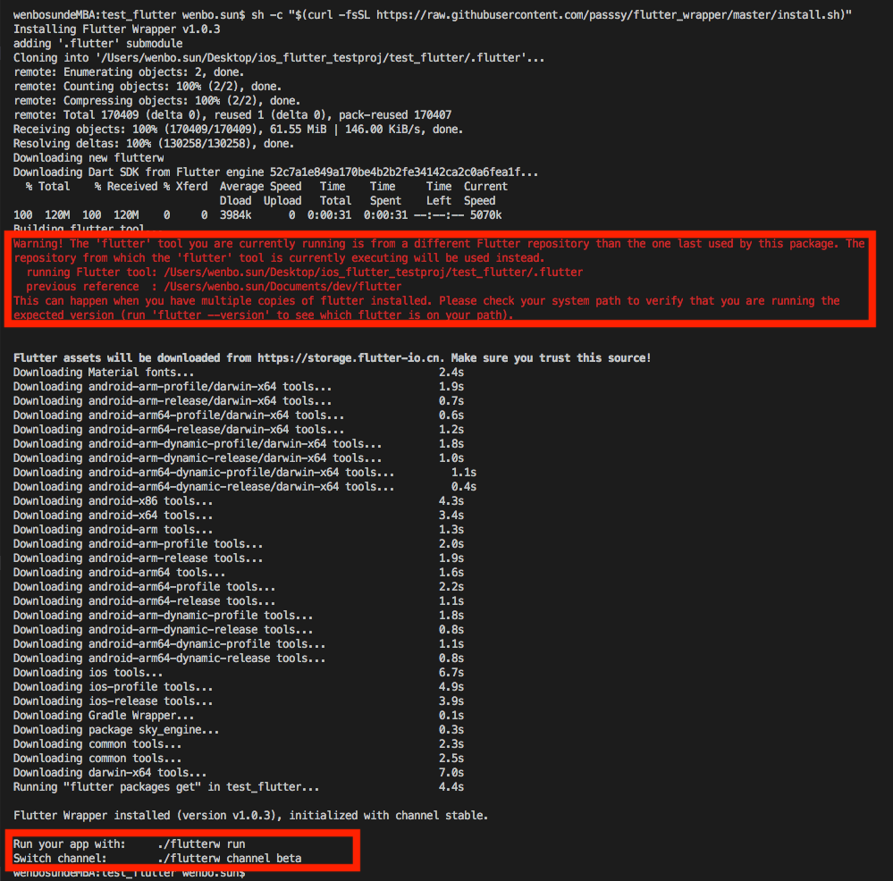

# Native集成Flutter
- [Native集成Flutter](#native%e9%9b%86%e6%88%90flutter)
  - [官方文档上的方法](#%e5%ae%98%e6%96%b9%e6%96%87%e6%a1%a3%e4%b8%8a%e7%9a%84%e6%96%b9%e6%b3%95)
    - [step 1：创建flutter模块](#step-1%e5%88%9b%e5%bb%baflutter%e6%a8%a1%e5%9d%97)
    - [step2：原生工程依赖flutter模块](#step2%e5%8e%9f%e7%94%9f%e5%b7%a5%e7%a8%8b%e4%be%9d%e8%b5%96flutter%e6%a8%a1%e5%9d%97)
    - [step3：添加一个Build Phase](#step3%e6%b7%bb%e5%8a%a0%e4%b8%80%e4%b8%aabuild-phase)
    - [step 4：Xcode中编写代码](#step-4xcode%e4%b8%ad%e7%bc%96%e5%86%99%e4%bb%a3%e7%a0%81)
  - [Flutter产物集成的方法](#flutter%e4%ba%a7%e7%89%a9%e9%9b%86%e6%88%90%e7%9a%84%e6%96%b9%e6%b3%95)
    - [实现步骤](#%e5%ae%9e%e7%8e%b0%e6%ad%a5%e9%aa%a4)
  - [遇到问题](#%e9%81%87%e5%88%b0%e9%97%ae%e9%a2%98)
  
## 官方文档上的方法

> Add Flutter to existing apps ： https://github.com/flutter/flutter/wiki/Add-Flutter-to-existing-apps

### step 1：创建flutter模块

现在有个iOS原生工程，放在目录`_projs`下面



打开终端，执行命令，会自动生成一个目录`my_flutter`

```shell
$ flutter create -t module my_flutter
```



### step2：原生工程依赖flutter模块

在`Podfile`文件里添加下面的代码，然后`pod install`

```ruby
# 集成Flutter
flutter_application_path = '../my_flutter/'
eval(File.read(File.join(flutter_application_path, '.ios', 'Flutter', 'podhelper.rb')), binding)
```

如果在flutter工程里的`../my_flutter/pubspec.yaml`修改了依赖的话，就需要执行`flutter packages get`安装依赖，然后原生工程也需要重新`pod install`

> pubspec.yaml就相当于我们的Podflie


另外，Flutter不支持bitcode，需要在Xcode中关闭它



### step3：添加一个Build Phase



将以下脚本复制进去

```shell
"$FLUTTER_ROOT/packages/flutter_tools/bin/xcode_backend.sh" build
"$FLUTTER_ROOT/packages/flutter_tools/bin/xcode_backend.sh" embed
```

然后拖动`Run Script`一栏到`Target Dependencies`下面



编译程序 `Command + B`

### step 4：Xcode中编写代码

case 1：直接修改工程AppDelegate的继承关系

```objective-c
// AppDelegate.h   ====================================

#import <UIKit/UIKit.h>
#import <Flutter/Flutter.h>

@interface AppDelegate : FlutterAppDelegate
@property (nonatomic,strong) FlutterEngine *flutterEngine;
@end

// AppDelegate.m   ====================================
  
#import <FlutterPluginRegistrant/GeneratedPluginRegistrant.h> // Only if you have Flutter Plugins

#include "AppDelegate.h"

@implementation AppDelegate

// This override can be omitted if you do not have any Flutter Plugins.
- (BOOL)application:(UIApplication *)application
    didFinishLaunchingWithOptions:(NSDictionary *)launchOptions {
  self.flutterEngine = [[FlutterEngine alloc] initWithName:@"io.flutter" project:nil];
  [self.flutterEngine runWithEntrypoint:nil];
  [GeneratedPluginRegistrant registerWithRegistry:self.flutterEngine];
  return [super application:application didFinishLaunchingWithOptions:launchOptions];
}

@end
```

case 2：遵循协议 FlutterAppLifeCycleProvider

```objective-c
// AppDelegate.h   ====================================

#import <Flutter/Flutter.h>
#import <UIKit/UIKit.h>
#import <FlutterPluginRegistrant/GeneratedPluginRegistrant.h> // Only if you have Flutter Plugins

@interface AppDelegate : UIResponder <UIApplicationDelegate, FlutterAppLifeCycleProvider>
@property (strong, nonatomic) UIWindow *window;
@property (nonatomic,strong) FlutterEngine *flutterEngine;
@end
  
// AppDelegate.m   ====================================

@implementation AppDelegate
{
    FlutterPluginAppLifeCycleDelegate *_lifeCycleDelegate;
}

- (instancetype)init {
    if (self = [super init]) {
        _lifeCycleDelegate = [[FlutterPluginAppLifeCycleDelegate alloc] init];
    }
    return self;
}

- (BOOL)application:(UIApplication*)application
didFinishLaunchingWithOptions:(NSDictionary*)launchOptions {
    self.flutterEngine = [[FlutterEngine alloc] initWithName:@"io.flutter" project:nil];
    [self.flutterEngine runWithEntrypoint:nil];
    [GeneratedPluginRegistrant registerWithRegistry:self.flutterEngine]; // Only if you are using Flutter plugins.
    return [_lifeCycleDelegate application:application didFinishLaunchingWithOptions:launchOptions];
}

// Returns the key window's rootViewController, if it's a FlutterViewController.
// Otherwise, returns nil.
- (FlutterViewController*)rootFlutterViewController {
    UIViewController* viewController = [UIApplication sharedApplication].keyWindow.rootViewController;
    if ([viewController isKindOfClass:[FlutterViewController class]]) {
        return (FlutterViewController*)viewController;
    }
    return nil;
}

- (void)touchesBegan:(NSSet*)touches withEvent:(UIEvent*)event {
    [super touchesBegan:touches withEvent:event];
    
    // Pass status bar taps to key window Flutter rootViewController.
    if (self.rootFlutterViewController != nil) {
        [self.rootFlutterViewController handleStatusBarTouches:event];
    }
}

- (void)applicationDidEnterBackground:(UIApplication*)application {
    [_lifeCycleDelegate applicationDidEnterBackground:application];
}

- (void)applicationWillEnterForeground:(UIApplication*)application {
    [_lifeCycleDelegate applicationWillEnterForeground:application];
}

- (void)applicationWillResignActive:(UIApplication*)application {
    [_lifeCycleDelegate applicationWillResignActive:application];
}

- (void)applicationDidBecomeActive:(UIApplication*)application {
    [_lifeCycleDelegate applicationDidBecomeActive:application];
}

- (void)applicationWillTerminate:(UIApplication*)application {
    [_lifeCycleDelegate applicationWillTerminate:application];
}

- (void)application:(UIApplication*)application
didRegisterUserNotificationSettings:(UIUserNotificationSettings*)notificationSettings {
    [_lifeCycleDelegate application:application
didRegisterUserNotificationSettings:notificationSettings];
}

- (void)application:(UIApplication*)application
didRegisterForRemoteNotificationsWithDeviceToken:(NSData*)deviceToken {
    [_lifeCycleDelegate application:application
didRegisterForRemoteNotificationsWithDeviceToken:deviceToken];
}

- (void)application:(UIApplication*)application
didReceiveRemoteNotification:(NSDictionary*)userInfo
fetchCompletionHandler:(void (^)(UIBackgroundFetchResult result))completionHandler {
    [_lifeCycleDelegate application:application
       didReceiveRemoteNotification:userInfo
             fetchCompletionHandler:completionHandler];
}

- (BOOL)application:(UIApplication*)application
            openURL:(NSURL*)url
            options:(NSDictionary<UIApplicationOpenURLOptionsKey, id>*)options {
    return [_lifeCycleDelegate application:application openURL:url options:options];
}

- (BOOL)application:(UIApplication*)application handleOpenURL:(NSURL*)url {
    return [_lifeCycleDelegate application:application handleOpenURL:url];
}

- (BOOL)application:(UIApplication*)application
            openURL:(NSURL*)url
  sourceApplication:(NSString*)sourceApplication
         annotation:(id)annotation {
    return [_lifeCycleDelegate application:application
                                   openURL:url
                         sourceApplication:sourceApplication
                                annotation:annotation];
}

- (void)application:(UIApplication*)application
performActionForShortcutItem:(UIApplicationShortcutItem*)shortcutItem
  completionHandler:(void (^)(BOOL succeeded))completionHandler NS_AVAILABLE_IOS(9_0) {
    [_lifeCycleDelegate application:application
       performActionForShortcutItem:shortcutItem
                  completionHandler:completionHandler];
}

- (void)application:(UIApplication*)application
handleEventsForBackgroundURLSession:(nonnull NSString*)identifier
  completionHandler:(nonnull void (^)(void))completionHandler {
    [_lifeCycleDelegate application:application
handleEventsForBackgroundURLSession:identifier
                  completionHandler:completionHandler];
}

- (void)application:(UIApplication*)application
performFetchWithCompletionHandler:(void (^)(UIBackgroundFetchResult result))completionHandler {
    [_lifeCycleDelegate application:application performFetchWithCompletionHandler:completionHandler];
}

- (void)addApplicationLifeCycleDelegate:(NSObject<FlutterPlugin>*)delegate {
    [_lifeCycleDelegate addDelegate:delegate];
}
@end
```

测试代码：跳转Flutter界面

```objective-c
#import <Flutter/Flutter.h>
#import "AppDelegate.h"
#import "ViewController.h"

@implementation ViewController
- (void)viewDidLoad {
    [super viewDidLoad];
    UIButton *button = [UIButton buttonWithType:UIButtonTypeCustom];
    [button addTarget:self
               action:@selector(handleButtonAction)
     forControlEvents:UIControlEventTouchUpInside];
    [button setTitle:@"Press me" forState:UIControlStateNormal];
    [button setBackgroundColor:[UIColor blueColor]];
    button.frame = CGRectMake(80.0, 210.0, 160.0, 40.0);
    [self.view addSubview:button];
}

- (void)handleButtonAction {
    FlutterEngine *flutterEngine = [(AppDelegate *)[[UIApplication sharedApplication] delegate] flutterEngine];
    FlutterViewController *flutterViewController = [[FlutterViewController alloc] initWithEngine:flutterEngine nibName:nil bundle:nil];
    [self presentViewController:flutterViewController animated:false completion:nil];
}
@end
```

## Flutter产物集成的方法

> 闲鱼flutter混合工程持续集成的最佳实践：https://zhuanlan.zhihu.com/p/40528502
>
> 好处是，将团队内原生开发和Flutter开发的同学分开来，负责原生开发的同学无需安装flutter开发环境，只用以cocoapods的方法将依赖库集成进来就行。

实现思路：将flutter的依赖抽取为一个flutter依赖库发布到远程。



### 实现步骤

- 参考这篇文章[从零搭建 iOS Native Flutter 混合工程](https://juejin.im/post/5c3ae5ef518825242165c5ca#heading-4)

- 安装`Flutter Wrapper`

  [安装方法](https://github.com/passsy/flutter_wrapper#add-the-flutter-wrapper-to-your-project)：在flutter工程的根目录执行以下命令。

  ```
  sh -c "$(curl -fsSL https://raw.githubusercontent.com/passsy/flutter_wrapper/master/install.sh)"
  ```

  - 此后，在当前flutter工程需要使用`flutter`命令的时候，都是用`./flutterw`来代替。

  这一步耗时会比较长，因为他会下载一个新的flutter SDK下来，放到当前flutter工程目录下。这样就不会出现协作开发时每人电脑里的SDK版本不一致的问题了。

  

## 遇到问题

1. 远端验证podspec文件不通过

   执行本地验证`pob lib lint --allow-warning`通过，但是远端验证`pod spec lint --allow-warnings`不通过。原因是创建的flutter工程里的`.gitignore`文件将`App.framework`和`Flutter.framework`忽略了，修改flutter工程的`.gitignore`文件就好了。

2. 安装flutter plugin的时候，pod库的加载（iOS）

    在原生工程Podfile文件中（路径的地方需要根据自己的工程目录来）

    ```ruby
   def parse_KV_file(file, separator='=')
       file_abs_path = File.expand_path(file)
       if !File.exists? file_abs_path
         return [];
       end
       pods_ary = []
       skip_line_start_symbols = ["#", "/"]
       File.foreach(file_abs_path) { |line|
           next if skip_line_start_symbols.any? { |symbol| line =~ /^\s*#{symbol}/ }
           plugin = line.split(pattern=separator)
           if plugin.length == 2
             podname = plugin[0].strip()
             path = plugin[1].strip()
             podpath = File.expand_path("#{path}", file_abs_path)
             pods_ary.push({:name => podname, :path => podpath});
           else
             puts "Invalid plugin specification: #{line}"
           end
       }
       return pods_ary
     end

   target 'BWCMTApp' do 
       # flutter 产物 Pods
       pod 'BWCMT_FlutterModule', :path => './bwcmt_fluttermodule'

       # Flutter Pods
       system('rm -rf ./bwcmt_fluttermodule/bwcmt_flutter_src/ios/.symlinks')
       system('mkdir -p ./bwcmt_fluttermodule/bwcmt_flutter_src/ios/.symlinks/plugins')

       generated_xcode_build_settings = parse_KV_file('./bwcmt_fluttermodule/bwcmt_flutter_src/ios/Flutter/Generated.xcconfig') # parse_KV_file('./Flutter/Generated.xcconfig')
       if generated_xcode_build_settings.empty?
           puts "Generated.xcconfig must exist. If you're running pod install manually, make sure flutter packages get is executed first."
       end

       generated_xcode_build_settings.map { |p|
           if p[:name] == 'FLUTTER_FRAMEWORK_DIR'
           symlink = File.join('bwcmt_fluttermodule','bwcmt_flutter_src','ios', '.symlinks', 'flutter')
           File.symlink(File.dirname(p[:path]), symlink)
           pod 'Flutter', :path => File.join(symlink, File.basename(p[:path]))
           end
       }

       # Flutter Plugin Pods
       plugin_pods = parse_KV_file('./bwcmt_fluttermodule/bwcmt_flutter_src/.flutter-plugins')
       plugin_pods.map { |p|
           symlink = File.join('bwcmt_fluttermodule','bwcmt_flutter_src','ios', '.symlinks', 'plugins', p[:name])
   #        puts symlink
   #        puts path
   #        puts p[:path]
           File.symlink(p[:path], symlink)
           localPodspec = File.join(symlink, 'ios')
           pod p[:name], :path => localPodspec
       }

   end 

    ```