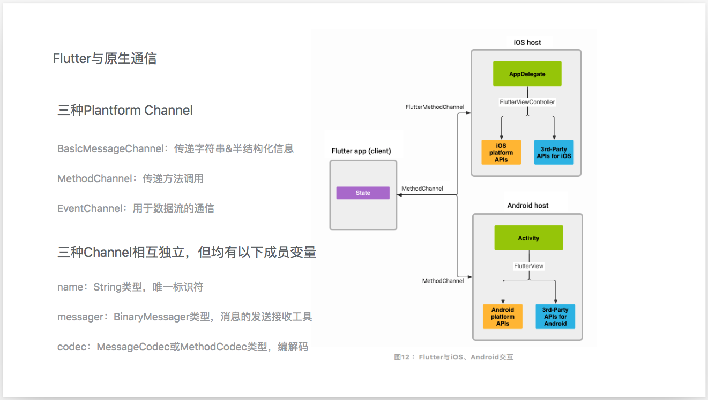
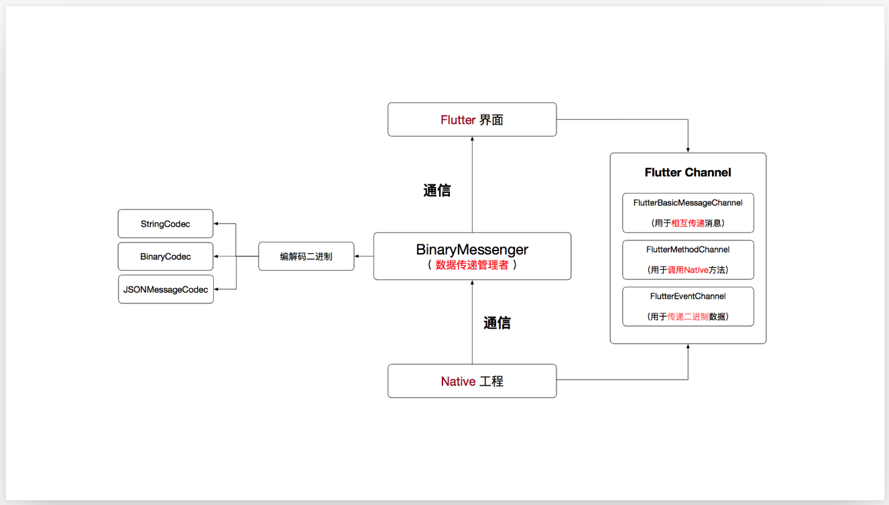
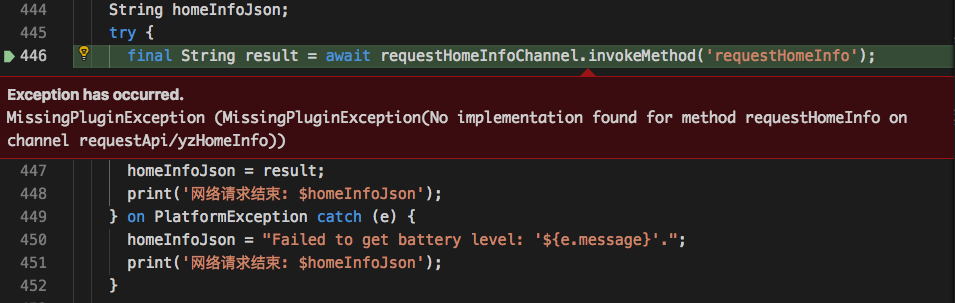
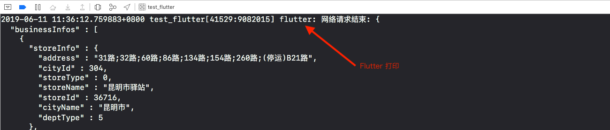

# Flutter和Native iOS交互






## Flutter调用iOS的方法

1. Native iOS里注册方法
   
   ```objc
    // 1. 注册channel
       NSString *channelName = @"bwcmt.flutter/yz_bench";  // 这里要跟flutter里的名字一致！！！
       FlutterMethodChannel *messageChannel = [FlutterMethodChannel methodChannelWithName:channelName binaryMessenger:flutterViewController];
       __weak typeof(self) weakSelf = self;
       [messageChannel setMethodCallHandler:^(FlutterMethodCall * _Nonnull call, FlutterResult  _Nonnull result) {
           /*
            * FlutterMethodCall * _Nonnull call
            * @param call.method：flutter传过来的方法名
            * @param call.arguments：flutter传过来的参数
            *
            * FlutterResult  _Nonnull result
            * native给flutter的回掉，该回调只能使用一次
            */
           // method和WKWebView里面JS交互很像
           if ([call.method isEqualToString:@"requestHomeInfo"]) {
               result([weakSelf requestHomeInfo]);
           }
       }];
    
    // 2. 定义原生方法
    - (NSString *)requestHomeInfo {
        NSData *JSONData = [NSData dataWithContentsOfFile:[[NSBundle mainBundle] pathForResource:@"yz_bench" ofType:@"json"]];
        NSString *data = [[NSString alloc] initWithData:JSONData encoding:(NSUTF8StringEncoding)];
        return data;
    }
   ```
2. Flutter里调用

     ```dart
       class _YzBenchHomeState extends State<YzBenchHome> {

         // channel命名规则：bwcmt.flutter/页面
         static const yzBenchChannel = const MethodChannel('bwcmt.flutter/yz_bench');

         Future<YzBenchModel> requestAPI() async {
          String homeInfoJson;
          try {
            // 调用原生的requestHomeInfo方法
            final String result = await yzBenchChannel.invokeMethod('requestHomeInfo');
            homeInfoJson = result;
            print('网络请求结束: $homeInfoJson');
          } on PlatformException catch (e) {
            homeInfoJson = "Failed to get battery level: '${e.message}'.";
            print('网络请求结束: $homeInfoJson');
          }
        } 

       }
     ```
     
     如果Native iOS里没有定义requestHomeInfo方法，就会报错如下`MissingPluginException (MissingPluginException(No implementation found for method requestHomeInfo on channel requestApi/yzHomeInfo))`

     

3. 运行iOS工程，正常结果如下

    

## iOS调用Flutter的方法

1. OC文件
   
   ```objc
    /// ntf NativeToFlutter
    @property (nonatomic, strong) FlutterMethodChannel *methodChannel_ntf;
      
    - (FlutterMethodChannel *)methodChannel_ntf {
      if (!_methodChannel_ntf) {
          _methodChannel_ntf = [FlutterMethodChannel methodChannelWithName:@"bwcmt.native/yz_bench" binaryMessenger:self.flutterVC];
      }
      return _methodChannel_ntf;
    }

     // 调用flutter方法
     [self.methodChannel_ntf invokeMethod:@"requestDataSuccessful" arguments:json];
   ```

2. Flutter文件

    ```dart

      void initState() {
        super.initState();

        MethodChannel methodChannel = MethodChannel(yzBenchChannelName_ntf);
        methodChannel.setMethodCallHandler(callbackHandler);
      }

      Future<dynamic>callbackHandler(MethodCall call) { // 回调方法

        if (call.method == 'requestDataSuccessful') {
          // 网络请求成功
          print('原生请求网络成功');

          Map data = json.decode(call.arguments as String);
          YzBenchModel model = YzBenchModel.fromJson(data);

          setState(() {
            networkErrorMsg = null;
            benchModel = model;
          });
        }
        return call.arguments;
      }

    ```