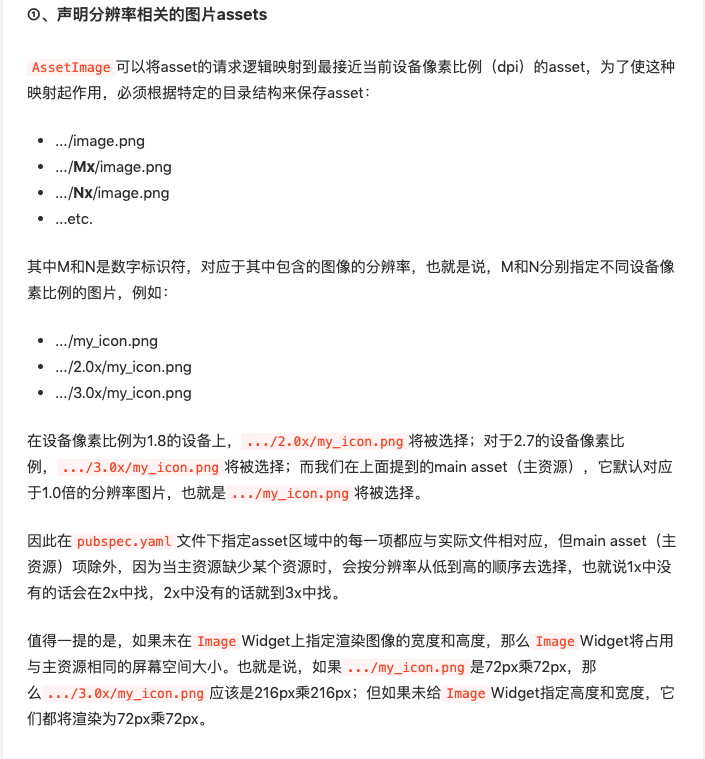
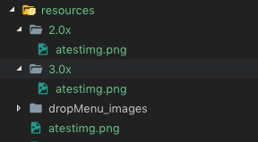
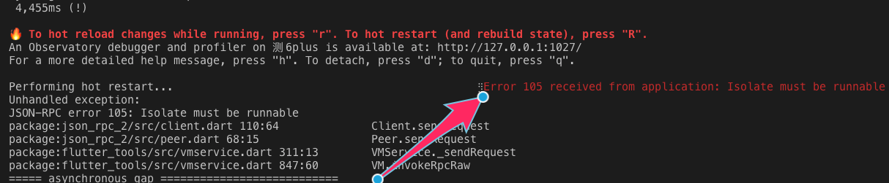
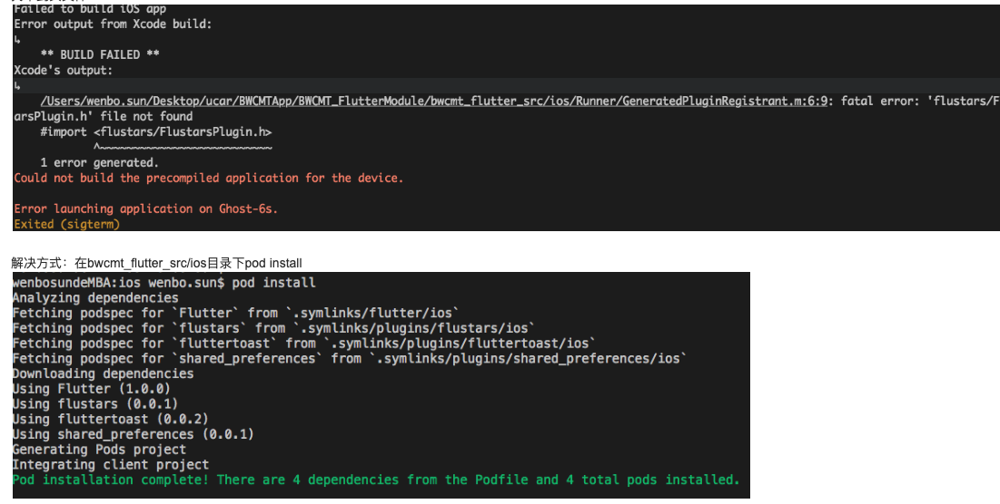

# 基础知识
  
## 自动选择二倍图三倍图资源

  

  eg: 

  1. 在`/resources`目录下放入三个不同倍率的图片

     

  2. 在`pubspec.ymal`里引入资源

     

  3. 使用

     ```dart
       child: Center(
           child: Image(image: AssetImage('resources/atestimg.png'),)
       ),
     ```

  4. 效果 (在6Plus上)

     

## StatelessWidget 和 StatefulWidget 区别

StatelessWidget：无状态 Widget

StatefulWidget：有状态 Widget

## 使用 setState 方法更新状态

```dart
class BWHome extends StatefulWidget {
@override
  State<StatefulWidget> createState() => BWHomeState();
}

class BWHomeState extends State<BWHome> {
  void itemAcion(int index) {
    setState(() {
      _currentIndex = index;
    });
  }
}
```   

## extends 、Minxins、implements、abstract

`extends`：继承

minxins：混合。使用关键字 `with`

```dart
class A {
  void testA() {
    print('test a');
  }
}

class B with A {

}

// B 的实例可以使用 A 中的方法
B obj = B();
obj.testA();	// test a
```

`implements` ：接口实现。iOS中的代理？？？

```dart
class _TextFieldState extends State<TextField> implements TextSelectionGestureDetectorBuilderDelegate {
}
``` 
# 踩坑记录

## 热重载【r】错误：`Error 105 received from application: Isolate must be runnable`

  + https://github.com/flutter/flutter/issues/26568
  + https://github.com/flutter/flutter/issues/26953

  表现：app里的flutter界面白屏，使用【r】hot-reload报错

  

## 真机运行，flutter run报错 : Error connecting to the service protocol: HttpException

  

## Runner找不到头文件

  

## [VERBOSE-2:ui_dart_state.cc(148)] Unhandled Exception: NoSuchMethodError: Class 'Window' has no instance setter 'onReportTimings='.

  + [参考链接](https://github.com/brianegan/flutter_redux/issues/142)

  解决方法：把flutter sdk版本换成stabel版本

 

 

 

 