- [搭建Flutter开发环境](#%e6%90%ad%e5%bb%baflutter%e5%bc%80%e5%8f%91%e7%8e%af%e5%a2%83)
  - [一、下载Flutter SDK](#%e4%b8%80%e4%b8%8b%e8%bd%bdflutter-sdk)
  - [二、配置 VSCode or Android Studio](#%e4%ba%8c%e9%85%8d%e7%bd%ae-vscode-or-android-studio)
  - [三、Flutter工程分类](#%e4%b8%89flutter%e5%b7%a5%e7%a8%8b%e5%88%86%e7%b1%bb)
- [混编](#%e6%b7%b7%e7%bc%96)
  - [现有原生工程引入Flutter](#%e7%8e%b0%e6%9c%89%e5%8e%9f%e7%94%9f%e5%b7%a5%e7%a8%8b%e5%bc%95%e5%85%a5flutter)
    - [Flutter 1.9版本的 官方集成方法](#flutter-19%e7%89%88%e6%9c%ac%e7%9a%84-%e5%ae%98%e6%96%b9%e9%9b%86%e6%88%90%e6%96%b9%e6%b3%95)
    - [Flutter产物集成方法](#flutter%e4%ba%a7%e7%89%a9%e9%9b%86%e6%88%90%e6%96%b9%e6%b3%95)
    - [使用 flutter-boot](#%e4%bd%bf%e7%94%a8-flutter-boot)
  - [启动Flutter](#%e5%90%af%e5%8a%a8flutter)
  - [原生和Flutter页面间的跳转](#%e5%8e%9f%e7%94%9f%e5%92%8cflutter%e9%a1%b5%e9%9d%a2%e9%97%b4%e7%9a%84%e8%b7%b3%e8%bd%ac)
- [创建私有Flutter Plugin](#%e5%88%9b%e5%bb%ba%e7%a7%81%e6%9c%89flutter-plugin)
  - [一、创建plugin：使用原生的网络请求](#%e4%b8%80%e5%88%9b%e5%bb%baplugin%e4%bd%bf%e7%94%a8%e5%8e%9f%e7%94%9f%e7%9a%84%e7%bd%91%e7%bb%9c%e8%af%b7%e6%b1%82)
    - [step1：创建plugin](#step1%e5%88%9b%e5%bb%baplugin)
    - [step2：编写代码](#step2%e7%bc%96%e5%86%99%e4%bb%a3%e7%a0%81)
  - [二、发布plugin](#%e4%ba%8c%e5%8f%91%e5%b8%83plugin)
    - [方式一：上传代码flutter_ucar_network到gitlab上](#%e6%96%b9%e5%bc%8f%e4%b8%80%e4%b8%8a%e4%bc%a0%e4%bb%a3%e7%a0%81flutterucarnetwork%e5%88%b0gitlab%e4%b8%8a)
    - [方式二：上传plugin到私有pub server](#%e6%96%b9%e5%bc%8f%e4%ba%8c%e4%b8%8a%e4%bc%a0plugin%e5%88%b0%e7%a7%81%e6%9c%89pub-server)
  - [!](#)
- [Tips](#tips)
  - [分支](#%e5%88%86%e6%94%af)
  - [Flutter版本](#flutter%e7%89%88%e6%9c%ac)
  - [flutter attach](#flutter-attach)
  - [flutter wrapper](#flutter-wrapper)
- [遇到的问题及解决](#%e9%81%87%e5%88%b0%e7%9a%84%e9%97%ae%e9%a2%98%e5%8f%8a%e8%a7%a3%e5%86%b3)
  - [模拟器编译报错 Command PhaseScriptExecution failed with a nonzero exit code](#%e6%a8%a1%e6%8b%9f%e5%99%a8%e7%bc%96%e8%af%91%e6%8a%a5%e9%94%99-command-phasescriptexecution-failed-with-a-nonzero-exit-code)
  - [Flutter.framework : permission denied](#flutterframework--permission-denied)
  - [Could not find the built application bundle at build/ios/iphonesimulator/Runner.app.](#could-not-find-the-built-application-bundle-at-buildiosiphonesimulatorrunnerapp)
- [参考资料](#%e5%8f%82%e8%80%83%e8%b5%84%e6%96%99)
# 搭建Flutter开发环境
## 一、下载Flutter SDK
1. 下载SDK  [https://flutter.dev/docs/get-started/install/macos](https://flutter.dev/docs/get-started/install/macos)
   ```shell
   cd ~/Documents/dev # 存放SDK的路径
   ```
2. 设置PATH 
   ```shell
   export PATH="$PATH:`pwd`/flutter/bin"
   # 到此为止，只对当前终端有效，如果退出终端重新打开就找不到PATH了
   ```
3. 更新环境变量
   ```shell
   # 1. 切换到user根目录
   cd ~ 
   # 2. 在 .bash_profile文件加入以下四行(如果没有就创建 touch .bash_profile)，/Users/wb/Documents/dev/flutter根据你实际的SDK存放位置修改
   export PUB_HOSTED_URL=https://pub.flutter-io.cn   
   export FLUTTER_STORAGE_BASE_URL=https://storage.flutter-io.cn 
   export PATH=/Users/wb/Documents/dev/flutter/bin:$PATH
   export PATH=${PATH}:/Users/wb/Documents/dev/flutter/bin/cache/dart-sdk/bin
   # 3. 保存好刷新以下终端
   source ~/.bash_profile
   # 4. 验证
   echo $PATH
   ```
## 二、配置 VSCode or Android Studio
下载flutter相关的插件

## 三、Flutter工程分类
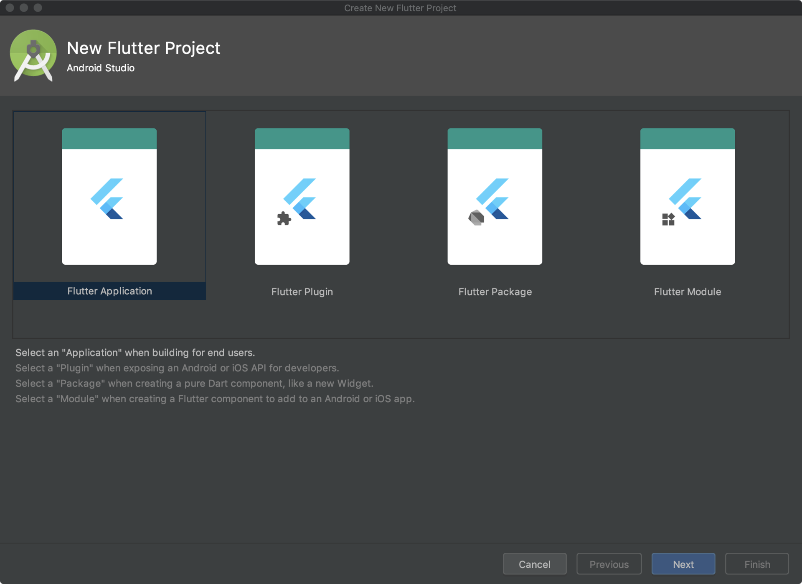

1. Flutter Application：标准Flutter工程
    ```shell
    flutter create xxapp # 默认Android使用Java，iOS使用Objective-C。
    flutter create -i swift -a kotlin xxapp # 如果要指定语言，比如安卓使用Kotlin，iOS使用Swift   
    ```
2. [Flutter Plugin](https://flutter.dev/docs/development/packages-and-plugins/developing-packages#plugin)：插件，包含原生代码和Flutter代码
    ```shell
    flutter create --template=plugin xxapp_plugin
    ```
3. [Flutter Package](https://flutter.dev/docs/development/packages-and-plugins/developing-packages#dart)：插件，纯Dart代码的
   ```shell
   flutter create --template=package xxapp_package
   ```
4. Flutter Module：往现有原生工程中嵌入Flutter模块
    ```shell
    flutter create -t module xxapp_module
    ```
 
# 混编
## 现有原生工程引入Flutter
### Flutter 1.9版本的 [官方集成方法](https://github.com/flutter/flutter/wiki/Add-Flutter-to-existing-apps#ios)
1. 在原生工程的同级目录下创建flutter_module
   1. 命令行方式 flutter create -t module my_flutter
   2. 使用Android Studio Code 创建
2. 编辑原生工程的Podfile
   ```ruby
   # Podfile 
   # flutter_module是你创建的flutter工程名字
   flutter_application_path = '../flutter_module' 
   load File.join(flutter_application_path, '.ios', 'Flutter', 'podhelper.rb')

   target 'BWCMTApp' do
     # App.framework、Flutter.framework、Flutter-plugin
     install_all_flutter_pods(flutter_application_path)
   end
   ```
3. 关闭原生工程的bitcode
4. 执行 pod install
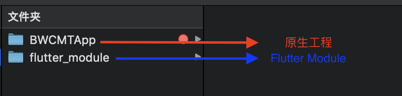
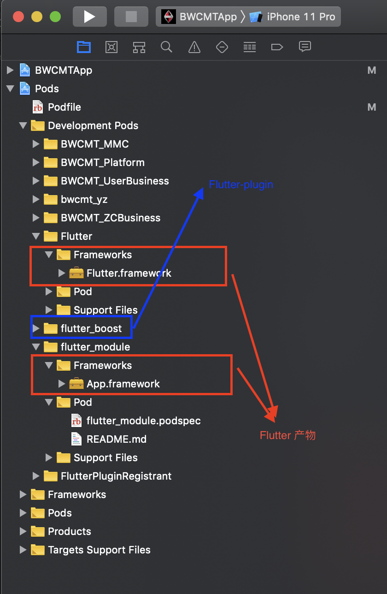
 
### Flutter产物集成方法
* [闲鱼flutter混合工程持续集成的最佳实践](https://zhuanlan.zhihu.com/p/40528502)
* [从零搭建iOS Native Flutter混编工程](https://juejin.im/post/5c3ae5ef518825242165c5ca#heading-4)
* [混合开发：flutter集成进iOS工程](https://juejin.im/post/5dd35c64e51d453daa0e4580#heading-0)


1. 在原生工程的同级目录创建flutter moduel
   ```shell
   flutter create -t module xxapp_module
   # 在flutter的pubspec.ymal里加入需要的三方库后，执行flutter pub get安装三方库
   ```
2. 编译flutter工程
   ```shell
   $ flutter build ios --debug      //编译debug产物
   或者
   $ flutter build ios --release --no-codesign //编译release产物（选择不需要证书）
   # 命令完成后，查看产物，路径如下
   # build路径下：
   # test_flutter_src/build/ios/Release-iphoneos/FlutterPluginRegistrant/FlutterPluginRegistrant.framework
   # test_flutter_src/build/ios/Release-iphoneos/flutter_boost/flutter_boost.framework  # 这里集成了flutter_boost三方库
   # .ios目录下：
   # /test_flutter_src/.ios/Flutter/engine/Flutter.framework
   # /test_flutter_src/.ios/Flutter/App.framework
   ```
3. 写一个脚本，将各个目录的framework放置到同一个目录下。⚠️：debug和release的命令不一样，用的时候修改下脚本
   ```shell
   # 在flutter module目录下创建一个 move_file.sh的文件，复制以下代码到move_file.sh
   if [ -z $out ]; then
       out='ios_frameworks'
   fi

   echo "准备输出所有文件到目录: $out"
   echo "清除所有已编译文件"
   find . -d -name build | xargs rm -rf
   flutter clean
   rm -rf $out
   rm -rf build

   flutter packages get

   addFlag(){
       cat .ios/Podfile > tmp1.txt
       echo "use_frameworks!" >> tmp2.txt
       cat tmp1.txt >> tmp2.txt
       cat tmp2.txt > .ios/Podfile
       rm tmp1.txt tmp2.txt
   }

   echo "检查 .ios/Podfile文件状态"
   a=$(cat .ios/Podfile)
   if [[ $a == use* ]]; then
       echo '已经添加use_frameworks, 不再添加'
   else
       echo '未添加use_frameworks,准备添加'
       addFlag
       echo "添加use_frameworks 完成"
   fi

   echo "编译flutter"
   # flutter build ios --debug
   #release下放开下一行注释，注释掉上一行代码
   flutter build ios --release --no-codesign
   echo "编译flutter完成"
   mkdir $out
   # cp -r build/ios/Debug-iphoneos/*/*.framework $out
   # release下放开下一行注释，注释掉上一行代码
   cp -r build/ios/Release-iphoneos/*/*.framework $out
   cp -r .ios/Flutter/App.framework $out
   cp -r .ios/Flutter/engine/Flutter.framework $out

   echo "复制framework库到临时文件夹: $out"

   libpath='../test_flutter_outcome' # test_flutter_outcome是cocoapods私有库目录

   rm -rf "$libpath/ios_frameworks"
   mkdir $libpath
   cp -r $out $libpath

   echo "复制库文件到: $libpath" 
   ```
4. 执行脚本
   ```shell
   sh move_file.sh
   ```
    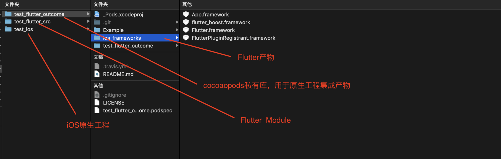

5. 编辑私有库的podspec文件
   ```ruby
    Pod::Spec.new do |s|
     s.name             = 'test_flutter_outcome'
     s.version          = '0.1.0'
     s.summary          = 'A short description of test_flutter_outcome.' 
     s.description      = <<-DESC
   TODO: Add long description of the pod here.
                          DESC
     s.homepage         = 'https://github.com/allenswb/test_flutter_outcome'
     s.license          = { :type => 'MIT', :file => 'LICENSE' }
     s.author           = { 'allenswb' => 'wenbo.sun@ucarinc.com' }
     s.source           = { :git => 'https://github.com/allenswb/test_flutter_outcome.git', :tag => s.version.to_s }
     s.ios.deployment_target = '8.0'
     s.source_files = 'test_flutter_outcome/Classes/**/*'
     
     # ⚠️：这几行是重点。添加flutter产物framework
     s.static_framework = true
     p = Dir::open("ios_frameworks")
     arr = Array.new
     arr.push('ios_frameworks/*.framework')
     s.ios.vendored_frameworks = arr
   end
   # 校验后在原生工程里引入这个私有库，⚠️校验命令如下
   # pod lib lint test_flutter_outcome.podspec --allow-warnings
   ```
    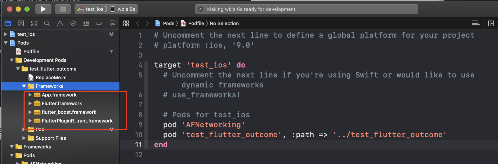

6. 可以把私有库test_flutter_outcome推到orgin，其他没有flutter环境的同学可以正常开发原生工程。

### 使用 [flutter-boot](https://github.com/alibaba-flutter/flutter-boot)

遇到 permission denied 错误

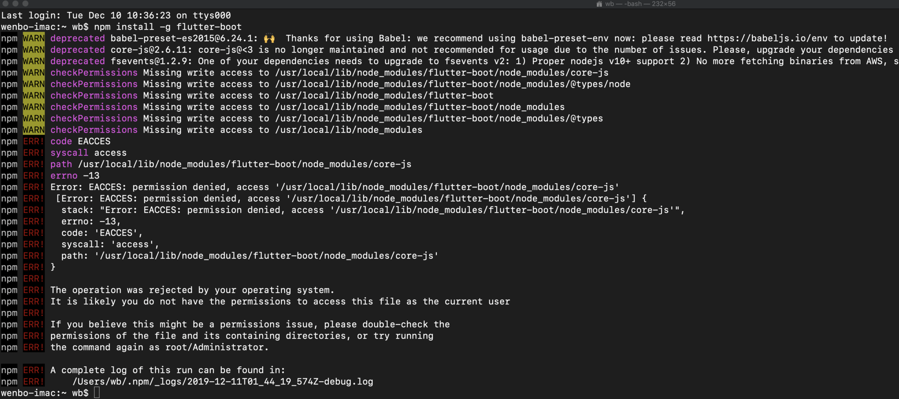

产生原因：之前用root用户安装过npm，解决方法：修改/usr/local/lib/node_modules

目录的所有人为当前用户. 

   ```shell
   chown -R wb node_modules
   ```
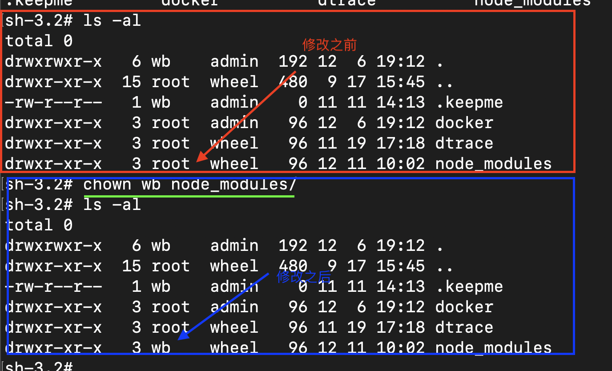

## 启动Flutter
```objc
// CMTPlatformContext.m
- (void)startupFinished {
  // 注册flutter引擎
  NSURL *url = [self produceRouterURL:@"ZCContext/flutter/startFlutterEngine"];
  [[self getContextRouter] performBusinessAction:url trigger:[[CMTTrigger alloc] init]];
}
```
```objc
// ZCContext.m
- (void)performBusinessAction:(NSURL *)url trigger:(CMTTrigger *)trigger {
  NSArray *components = [self.platformContext getRouterComponents:url];
  if (components.count >= 2) {
    if ([moduleIdentifier isEqualToString:@"flutter"]) {
      // 启动flutter引擎
    }
  }  
}
```
## 原生和Flutter页面间的跳转 
>页面跳转使用咸鱼开源的解决方案 [flutter_boost](https://github.com/alibaba/flutter_boost/blob/master/README_CN.md)  [使用方法](https://github.com/alibaba/flutter_boost/blob/feature/flutter_1.9_upgrade/README_CN.md)
# 创建私有Flutter Plugin
## 一、创建plugin：使用原生的网络请求
### step1：创建plugin
```shell
flutter create --template=plugin flutter_ucar_network
```
### step2：编写代码
```shell
# flutter_ucar_network.podspec 添加依赖的私有库
s.dependency 'UCARNetwork/CMT', '4.2.3'
# /flutter_ucar_network/example/ios/Podfile中添加私有索引源(Runner工程)
source 'https://github.com/CocoaPods/Specs.git'
source 'http://gitlab.10101111.com/ucar_ios_platform/specs.git'
# pod install下，把依赖的UCARNetwork/CMT装好
```
打开Example/ios中的Runner工程

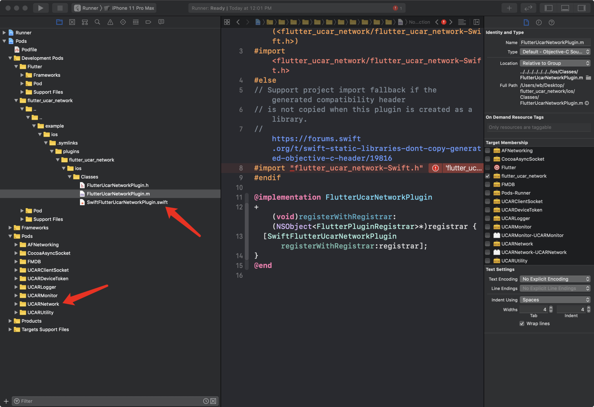

plugin模块默认创建了swift和OC两个版本的代码，我们用OC开发，这里直接把SwiftFlutterUcarNetworkPlugin.swift文件删掉，把MethodChannel的创建和回调方法写在FlutterUcarNetworkPlugin.m中

```objc
@implementation FlutterUcarNetworkPlugin
//  👇两个都是FlutterPlugin协议的方法 
+ (void)registerWithRegistrar:(NSObject<FlutterPluginRegistrar>*)registrar {
    FlutterMethodChannel *channel = [FlutterMethodChannel methodChannelWithName:@"flutter_ucar_network" binaryMessenger:[registrar messenger]];
    FlutterUcarNetworkPlugin *instance = [FlutterUcarNetworkPlugin new];
    [registrar addMethodCallDelegate:instance channel:channel];
}

- (void)handleMethodCall:(FlutterMethodCall *)call result:(FlutterResult)result {
    result(@"传递msg回调给Flutter");
}
@end
```
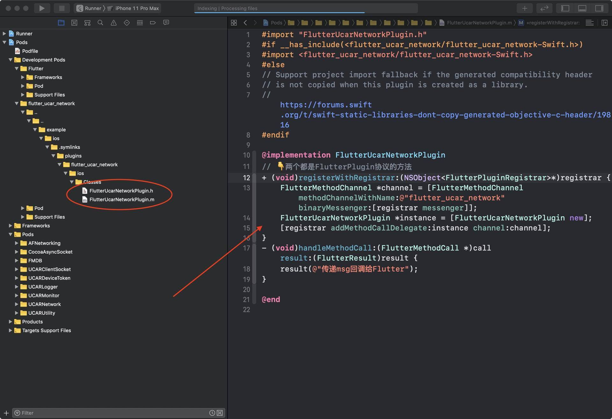

## 二、发布plugin
### 方式一：上传代码flutter_ucar_network到gitlab上
>文档地址：[https://dart.dev/tools/pub/dependencies#git-packages](https://dart.dev/tools/pub/dependencies#git-packages)

使用：

```YMAL
# pubspec.ymal
dependencies:
   flutter_ucar_network:
    git: http://gitlab.10101111.com:8888/wenbo.sun/flutter_ucar_network.git
    
```
⚠️：因为ucar_network这个plugin依赖了私有的cocoapods库，出现以下问题。解决是在Runner工程Podfile里加上私有索引源
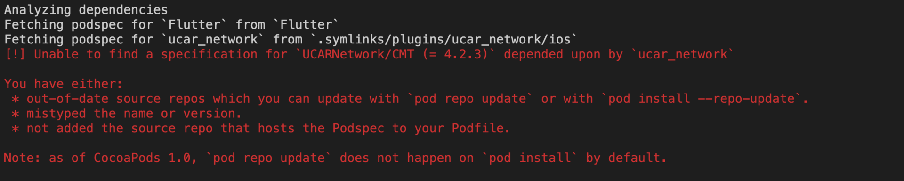

```ruby
# Runner的Podfile，在顶部指明私有索引源地址
source 'http://gitlab.10101111.com:8888/ucar_ios_platform/specs.git'
source 'http://gitlab.10101111.com:8888/p2p/zcspec.git'
source 'https://github.com/CocoaPods/Specs.git'
```
### 方式二：上传plugin到私有pub server
>地址：https://github.com/dart-lang/pub_server

**step1：搭建pub server**

官方提供了一个私有[pub server](https://github.com/dart-lang/pub_server)的库，按照文档在本机搭建一下

```shell
~ $ git clone https://github.com/dart-lang/pub_server.git
~ $ cd pub_server
~/pub_server $ pub get
...
~/pub_server $ dart example/example.dart -d /tmp/package-db
Listening on http://localhost:8080

To make the pub client use this repository configure your shell via:

    $ export PUB_HOSTED_URL=http://localhost:8080
    
```
⚠️：执行dart命令的时候如果提示 dart: command not found，就是说没有配置好Dart的环境变量。配置方法：打开 ~/.bash_profile文件，添加以下文本到末尾（路径根据你的实际情况填写）。
```
export PATH=${PATH}:/Users/wb/Documents/dev/flutter/bin/cache/dart-sdk/bin
```
保存好后执行命令刷新以下，重启terminal就可以使用dart指令启动本地的pub server了
```shell
source ~/.bash_profile
```
**step2：上传plugin，在工程中使用**
```shell
~/ucar_network $ export PUB_HOSTED_URL=http://localhost:8080
~/ucar_network $ pub get
...
~/ucar_network $ pub publish
Publishing ucar_network 0.0.1 to http://localhost:8080:
|-- ...
'-- pubspec.yaml

Package has 1 warning. Upload anyway (y/n)? y
Pub needs your authorization to upload packages on your behalf.
In a web browser, go to https://accounts.google.com/o/oauth2/auth?access_type=offline&approval_prompt=force&response_type=code&client_id=818368855108-8grd2eg9tj9f38os6f1urbcvsq399u8n.apps.googleusercontent.com&redirect_uri=http%3A%2F%2Flocalhost%3A51092&scope=openid+https%3A%2F%2Fwww.googleapis.com%2Fauth%2Fuserinfo.email
Then click "Allow access".

Waiting for your authorization...
Authorization received, processing...
Successfully uploaded package.
```
## 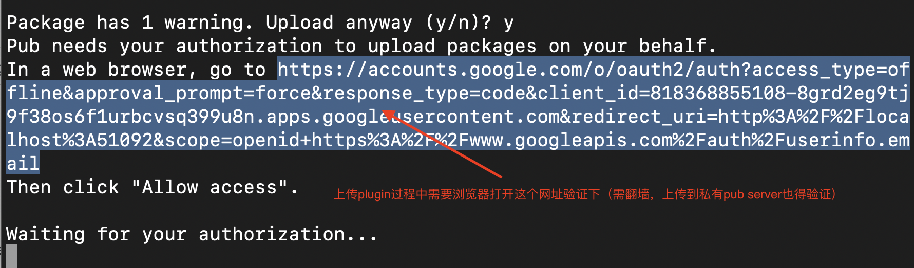
# Tips 
## 分支
以下四个分支，稳定性依次降低：

1. Stable：稳定版。近一年中最好的beta版本。
2. Beta：测试版。每隔几周都会选取近几个月中最好的dev版本作为Beta版。
3. dev：最新的经过完全测试的版本。包含新功能，但可能有一些问题。
4. master：最新版，但未经测试。 
```shell
# 查看当前所用分支
flutter channel  # master是开发分支 stable是稳定分支
# 切换到master分支
flutter channel master 
# 切换完分支后要upgrade以下, 在flutter工程根目录执行以下命令。这个命令要从网上下载东西，非常耗时~
flutter upgrade  
```
现在Flutter的开发进度还是蛮快的，在选用SDK版本的时候，不用非得选用最新的版本。在Flutter发布重要更新的版本再去更新SDK就行了。
## Flutter版本
```shell
# 查看所有版本
flutter version
# 修改版本到 v1.12.13+hotfix.5 (在pubspec.ymal同级目录下执行)
flutter version v1.12.13+hotfix.5
```
## flutter attach
```shell
# attach时候指定设备加参数 -d xxx
flutter attach -d EF8429A7-3E3A-4C01-B1D6-5A6AA7FF4C89
```
## flutter wrapper
这个工具是在当前flutter工程里下载一个flutter SDK（[地址](https://github.com/passsy/flutter_wrapper)）。之后使用flutterw命令替代flutter命令。

注意，需要配置VSCode中Flutter SDK的路径为当前目录。

# 遇到的问题及解决
## 模拟器编译报错 Command PhaseScriptExecution failed with a nonzero exit code
解决：File - Workspace Setting - Legacy Build System

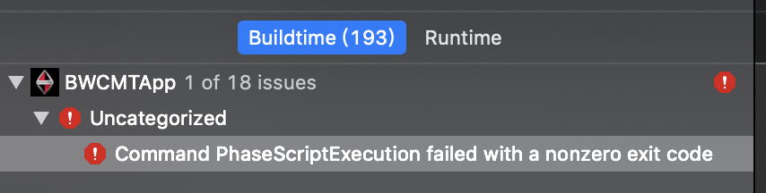

## Flutter.framework : permission denied
解决：这是1.9版本的一个bug，现在master分支已经修复 [Pull Request 在此](https://github.com/flutter/flutter/pull/45189)

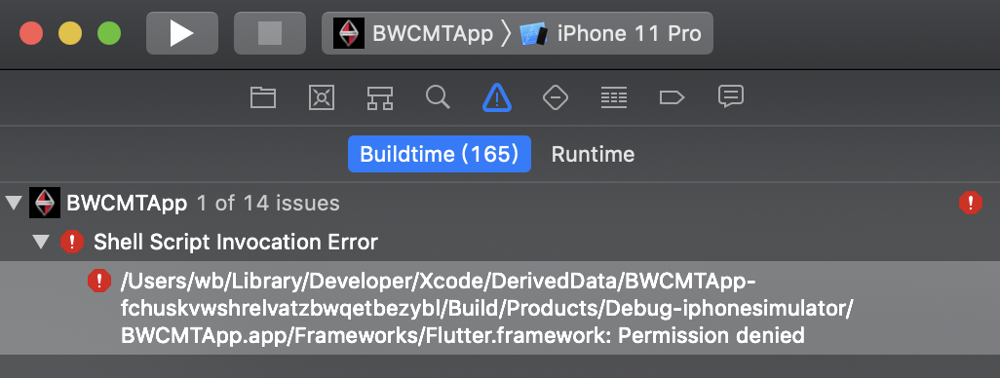

## Could not find the built application bundle at build/ios/iphonesimulator/Runner.app.
原因是在xcode中修改了bundle Name字段的名字 默认是Runner，将bundle Name修改为Runner即可

# 参考资料
* [官方文档](https://flutter.dev/docs)
* [flutter-go](https://github.com/alibaba/flutter-go)
* [pub.dev](https://pub.dev/)
* [Ucar Flutter wiki](http://wiki.10101111.com/display/UCARFTT/Flutter)
* [Flutter驿站](http://wiki.10101111.com/pages/viewpage.action?pageId=194938325)
* [Dart Language](https://dart.dev/guides/language/language-tour)
* [Dart笔记](https://github.com/AllenSWB/notes/blob/master/docs/flutter/dart.md)
* [Widget](https://github.com/AllenSWB/notes/blob/master/docs/flutter/widgets_in_flutter.md)
* [状态管理](https://github.com/AllenSWB/notes/blob/master/docs/flutter/state_manage_in_flutter.md) 