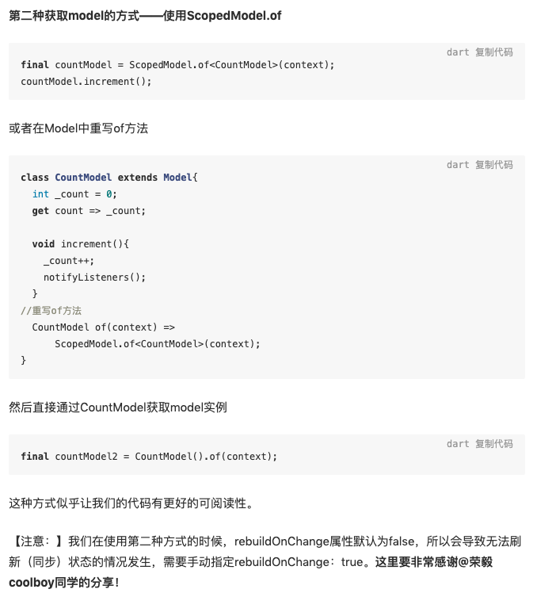
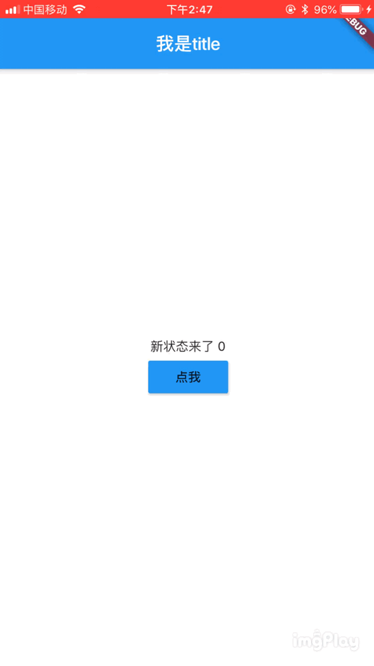
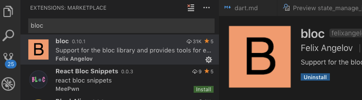
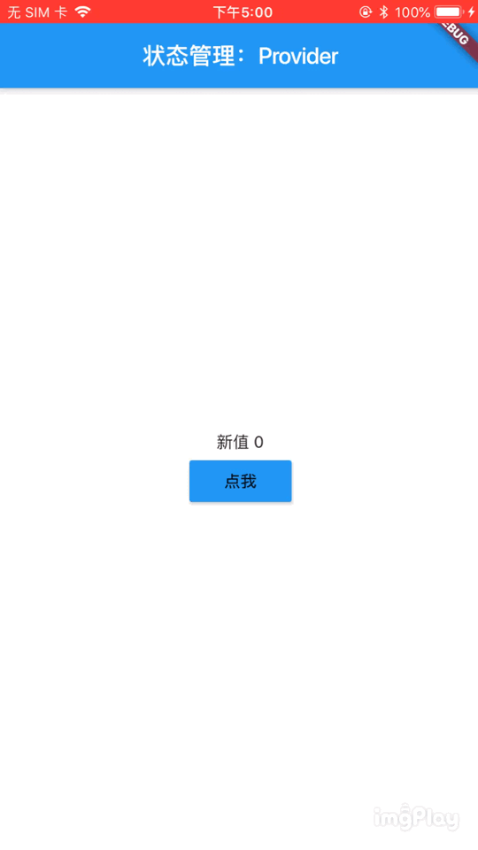

# Flutter中的状态管理
- [Flutter中的状态管理](#Flutter%E4%B8%AD%E7%9A%84%E7%8A%B6%E6%80%81%E7%AE%A1%E7%90%86)
  - [使用setState](#%E4%BD%BF%E7%94%A8setState)
  - [使用scoped_model](#%E4%BD%BF%E7%94%A8scopedmodel)
  - [使用Bloc](#%E4%BD%BF%E7%94%A8Bloc)
  - [使用Provider](#%E4%BD%BF%E7%94%A8Provider)
  - [使用Redux](#%E4%BD%BF%E7%94%A8Redux)

## 使用setState

  ```dart
    class _MyHomePageState extends State<MyHomePage> {
      int _counter = 0;

      void _incrementCounter() {
        setState(() {
          _counter++;
        });
      }

      @override
      Widget build(BuildContext context) {
        return Scaffold(
          appBar: AppBar(
            title: Text(widget.title),
          ),
          body: Center(
            child: Column(
              mainAxisAlignment: MainAxisAlignment.center,
              children: <Widget>[
                Text(
                  'You have pushed the button this many times:',
                ),
                Text(
                  '$_counter',
                  style: Theme.of(context).textTheme.display1,
                ),
              ],
            ),
          ),
          floatingActionButton: FloatingActionButton(
            onPressed: _incrementCounter,
            tooltip: 'Increment',
            child: Icon(Icons.add),
          ), 
        );
      }
    }
  ```

## 使用scoped_model

> 前序知识点：InheritedWidget

  + [scoped_model](https://github.com/brianegan/scoped_model)，提供了能将数据模型从父widget传递到后代的功能。还会在模型更新时重新渲染使用该模型的所有子项。 

  + 引入依赖
    ```ymal
      dependencies:
        scoped_model: ^1.0.1
    ```

  + 使用

    ```dart
      import 'package:flutter/material.dart';
      import 'package:scoped_model/scoped_model.dart';

      // 1. 创建model，继承自Model
      class CountModel extends Model {
        int _count = 0;
        int get value => _count;

        void increment() {
          _count++;
          notifyListeners();
        }
      }

      void main() => runApp(MyApp());

      class MyApp extends StatelessWidget {
        // This widget is the root of your application.
        @override
        Widget build(BuildContext context) {
          return MaterialApp(
            title: 'Flutter Demo',
            theme: ThemeData(
              primarySwatch: Colors.blue,
            ),
            home: MyHomePage(),
          );
        }
      }

      class MyHomePage extends StatelessWidget {
        // 2. 将model放入顶层 
        final CountModel model = CountModel();

        @override
        Widget build(BuildContext context) {
          return Scaffold(
            appBar: AppBar(title: Text('状态管理:scoped_model'),),
            body: ScopedModel(
              model: model,
              child: TestView(),
            )
          );
        }
      }

      class TestView extends StatelessWidget {
        @override
        Widget build(BuildContext context) {
          // 3. 在子页面中获取Model
          return ScopedModelDescendant<CountModel>(// 第一种获取状态的方式  ScopedModelDescendant
            builder: (context,child, model){
              return Center(
                child: Column(
                  mainAxisAlignment: MainAxisAlignment.center,
                  children: <Widget>[
                    Text('新值 ${model.value}'),
                    MaterialButton(
                      child: Text('点我'),
                      color: Colors.blue,
                      onPressed: (){
                        model.increment();
                      },
                    )
                  ],
                ),
              );
            },
          );
        }
      }
    ```

    

## 使用Bloc

> 前序知识点：Stream

  + [官方文档](https://felangel.github.io/bloc/#/gettingstarted)
  
  + 核心概念

    - Event：Events are the input to a Bloc. They are commonly dispatched in response to user interactions such as button presses or lifecycle events like page loads.
    - State：States are the output of a Bloc and represent a part of your application's state. UI components can be notified of states and redraw portions of themselves based on the current state.

  - 添加依赖
  
    ```yaml
      dependencies:
          flutter:
            sdk: flutter
          flutter_bloc: ^0.19.0
          bloc: ^0.14.4 
    ```
  
  - 使用

    ```dart
      import 'package:flutter/material.dart';
      // 1. 引入头文件
      import 'package:bloc/bloc.dart';
      import 'package:flutter_bloc/flutter_bloc.dart';

      void main() => runApp(MyApp());

      class MyApp extends StatelessWidget {
        @override
        Widget build(BuildContext context) {
          return MaterialApp(
            title: 'Flutter Demo',
            theme: ThemeData(
              primarySwatch: Colors.blue,
            ),
            home: MyHomePage(title: 'Flutter Demo Home Page'),
          );
        }
      }


      // 2. 创建Event
      enum MyEvent {
        add,
      }

      // 3. 创建Bloc
      class MyBloc extends Bloc<MyEvent, int> {
        @override
        int get initialState => 0;  // 初始化状态 (本例中状态是个num值传递)

        @override
        Stream<int> mapEventToState(
          MyEvent event,
        ) async* {  // 响应event，修改状态
          if (event == MyEvent.add) {
            print('来了 老弟');
            yield currentState + 1;
          }
        }
      }

      class MyHomePage extends StatelessWidget {
        MyHomePage({Key key, this.title}) : super(key: key);

        final String title;

        final MyBloc _myBloc = MyBloc();

        @override
        Widget build(BuildContext context) {
          return Scaffold(
            appBar: AppBar(
              title: Text('我是title'),
            ),
            body: BlocProvider(
              builder: (BuildContext context) => MyBloc(),
              child: BlocBuilder( // 4. 用一个BlocBuilder包裹
                bloc: _myBloc,
                builder: (BuildContext context, int state) {
                  return Center(
                    child: Column(
                      mainAxisAlignment: MainAxisAlignment.center,
                      children: <Widget>[
                        Text('新状态来了 $state'),  // 接受新的state
                        MaterialButton(
                          onPressed: (){
                            _myBloc.dispatch(MyEvent.add);  // 触发bloc，传递event
                          },
                          child: Text('点我'),
                          color: Colors.blue,
                        ),
                      ],
                    ),
                  );
                },
              )
            ),
          );
        }

      }
      

    ```

    
  
  - VSCode扩展
    
    

## 使用Provider

> 前序知识点：[Mixins](http://dart.goodev.org/guides/language/language-tour#adding-features-to-a-class-mixins%E4%B8%BA%E7%B1%BB%E6%B7%BB%E5%8A%A0%E6%96%B0%E7%9A%84%E5%8A%9F%E8%83%BD) 

  + [官网地址 provider](https://github.com/rrousselGit/provider)

  + 添加依赖

    ```ymal
      dependencies:
        provider: ^3.0.0+1
    ```

    ```dart
      import 'package:provider/provider.dart'
    ```

  + 使用

    ```dart
      import 'package:flutter/material.dart';
      import 'package:provider/provider.dart';

      // 1. 创建数据model 
      class CounterModel with ChangeNotifier {
        int _count = 0; // 要传递的值，这里定义成私有的了
        int get value => _count; //提供一个方法供外界获取值

        void increment() {
          _count++;
          notifyListeners();// 通知所有监听者刷新 
        }
      }

      void main() => runApp(MyApp());

      class MyApp extends StatelessWidget {

        // 2. 创建顶层共享数据
        final counter = CounterModel();

        @override
        Widget build(BuildContext context) {
          return MaterialApp(
            title: 'Flutter Demo',
            theme: ThemeData(
              primarySwatch: Colors.blue,
            ),
            home: Scaffold(
              appBar: AppBar(title: Text('状态管理：Provider'),),
              body: Center(
                child: Provider.value(
                  value: 'ignore me', // 通过 Provider<T>.value：能管理一个恒定的数据，并提供给子孙节点使用。这里我们随便传了个值，忽略就行了。
                  child: ChangeNotifierProvider.value(// ChangeNotifierProvider<T>.value：不仅能提供数据给子孙节点使用，还可以在数据改变的时候通知所有听众刷新。(通过之前的notifyListeners)
                    value: counter,
                    child: TestView(),
                  ),
                )
              ),
            ),
          );
        }
      }

      // 获取状态方式一
      class TestView extends StatelessWidget {
        @override
        Widget build(BuildContext context) {
          // 3. 在子页面中获取状态 
          // 第一种获取状态的方式： Provider.of(context)
          final _counter = Provider.of<CounterModel>(context);

          return Column(
            mainAxisAlignment: MainAxisAlignment.center,
            mainAxisSize: MainAxisSize.max,
            children: <Widget>[
              Text('新值 ${_counter.value}'),// 获取新值
              MaterialButton(
                child: Text('点我'),
                color: Colors.blue,
                onPressed: (){
                  _counter.increment();// 调用CounterModel中改变状态的方法
                },
              ),
            ],
          );
        } 
      }

      // 获取状态方式二
      class TestView extends StatelessWidget {
        @override
        Widget build(BuildContext context) {
          // 3. 在子页面中获取状态 
          // 第二种获取状态的方式： Consumer
          return Column(
            mainAxisAlignment: MainAxisAlignment.center,
            mainAxisSize: MainAxisSize.max,
            children: <Widget>[
              Consumer2<CounterModel, String>(
                builder: ((context, CounterModel counter, String value, _){
                  return Text('新值；${counter.value}');// 获取新值
                }),
              ),
              Consumer<CounterModel>(
                builder: (context, CounterModel counter, widget) {
                  return MaterialButton(
                    onPressed: (){
                      counter.increment();// 更改状态
                    },
                    child: widget,
                    color: Colors.blue,
                  );
                },
                child: Text('点我'),
              )
            ],
          );
        }
      }
    ```

  

## 使用Redux

> Redux 是 JavaScript 状态容器，提供可预测化的状态管理.
> - [redux入门教程 by 阮一峰](http://www.ruanyifeng.com/blog/2016/09/redux_tutorial_part_one_basic_usages.html)
> - [redux中文文档](http://cn.redux.js.org/index.html)

  + [fish-redux](https://github.com/alibaba/fish-redux) 
  + [flutter_redux](https://github.com/brianegan/flutter_redux)

---

> + [状态管理探索篇——Scoped Model（一）](https://juejin.im/post/5b97fa0d5188255c5546dcf8)
> + [状态管理探索篇——Redux（二）](https://juejin.im/post/5ba26c086fb9a05ce57697da)
> + [状态管理探索篇——BLoC(三)](https://juejin.im/post/5bb6f344f265da0aa664d68a)
> + [状态管理特别篇 —— Provide](https://juejin.im/post/5c6d4b52f265da2dc675b407)
> + [状态管理指南篇——Provider](https://juejin.im/post/5d00a84fe51d455a2f22023f)