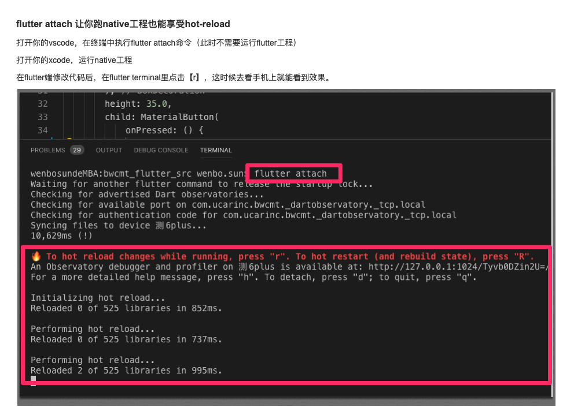
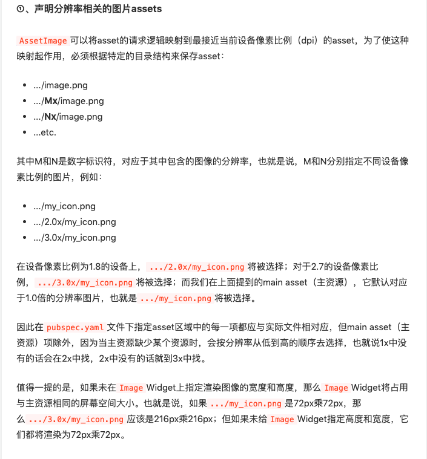
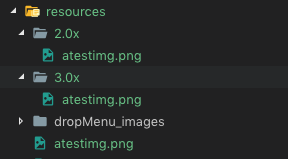
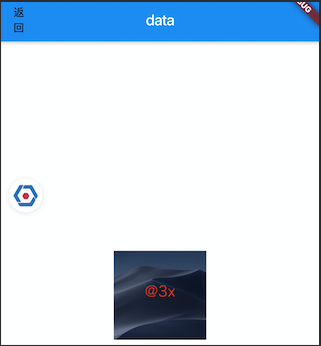
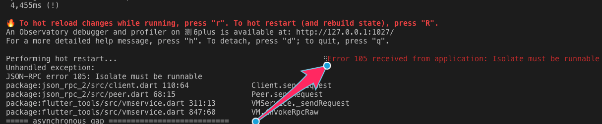
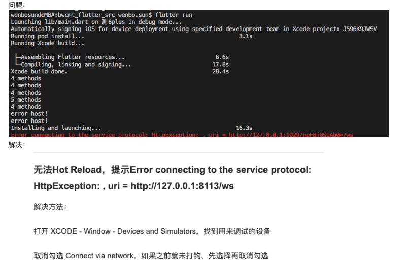
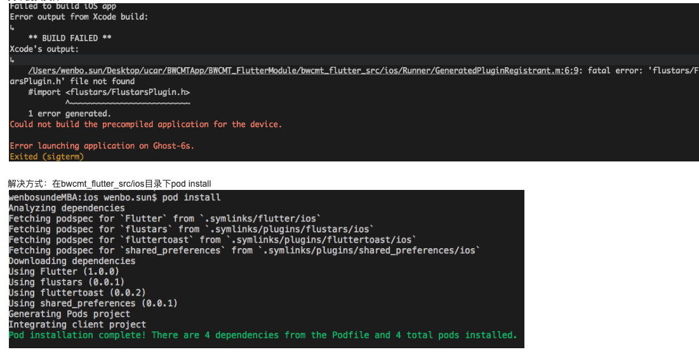

# tips in Flutter
- [tips in Flutter](#tips-in-Flutter)
  - [开发](#%E5%BC%80%E5%8F%91)
    - [打开视觉调试开关](#%E6%89%93%E5%BC%80%E8%A7%86%E8%A7%89%E8%B0%83%E8%AF%95%E5%BC%80%E5%85%B3)
    - [SingleChildScrollView嵌套ListView，防止内部的ListView滚动，设置`primary: false`](#SingleChildScrollView%E5%B5%8C%E5%A5%97ListView%E9%98%B2%E6%AD%A2%E5%86%85%E9%83%A8%E7%9A%84ListView%E6%BB%9A%E5%8A%A8%E8%AE%BE%E7%BD%AEprimary-false)
    - [判断当前设备平台](#%E5%88%A4%E6%96%AD%E5%BD%93%E5%89%8D%E8%AE%BE%E5%A4%87%E5%B9%B3%E5%8F%B0)
    - [获取屏幕宽高](#%E8%8E%B7%E5%8F%96%E5%B1%8F%E5%B9%95%E5%AE%BD%E9%AB%98)
    - [`pubspec.ymal`文件中的`dev_dependencies`和`dependencies`区别](#pubspecymal%E6%96%87%E4%BB%B6%E4%B8%AD%E7%9A%84devdependencies%E5%92%8Cdependencies%E5%8C%BA%E5%88%AB)
    - [`flutter attach`让你跑native工程也能享受hot-reload](#flutter-attach%E8%AE%A9%E4%BD%A0%E8%B7%91native%E5%B7%A5%E7%A8%8B%E4%B9%9F%E8%83%BD%E4%BA%AB%E5%8F%97hot-reload)
    - [修改`app`名和`logo`](#%E4%BF%AE%E6%94%B9app%E5%90%8D%E5%92%8Clogo)
    - [自动选择二倍图三倍图资源](#%E8%87%AA%E5%8A%A8%E9%80%89%E6%8B%A9%E4%BA%8C%E5%80%8D%E5%9B%BE%E4%B8%89%E5%80%8D%E5%9B%BE%E8%B5%84%E6%BA%90)
  - [错误](#%E9%94%99%E8%AF%AF)
    - [热重载【r】错误：`Error 105 received from application: Isolate must be runnable`](#%E7%83%AD%E9%87%8D%E8%BD%BDr%E9%94%99%E8%AF%AFError-105-received-from-application-Isolate-must-be-runnable)
    - [真机运行，flutter run报错 : Error connecting to the service protocol: HttpException](#%E7%9C%9F%E6%9C%BA%E8%BF%90%E8%A1%8Cflutter-run%E6%8A%A5%E9%94%99--Error-connecting-to-the-service-protocol-HttpException)
    - [Runner找不到头文件](#Runner%E6%89%BE%E4%B8%8D%E5%88%B0%E5%A4%B4%E6%96%87%E4%BB%B6)
  - [todo list](#todo-list)
## 开发

### 打开视觉调试开关

  ```dart
    // 1. 在main.dart中导入头文件
    import 'package:flutter/rendering.dart';
    // 2. 在main方法中加入下面一行代码
    main () async {
      debugPaintSizeEnabled = true;      //打开视觉调试开关
      runApp(MyApp());
    } 
  ```

### SingleChildScrollView嵌套ListView，防止内部的ListView滚动，设置`primary: false`

  ```dart
      ListView.builder(
         itemExtent: 88,
         itemCount: 3,
         shrinkWrap: true,
         primary: false, // 当我们使用SingleChildScrollView 整个布局包含了ListView 滑动时会产生冲突 滚动卡顿，不流畅。要关闭这个属性
         itemBuilder: (BuildContext context ,int index) {
           return OrderListCell();
         },
      ),
  ```

### 判断当前设备平台

  ```dart
    // 导入头文件
    import 'dart:io';
    // 调用方法
    if (Platform.isIOS) {
      print('iOS');
    } else if (Platform.isAndroid) {
      print('安卓');
    } else if (Platform.isWindows) {
      print('Windows');
    } else if (Platform.isFuchsia) {
      print('Fuchsia');
    } else if (Platform.isLinux) {
      print('Linux');
    } else if (Platform.isMacOS) {
      print('Mac OS');
    }
  ```

### 获取屏幕宽高
   
   ```dart
      import 'dart:ui';
      import 'package:flutter/material.dart';

      /// 返回屏幕宽
      double wbScreenWidth(BuildContext context) {
        return wbScreenSize(context).width;
      }

      /// 返回屏幕高
      double wbScreenHeight(BuildContext context) {
        return wbScreenSize(context).height;
      }

      Size wbScreenSize(BuildContext context) {
        return MediaQuery.of(context).size;
      }
   ```
   
### `pubspec.ymal`文件中的`dev_dependencies`和`dependencies`区别

  > pubspec.ymal文件：https://dart.dev/tools/pub/pubspec

  + `dependencies`：工程所依赖的库放在这里；[官方释义点我](https://dart.dev/tools/pub/pubspec#dependencies)
  + `dev_dependencies`：仅在开发阶段才使用到的库放在这里；

### `flutter attach`让你跑native工程也能享受hot-reload
   
   [flutter attach 文档](https://github.com/flutter/flutter/wiki/Add-Flutter-to-existing-apps#hot-restartreload-and-debugging-dart-code-1)
   
   

### 修改`app`名和`logo`

  - 名称：
  
    `iOS`是`info.plist`文件中修改，`Android`在`AndroidManifest.xml`文件中修改。两个名字可以不一致。

  - `Logo`：
  
    `iOS` 是在 `AppIcon.appiconset` 文件夹中添加对应 `Logo` 图标，并在 `Contents.json` 中进行配置，`Android` 是添加图片在 `mipmap` 文件夹中，并在 `AndroidManifest.xml` 中修改 

### 自动选择二倍图三倍图资源

  

  eg: 

  1. 在`/resources`目录下放入三个不同倍率的图片
     
     
  
  2. 在`pubspec.ymal`里引入资源
     
     
  
  3. 使用

      ```dart
        child: Center(
            child: Image(image: AssetImage('resources/atestimg.png'),)
        ),
      ```
  4. 效果 (在6Plus上)

     

## 错误

### 热重载【r】错误：`Error 105 received from application: Isolate must be runnable`

  + https://github.com/flutter/flutter/issues/26568
  + https://github.com/flutter/flutter/issues/26953

  表现：app里的flutter界面白屏，使用【r】hot-reload报错

  

### 真机运行，flutter run报错 : Error connecting to the service protocol: HttpException

  
### Runner找不到头文件

  

##  todo list

1. Flutter中使用2倍图、3倍图
2. 获取设备信息 https://segmentfault.com/a/1190000014913010?utm_source=index-hottest
3. 一个channel处理1万个方法，和一千个channel，每个处理10个方法，性能可能前者更好吧？
4. 页面跳转的方式；push栈 ；router
5. 页面间传参数
6. 下层widget通知上层widget更高state
7. bloc 状态
