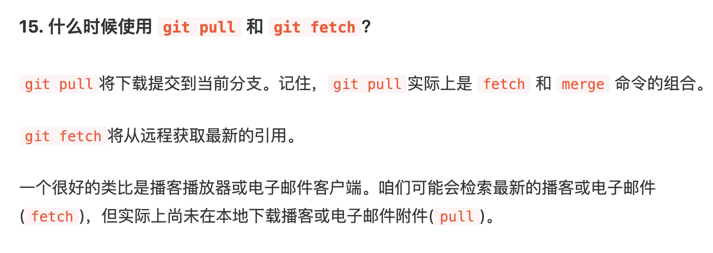

- [Git](#git)
  - [常用命令](#%e5%b8%b8%e7%94%a8%e5%91%bd%e4%bb%a4)
  - [merge和rebase区别](#merge%e5%92%8crebase%e5%8c%ba%e5%88%ab)
  - [Git库迁移，不丢失之前的分支和commit记录](#git%e5%ba%93%e8%bf%81%e7%a7%bb%e4%b8%8d%e4%b8%a2%e5%a4%b1%e4%b9%8b%e5%89%8d%e7%9a%84%e5%88%86%e6%94%af%e5%92%8ccommit%e8%ae%b0%e5%bd%95)
  - [将本地git库关联到一个远端git库](#%e5%b0%86%e6%9c%ac%e5%9c%b0git%e5%ba%93%e5%85%b3%e8%81%94%e5%88%b0%e4%b8%80%e4%b8%aa%e8%bf%9c%e7%ab%afgit%e5%ba%93)
  - [git子模块submodule](#git%e5%ad%90%e6%a8%a1%e5%9d%97submodule)
  - [git fetch & git pull](#git-fetch--git-pull)
  - [把三个commit log合成一个](#%e6%8a%8a%e4%b8%89%e4%b8%aacommit-log%e5%90%88%e6%88%90%e4%b8%80%e4%b8%aa)
  - [忽略文件 .gitignore](#%e5%bf%bd%e7%95%a5%e6%96%87%e4%bb%b6-gitignore)
  - [git 原理 使用 对比svn](#git-%e5%8e%9f%e7%90%86-%e4%bd%bf%e7%94%a8-%e5%af%b9%e6%af%94svn)
# Git

+ [廖雪峰 Git 教程](https://www.liaoxuefeng.com/wiki/896043488029600)
+ [通过 41 个 问答方式快速了解学习 Git](https://juejin.im/post/5dba2249f265da4cef190484)
 
## 常用命令
 


```shell
# 查看工作区（Working Directory）状态
git status 

git pull
git fetch

git push

git add .
git commit -m 'feat：新特性'

git checkout .

# to discard changes in working directory
git checkout -- <file> 
```

**标签tag**

```shell 
# 打一个0.1.1的tag
git tag 0.1.1	

# 查看tag信息
git show <tagname> 

# 将 0.1.1的tag push到origin
git push origin 0.1.1	

# 删除一个本地tag
git tag -d 0.1.1 

# 删除远端tag，需要先本地删除tag，然后执行远端删除的命令
git push origin :refs/tags/v0.9


# 查看所有tag
git tag  

# 将所有的tag push到origin
git push origin --tags 
```

**分支branch**

 ```
 git branch dev	// 切换到dev分支
 ```

## merge和rebase区别

`merge` 是合并的意思，`rebase`是复位变基。

+ merge操作会生成一个新的节点，之前的提交分开显示。
+ rebase操作不会生成新的节点，是将两个分支融合成一个线性的提交


 现在有两个分支 test 和 master

 ```
 	   D --- E test
 	  /
 A --- B --- C --- F master
 ```

 在master执行`git merge test`，结果如下

 ```
  	   D ------------ E test
 	  /				   \
 A --- B --- C --- F --- G master
 ```

 在master执行`git rebase test`，结果如下

 ```
 A --- B --- D --- E --- C --- F test,master
 ```
  
## Git库迁移，不丢失之前的分支和commit记录

+ 创建一个新git库
+ 在本地工程目录下执行以下命令
  ```shell
  cd existing_repo
  git remote rename origin old-origin
  git remote add origin https://xxx.git
  git push -u origin --all
  git push -u origin --tags
  ``` 

## 将本地git库关联到一个远端git库


## git子模块submodule
 
- 添加submodule : `git submodule add https://github.com/xxx.git`

    ```shell
    $ git submodule add https://github.com/xxx.git
    Cloning into 'xxx'...
    remote: Counting objects: 11, done.
    remote: Compressing objects: 100% (10/10), done.
    remote: Total 11 (delta 0), reused 11 (delta 0)
    Unpacking objects: 100% (11/11), done.
    Checking connectivity... done.
    ```
- 删除submodule
  - `cd .git` 切换到.git目录，修改config，删掉 submodule
  - `cd modules` 删除子模块目录
  - `cd 项目根目录` 删除子模块目录

- 直接clone下来submodule的代码 `git clone --recursive http://xxx.git`

  

  

## git fetch & git pull



## 把三个commit log合成一个

<!-- git rebase , git cherry-pick, git reset --> 

## 忽略文件 .gitignore

- 已经纳入版本管理的文件，加入.gitignore不生效的问题
  
  .gitignore只能忽略那些原来没有被track的文件，如果某些文件已经被纳入了版本管理中，则修改.gitignore是无效的。

  只能clone到本地，删除后，再进行忽略。
  
- iOS 工程
 - 忽略`Pods`
 - 提交`Podfile.lock`
 
## git 原理 使用 对比svn

.gitignore文件 (github ignore模板)

忽略UserInterfaceState.xcuserstate文件
 
 