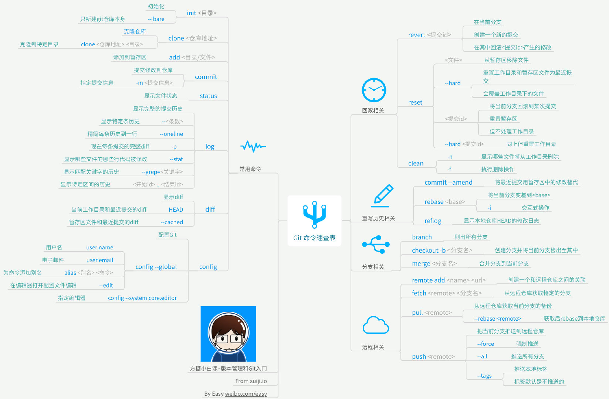
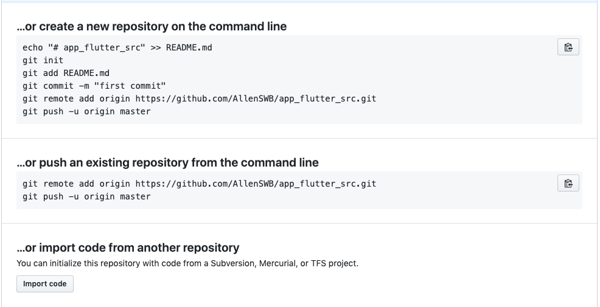
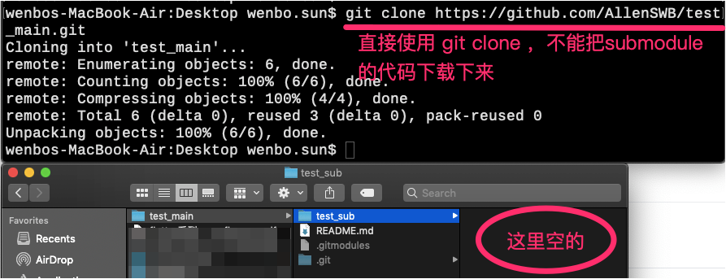
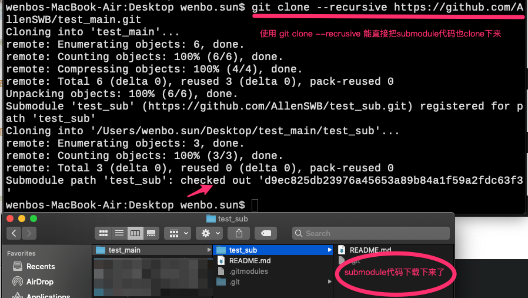

# Git

```shell

# 查看工作区（Working Directory）状态
git status 

git pull
git fetch

git push

git add .
git commit -m 'feat：新特性'

git checkout .

# to discard changes in working directory
git checkout -- <file> 


# 打tag
git tag <name> 

# 查看所有tag
git tag 

# 查看tag信息
git show <tagname> 

# 删除本地tag
git tag -d <tagname>

# 删除远端tag，需要先本地删除tag，然后执行远端删除的命令
git push origin :refs/tags/v0.9

# 推送特定tag到origin
git push origin <tagname>

# 一次性推送全部尚未推送到远程的本地标签
git push origin --tags

```

1. 常用

    https://www.liaoxuefeng.com/wiki/896043488029600

    

2. 回退

   ```shell
     git reset
   ```

3. git库更换地址，不丢失原来的提交记录

4. git关联远端仓库

    

5. 忽略文件 .gitignore

    - 已经纳入版本管理的文件，加入.gitignore不生效的问题
        
        .gitignore只能忽略那些原来没有被track的文件，如果某些文件已经被纳入了版本管理中，则修改.gitignore是无效的。

        只能clone到本地，删除后，再进行忽略。
        
    - iOS 工程
       - 忽略`Pods`
       - 提交`Podfile.lock`

6. git子模块submodule

    - 添加submodule : `git submodule add https://github.com/xxx.git`

        ```shell
           $ git submodule add https://github.com/xxx.git
            Cloning into 'xxx'...
            remote: Counting objects: 11, done.
            remote: Compressing objects: 100% (10/10), done.
            remote: Total 11 (delta 0), reused 11 (delta 0)
            Unpacking objects: 100% (11/11), done.
            Checking connectivity... done.
        ```
    - 删除submodule
      - `cd .git` 切换到.git目录，修改config，删掉 submodule
      - `cd modules` 删除子模块目录
      - `cd 项目根目录` 删除子模块目录

    - 直接clone下来submodule的代码 `git clone --recursive http://xxx.git`

        

        