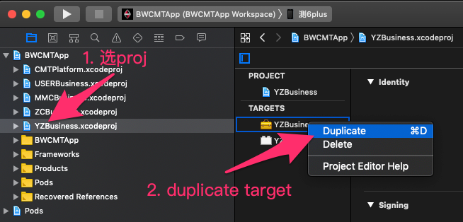
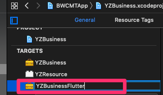
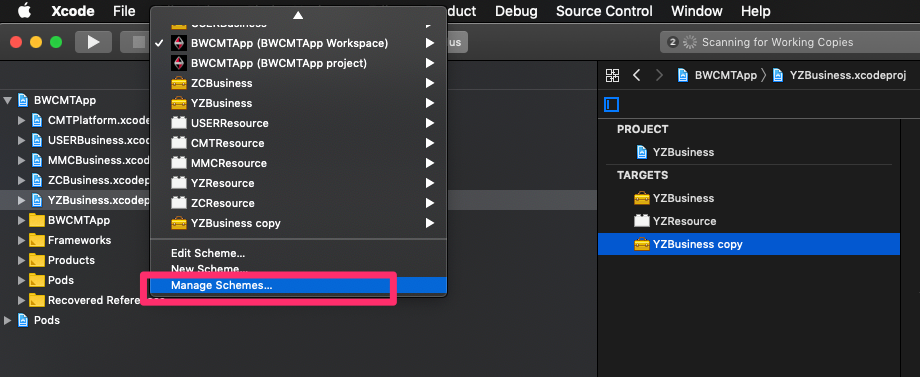
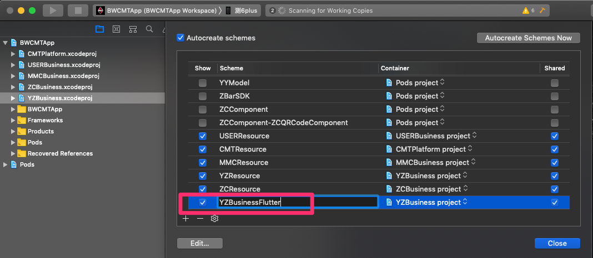
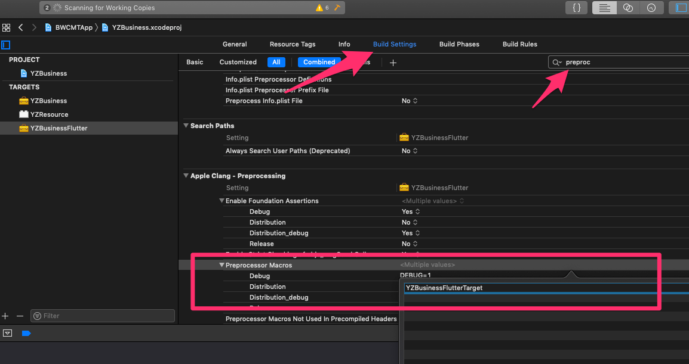

# 创建多target

- [创建多target](#%e5%88%9b%e5%bb%ba%e5%a4%9atarget)
  - [创建多target的方法](#%e5%88%9b%e5%bb%ba%e5%a4%9atarget%e7%9a%84%e6%96%b9%e6%b3%95)
    - [选中一个target，右键，duplicate](#%e9%80%89%e4%b8%ad%e4%b8%80%e4%b8%aatarget%e5%8f%b3%e9%94%aeduplicate)
    - [修改target名称](#%e4%bf%ae%e6%94%b9target%e5%90%8d%e7%a7%b0)
    - [添加宏，以便在代码中判断当前是那个target](#%e6%b7%bb%e5%8a%a0%e5%ae%8f%e4%bb%a5%e4%be%bf%e5%9c%a8%e4%bb%a3%e7%a0%81%e4%b8%ad%e5%88%a4%e6%96%ad%e5%bd%93%e5%89%8d%e6%98%af%e9%82%a3%e4%b8%aatarget)
  - [创建一个新target的注意点](#%e5%88%9b%e5%bb%ba%e4%b8%80%e4%b8%aa%e6%96%b0target%e7%9a%84%e6%b3%a8%e6%84%8f%e7%82%b9)
    - [依赖](#%e4%be%9d%e8%b5%96)
    - [宏：判断当前run的那个target](#%e5%ae%8f%e5%88%a4%e6%96%ad%e5%bd%93%e5%89%8drun%e7%9a%84%e9%82%a3%e4%b8%aatarget)
    - [Pods库：新的target也要记得依赖pod库](#pods%e5%ba%93%e6%96%b0%e7%9a%84target%e4%b9%9f%e8%a6%81%e8%ae%b0%e5%be%97%e4%be%9d%e8%b5%96pod%e5%ba%93)
    - [多target设置`GCC_PREPROCESSOR_DEFINITIONS`引起的问题](#%e5%a4%9atarget%e8%ae%be%e7%bd%aegccpreprocessordefinitions%e5%bc%95%e8%b5%b7%e7%9a%84%e9%97%ae%e9%a2%98)


## 创建多target的方法

### 选中一个target，右键，duplicate
   
   

### 修改target名称

   

   
   
   

### 添加宏，以便在代码中判断当前是那个target

  

  ```objc
  // 代码中判断
  #ifdef  YZBusinessFlutterTarget
  // flutter target
  #elif defined YZBusinessNormalTarget
  //normal target
  #endif
  ```

##  创建一个新target的注意点

### 依赖
    
  

### 宏：判断当前run的那个target
  
  
    
  ```objc
    #ifdef BWCMT_FULL
    // bwcmt full target
    #elif defined BWCMT_YZ_FLUTTER
    // yz flutter target
    #endif
  ```

### Pods库：新的target也要记得依赖pod库

 ```ruby
   # Podfile 文件
   targetsArray = ['BWCMTApp','BWCMTAppYZFlutter']

   targetsArray.each  do |t|

      target t do
          pod 'YYModel', '~>1.0.4'
          pod 'DoraemonKit/Core', :git => 'http://gitlab.10101111.com:8888/p2p/udoraemonkit.git', :configurations => ['Debug','ZC','Distribution']
      end
   end
  ```

### 多target设置`GCC_PREPROCESSOR_DEFINITIONS`引起的问题
   
   前面说了，为了用代码判断当前run的是那个target，设置了两个宏`BWCMT_FULL`和`BWCMT_YZ_FLUTTER`。这时候使用`pod install`会有下面的提示（pod没有出错，只是会给个警告⚠️）。

  ```shell
    [!] The `BWCMTApp [Release]` target overrides the `GCC_PREPROCESSOR_DEFINITIONS` build setting defined in `Pods/Target Support Files/Pods-BWCMTApp/Pods-BWCMTApp.release.xcconfig'. This can lead to problems with the CocoaPods installation
     - Use the `$(inherited)` flag, or
     - Remove the build settings from the target.
  ```

   

   解决办法是在`GCC_PREPROCESSOR_DEFINITIONS`里加上`$(inherited)`。再次`pod install`警告会消失。

   
