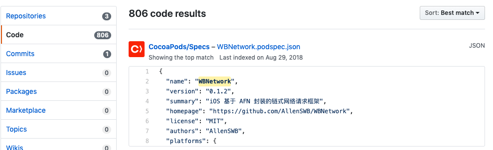
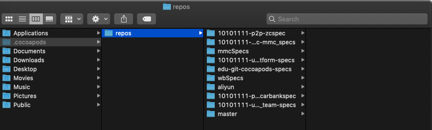
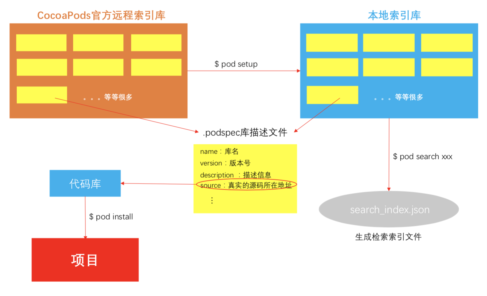
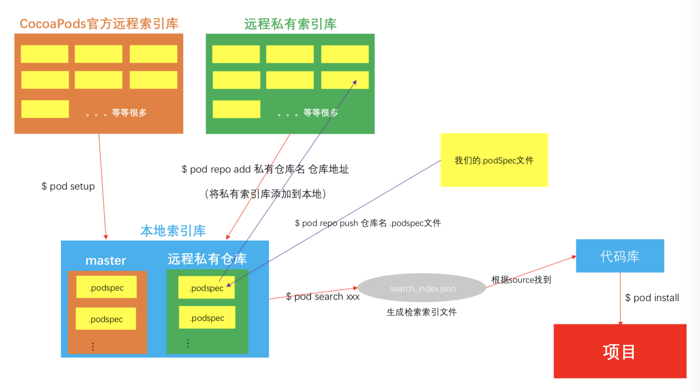
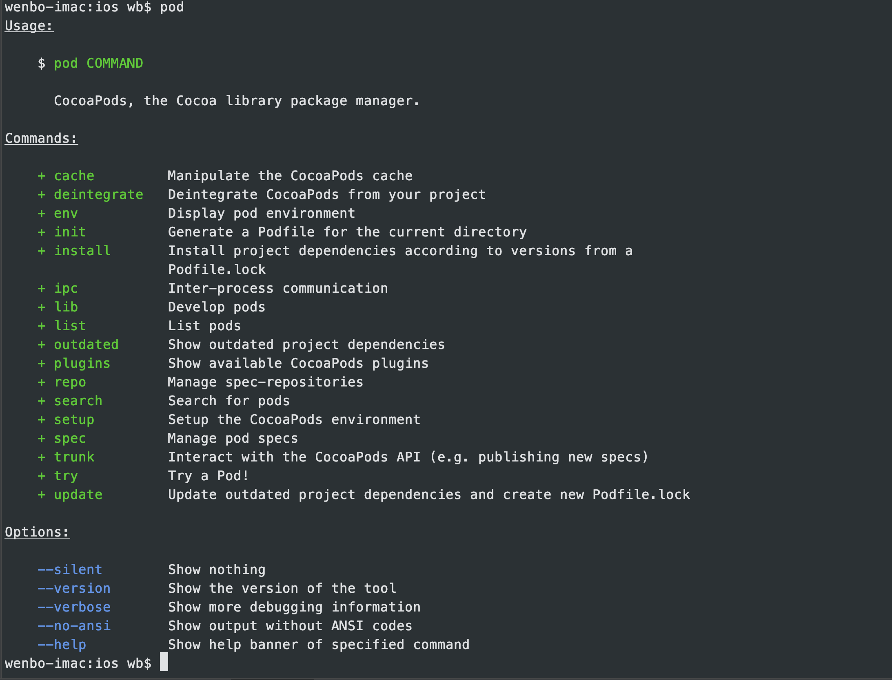
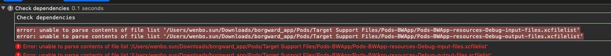
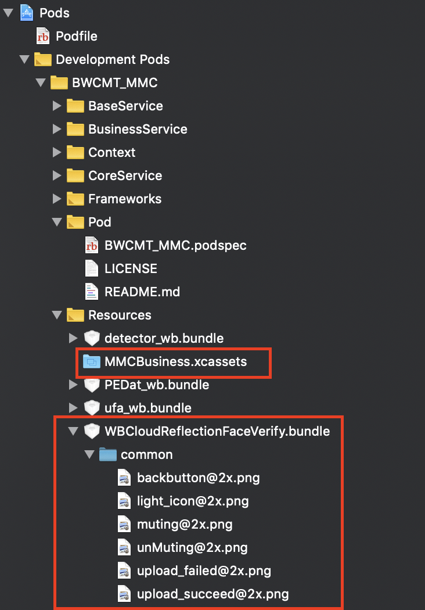

- [封装私有库](#%e5%b0%81%e8%a3%85%e7%a7%81%e6%9c%89%e5%ba%93)
  - [如果要封装的私有库依赖于另外一个私有库，校验podspec文件的时候要指明私有库索引源的位置](#%e5%a6%82%e6%9e%9c%e8%a6%81%e5%b0%81%e8%a3%85%e7%9a%84%e7%a7%81%e6%9c%89%e5%ba%93%e4%be%9d%e8%b5%96%e4%ba%8e%e5%8f%a6%e5%a4%96%e4%b8%80%e4%b8%aa%e7%a7%81%e6%9c%89%e5%ba%93%e6%a0%a1%e9%aa%8cpodspec%e6%96%87%e4%bb%b6%e7%9a%84%e6%97%b6%e5%80%99%e8%a6%81%e6%8c%87%e6%98%8e%e7%a7%81%e6%9c%89%e5%ba%93%e7%b4%a2%e5%bc%95%e6%ba%90%e7%9a%84%e4%bd%8d%e7%bd%ae)
- [封装开源库](#%e5%b0%81%e8%a3%85%e5%bc%80%e6%ba%90%e5%ba%93)
- [索引库](#%e7%b4%a2%e5%bc%95%e5%ba%93)
- [Podfile](#podfile)
- [升级Cocoapods](#%e5%8d%87%e7%ba%a7cocoapods)
- [Cocoapods工作原理](#cocoapods%e5%b7%a5%e4%bd%9c%e5%8e%9f%e7%90%86)
- [iOS 多target 项目使用 pod 管理三方库的方法](#ios-%e5%a4%9atarget-%e9%a1%b9%e7%9b%ae%e4%bd%bf%e7%94%a8-pod-%e7%ae%a1%e7%90%86%e4%b8%89%e6%96%b9%e5%ba%93%e7%9a%84%e6%96%b9%e6%b3%95)
- [常用`pod`命令](#%e5%b8%b8%e7%94%a8pod%e5%91%bd%e4%bb%a4)
- [cocoapods资源文件怎么管理](#cocoapods%e8%b5%84%e6%ba%90%e6%96%87%e4%bb%b6%e6%80%8e%e4%b9%88%e7%ae%a1%e7%90%86)
- [参考链接](#%e5%8f%82%e8%80%83%e9%93%be%e6%8e%a5)

## 封装私有库

  [封装私有库](./how_to_create_private_third_party_repo_cocoapods.md)

### 如果要封装的私有库依赖于另外一个私有库，校验podspec文件的时候要指明私有库索引源的位置

  ```ruby 
  Pod::Spec.new do |s|
    s.name             = 'bwcmt_network'
    s.version          = '0.0.1'
    s.summary          = '网络请求Flutter plugin'
    s.description      = <<-DESC
  网络请求Flutter plugin
                         DESC
    s.homepage         = 'http://example.com'
    s.license          = { :file => '../LICENSE' }
    s.author           = { 'Your Company' => 'email@example.com' }
    s.source           = { :path => '.' }
    s.source_files = 'Classes/**/*'
    s.public_header_files = 'Classes/**/*.h'
    s.dependency 'Flutter'
    s.dependency 'UCARNetwork/CMT', '4.2.3'       # 这是一个私有的库

    s.ios.deployment_target = '8.0'
  end 
  ```
  校验时候要指明索引库
  ```shell
  # 默认索引源是https://github.com/artsy/Specs， 多个源的话要用逗号分隔。可以写索引源地址或者名字
  pod lib lint bwcmt_network.podspec --sources=master,ucar_ios_platform
  ```

## 封装开源库

1. 创建 WBNetwork.podspec 
   
   ```shell
    pod spec create WBNetwork 
   ```
2. 编辑 WBNetwork.podspec 文件, 下面是个示例

    ```ruby  
     Pod::Spec.new do |s|

     s.name         = "WBNetwork"
     s.version      = "0.1.3"
     s.summary      = "iOS 基于 AFN 封装的链式网络请求框架" 
     s.homepage     = "https://github.com/AllenSWB/WBNetwork"
     s.license      = "MIT"
     s.author       = "AllenSWB"
     s.platform     = :ios, "8.0"
     s.source       = { :git => "https://github.com/AllenSWB/WBNetwork.git", :tag => "#{s.version}" }
     s.frameworks   = "Foundation",'UIKit'
     s.source_files = "WBNetworkDemo/WBNetwork/*.{h,m}" 
     s.dependency "AFNetworking" 
     end
    ```
3. pod lib lint WBNetwork.podspec , 本地验证 .podspec 文件。可以加上参数 --allow-warnings --verbose

   ```shell
    pod lib lint WBNetwork.podspec --vrebose --allow-warnings
   ```
    + --verbose 校验过程会log处详情
    + --allow-warnings 有警告也允许验证通过

4. 把本地更新推送到origin
5. 远端验证文件
    ```shell
      pod spec lint WBNetwork.podspec
    ```
6. 打tag
   ```shell
    git tag 0.1.3
    git push --tags
   ```
7. 注册 trunk 
    ```shell
      pod trunk register 276476869@qq.com 'allenswb'
    ```
8. 查看注册信息
    ```shell
      pod trunk me 
    ```
9.  去邮箱验证 trunk 发过来的邮件
10. 推送库到cocoapods
    ```shell
      pod trunk push --allow-warnings

      pod search WBNetwork # 这时候就能搜索到自己的库了
    ```

## 索引库

1. 查看本地所有的索引库
   ```shell
   pod repo
   ```
2. 添加索引库 `ucar_ios_zcspec`
   ```shell
   pod repo add ucar_ios_zcspec http://gitlab.10101111.com/p2p/zcspec.git
   ```
3. 移除索引库 `10101111-mmc-mmc_specs`
   ```shell
   pod repo remove 10101111-mmc-mmc_specs
   ```
4. 更新索引库
     + 更新所有索引库
        ```shell
        pod repo update
        pod install --repo-update
        ```
     + 单独更新某一个索引库
        ```shell
        pod repo update wbSpecs 
        ``` 
5. 索引库位置
     - 远端 https://github.com/CocoaPods/Specs
        
        

     - 本地 `~/.cocoapods/repos/master/`
     
        


## Podfile

> Podfile中的代码是ruby

```ruby

  # 本地导入指明podspec文件路径
  pod 'Whoops', :path => '../'

  # 版本号
  pod 'ZCComponent', '0.1.2' # 指定版本号
  pod 'ZBarSDK', '~> 1.3.1' # 不小于1.3.1版本

  # tag

  # 分支

  # 仅Debug
  pod 'UCARRobot', :configurations => ['Debug']

```

## 升级Cocoapods

+ 升级cocoapods到指定版本

  ```shell
    sudo gem install -n /usr/local/bin cocoapods -v 1.6.1
  ```

+ 安装cocoapods最新版本

  ```shell
    sudo gem install -n /usr/local/bin cocoapods --pre 
  ```

## Cocoapods工作原理

  它是将所有依赖库都放到一个名为`Pods`的项目中。
  
  `Pods`项目最终会编译成一个名为`libPods.a`的文件，主项目只要依赖这个`.a`文件即可。这样，依赖库源码管理工作就从主项目移到了`Pods`项目中。 
  
  对于资源文件，CocoaPods 提供了一个名为`Pods-resources.sh` 的`bash`脚本，该脚本在每次项目编译的时候都会执行，将第三方库的各种资源文件复制到目标目录中。

  CocoaPods 通过一个名为`Pods.xcconfig`的文件来在编译时设置所有的依赖和参数。

  
  

  <!-- + coaoapods二进制？？？？ -->
  + cocoapods-packager

## iOS 多target 项目使用 pod 管理三方库的方法

  ```ruby
  ## Podfile 文件内容（使用 ruby 语法）

  ######################## 方式1
 	target 'CZ' do
 	pod 'AFNetworking', '~> 3.0'	
 	pod 'JSONModel'
 	end

 	target 'CZBuyer' do
 	pod 'AFNetworking', '~> 3.0'
 	pod 'YYModel'
 	end

 	target 'CZPlatform' do
 	pod 'AFNetworking', '~> 3.0'
 	pod 'MJExtension'
  end

  ######################## 方式2
	targetsArray = ['CZ', 'CZBuyer', 'CZPlatform']
	targetsArray.each do |t|
		target t do
		pod 'AFNetworking', '~> 3.0'
			if t == 'CZ' then
				pod 'JSONModel'
			elsif t == 'CZBuyer' then
				pod 'YYModel'
			elsif t == 'CZPlatform' then
				pod 'MJExtension'
			end
		end
	end
  ```

## 常用`pod`命令
  
  
  `pod install `
  
  + 第一次给项目添加pod时使用
  + 添加或者移除三方库时使用

  每次 pod install 命令运行的时候，pod install 会将要安装的三方库版本号写入Podfile.lock 文件中。

  Podfile.lock 文件追踪每一个三方库的版本号，并锁定这些版本号

  当 pod install 运行时候，它将只解决不在 Podfile.lock 中的三方库的依赖关系；对于在 Podfile.lock文件的库， pod install 只会下载指定的版本，而不会检查这个库是否有更新；对于不在 Podfile.lock 文件的库，pod install 会搜索这个三方库指定的版本

  `pod update` 

  + 更新三方库的版本时使用

  `pod outdated`
  
  + 这个命令会列出所有在Podfile.lock文件中有新版本的三方库。在运行 pod update 时候会更新这些库。  

  使用 `pod deintegrate` 和 `pod install` 解决下图的问题

  

  > 使用git时候，Pods文件夹可以不提交，但是**Podfile.lock**文件一定要提交。因为它里面指定了每个库使用的版本。
       case: 一个项目里用到了三方库A。三方库A依赖于三方库B。如果团队里的小伙伴不使用相同的Podfile.lock文件，就算指定A的版本 ( A ~> 1.0.2) ，也不能保证所有人用的库B都是相同的版本。

## cocoapods资源文件怎么管理



```ruby
# podspec 
s.resource_bundles = {
  'BWCMT_MMC' => ['BWCMT_MMC/Assets/*.xcassets']
} 
s.resources = ['BWCMT_MMC/ThirdFrameworks/WBCloudReflectionFaceVerify/bundles/*']
```

```objc
// 提供获取图片方法
+ (UIImage *)imageNamed:(NSString *)name {
    UIImage *image = nil;
    
    if (name) {
        image = [UIImage imageNamed:name inBundle:[self getCurrentBundle] compatibleWithTraitCollection:nil];
    }
    //else cont.
    
    return image;
}

// 提供资源Bundle对象
+ (NSBundle *)getCurrentBundle {
//    NSBundle *resourceBundle = [NSBundle bundleWithPath:[[NSBundle mainBundle] pathForResource:@"MMCResource" ofType:@"bundle"]];
//    return resourceBundle;
    NSBundle *bundle = [NSBundle bundleForClass:[self class]];
    NSURL *url = [bundle URLForResource:@"BWCMT_MMC" withExtension:@"bundle"];
    NSBundle *targetBundle = [NSBundle bundleWithURL:url];
    return targetBundle;
}
```

## 参考链接

+ [为什么我还在写 CocoaPods 的教程](https://www.jianshu.com/p/1d8340bd0efd) 
+ [使用CocoaPods打造 --- 远程私有库](https://www.jianshu.com/p/558dd48273d0) 
+ [使用CocoaPods打造 --- 第三方库](https://www.jianshu.com/p/a57b696510e9)