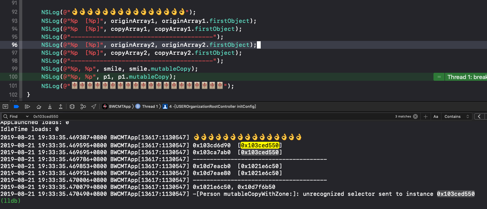

# 深拷贝实践

## 背景

组织结构面包屑导航交互修改

旧版：

<video src="../../src/video/RPReplay_Final1566384692.MP4" width="320" height="180" controls="controls"></video> 

新版：

<video src="../../src/video/RPReplay_Final1566384154.MP4" width="320" height="180" controls="controls"></video> 


现在有三级页面 pageA pageB pageC，从旧版交互改到新版，变化的地方在于：之前从pageB到pageA，只有pop一种方式，现在是可以一直push下去。

实现思路就是从self.navigationController.childViewControllers里，取出pageA，拷贝一份pageA-copy出来，然后直接push到pageA-copy

## 错误的实现方式：直接赋值

```objc
 // step1: 找到上一级页面
 USEROrganizationViewController *tempVC = (USEROrganizationViewController *)[self _findOrganizationVC:[USEROrganizationViewController class]];
 // step2: 复制一份新的出来
 USEROrganizationViewController *vc1 = [[USEROrganizationViewController alloc] init];
 vc1 = tempVC;
```

正确的实现方式：深拷贝
```objc

@interface Person : NSObject <NSCopying, NSMutableCopying>

@property (nonatomic, copy) NSString *name;

@end

@implementation Person

- (id)copyWithZone:(NSZone *)zone {

    Person *person = [Person allocWithZone:zone];
    person.name = self.name;
    return person;

}

- (id)mutableCopyWithZone:(NSZone *)zone {

    Person *person = [Person allocWithZone:zone];
    person.name = self.name;
    return person;

}

@end

// 测试
Person *p1 = [[Person alloc] init];    
p1.name = @"小光";
Person *p2 = p1.mutableCopy;
NSLog(@"%p, %p, [p2 name is %@]", p1, p2, p2.name); // 2019-08-21 20:08:11.370119+0800 BWCMTApp[13753:1141151] 0x10efe32a0, 0x10ef90e90, [p2 name is 小光]
```


## 利用runtime实现深拷贝
```objc

@interface Person : NSObject

@property (nonatomic, strong) NSString *name;

- (void)copy:(NSObject *)object;

@end


@implementation Person

- (void)copy:(NSObject *)object {
    unsigned int property_count = 0;
    objc_property_t * propertys = class_copyPropertyList([object class], &property_count);
    for (int i = 0; i < property_count; i++) {
        objc_property_t property = propertys[i];
        const char * property_name = property_getName(property);
        NSString * property_name_string = [NSString stringWithUTF8String:property_name];
        [self setValue:[object valueForKey:property_name_string] forKey:property_name_string];
    }
    free(propertys);
}

@end


// 测试
Person *p1 = [[Person alloc] init];
p1.name = @"小光";

Person *p2 = [Person new];
[p2 copy:p1];
NSLog(@"%p, %p, %@", p1, p2, p2.name);  // 2019-08-21 19:53:50.009016+0800 BWCMTApp[13700:1136755] 0x10d944280, 0x107da3e80, 小光


```
## 一个思考题
```objc

// 定义一个类
@interface Person : NSObject 
@property (nonatomic, strong) NSString *name;

@end

@implementation Person

@end

// 猜测一下代码打印的结果
Person *p1 = [[Person alloc] init];
p1.name = @"小光";
NSMutableArray *originArray1 = [NSMutableArray arrayWithObject:p1];
NSMutableArray *copyArray1 = [originArray1 mutableCopy];

NSString *smile = @"哈哈";
NSMutableArray *originArray2 = [NSMutableArray arrayWithObject:smile];
NSMutableArray *copyArray2 = [originArray2 mutableCopy];


    NSLog(@"👌👌👌👌👌👌👌👌👌👌👌👌👌👌👌");

    NSLog(@"%p  [%p]", originArray1, originArray1.firstObject);

    NSLog(@"%p  [%p]", copyArray1, copyArray1.firstObject);

    NSLog(@"---------------------------------------");

    NSLog(@"%p  [%p]", originArray2, originArray2.firstObject);

    NSLog(@"%p  [%p]", copyArray2, copyArray2.firstObject);

    NSLog(@"---------------------------------------");

    NSLog(@"%p, %p", smile, smile.mutableCopy);

    NSLog(@"%p, %p", p1, p1.mutableCopy);

    NSLog(@"🀄️🀄️🀄️🀄️🀄️🀄️🀄️🀄️🀄️🀄️🀄️🀄️🀄️🀄️🀄️🀄️🀄️🀄️🀄️🀄️");
```


运行结果：


