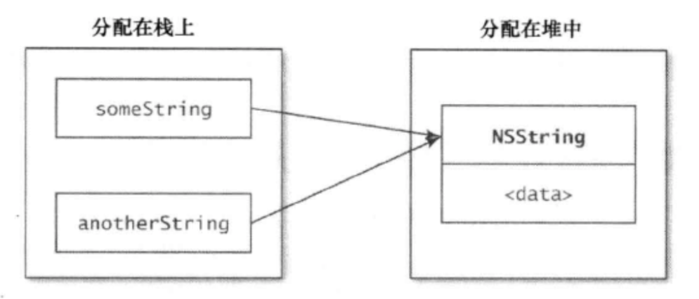

- [什么是动态绑定](#%e4%bb%80%e4%b9%88%e6%98%af%e5%8a%a8%e6%80%81%e7%bb%91%e5%ae%9a)
- [OC 对象存放位置](#oc-%e5%af%b9%e8%b1%a1%e5%ad%98%e6%94%be%e4%bd%8d%e7%bd%ae)
- [引用计数机制和运行时关系](#%e5%bc%95%e7%94%a8%e8%ae%a1%e6%95%b0%e6%9c%ba%e5%88%b6%e5%92%8c%e8%bf%90%e8%a1%8c%e6%97%b6%e5%85%b3%e7%b3%bb)
- [为什么要尽量少的引用其他头文件](#%e4%b8%ba%e4%bb%80%e4%b9%88%e8%a6%81%e5%b0%bd%e9%87%8f%e5%b0%91%e7%9a%84%e5%bc%95%e7%94%a8%e5%85%b6%e4%bb%96%e5%a4%b4%e6%96%87%e4%bb%b6)
- [使用字面量创建新值要注意什么](#%e4%bd%bf%e7%94%a8%e5%ad%97%e9%9d%a2%e9%87%8f%e5%88%9b%e5%bb%ba%e6%96%b0%e5%80%bc%e8%a6%81%e6%b3%a8%e6%84%8f%e4%bb%80%e4%b9%88)
- [const、static、extern](#conststaticextern)
- [属性的实质](#%e5%b1%9e%e6%80%a7%e7%9a%84%e5%ae%9e%e8%b4%a8)
- [属性修饰符](#%e5%b1%9e%e6%80%a7%e4%bf%ae%e9%a5%b0%e7%ac%a6)
- [weak 和 unsafe_unreatined 的区别](#weak-%e5%92%8c-unsafeunreatined-%e7%9a%84%e5%8c%ba%e5%88%ab)
- [MRC 环境下重写一个 strong 修饰的属性的存取方法](#mrc-%e7%8e%af%e5%a2%83%e4%b8%8b%e9%87%8d%e5%86%99%e4%b8%80%e4%b8%aa-strong-%e4%bf%ae%e9%a5%b0%e7%9a%84%e5%b1%9e%e6%80%a7%e7%9a%84%e5%ad%98%e5%8f%96%e6%96%b9%e6%b3%95)
- [weak 属性自动置 nil 的原理？](#weak-%e5%b1%9e%e6%80%a7%e8%87%aa%e5%8a%a8%e7%bd%ae-nil-%e7%9a%84%e5%8e%9f%e7%90%86)
- [为什么要用 copy 修饰 NSString 属性？](#%e4%b8%ba%e4%bb%80%e4%b9%88%e8%a6%81%e7%94%a8-copy-%e4%bf%ae%e9%a5%b0-nsstring-%e5%b1%9e%e6%80%a7)
- [对象等同性判断](#%e5%af%b9%e8%b1%a1%e7%ad%89%e5%90%8c%e6%80%a7%e5%88%a4%e6%96%ad)
#### 什么是动态绑定

OC 是消息型语言。方法调用的时候，在运行时才回去查找要执行的方法。编译器不关心接收消息的对象是何种类型。接受消息的对象问题也要在运行时处理，其过程叫做动态绑定 dynamic binding.

#### OC 对象存放位置
```objc
NSString *someString = @"Nem is watching you!";
```
上述代码的含义是：`someString` 变量指向分配在堆中的某块内存，其中还有一个 `NSString` 对象。

对象所占内存总是分配在 **堆 heap** 中。

`someString` 变量类型是指针 `NSString *`，这个存放位置是 **栈 stack** 。



分配在堆中的内存必须直接管理，而分配在栈上用于保存变量的内存则会在其栈帧弹出时自动清理。

不含 `*` 的变量，他们可能使用栈空间。这些变量保存的不是 OC 对象，例如 CGRect。

#### 引用计数机制和运行时关系

OC 将堆内存管理抽象出来了，把这部分工作抽象为一套内存管理架构，名叫“引用计数”。

自动引用计数是运行时 runtime 和 LLVM 协作的结果。

#### 为什么要尽量少的引用其他头文件

>C CPP OC 这三种语言都使用‘头文件’和‘实现文件’来区隔代码。

原因如下：
- 能够减少编译时间
- 能够解决两个类互相引用导致的循环引用问题。虽然使用 `#imoprt` 而非 `#include` 指令不会导致死循环，但却意味着两个类里有一个无法被正确的编译。
   
应该尽量使用‘向前声明 forward declaring’而非引入头文件。
```objc
// Person.h
#import <Foundation/Foundation.h>

// #import "Employee.h"
@class Employee;

@interface Person : NSObject
@property (strong, nonatomic) Employee *employee00;
@end
```

尽量把协议放到单独的头文件里，而非放到一个大的头文件里。

声明某个类遵循协议，尽量把这个声明放到类的实现文件里（class-continuation 分类）。
```objc
// ViewController.m 
@interface ViewController ()<UITableViewDataSource, UITableViewDelegate>  
@end
```

#### 使用字面量创建新值要注意什么
> 语法糖：计算机语言中与另外一套语法等效但是开发者用起来却更加方便的写法。
```objc
NSNumber *num = @2.f;
NSArray *temp = @[@"i", @"am", @"Nem"]; 
```

使用字面量的时候，需要注意不要往数组或字典中插入 nil 值。

#### const、static、extern
```objc
static const NSTimeInterval kAnmiationDuration = 0.3;
```
const：一经赋值，就不可更改。如果试图修改 const 修饰的变量，编译器会报错。

static：意味着该变量仅在定义此变量的编译单元中可见。（OC中，编译单元通常指实现文件.m）

extern：声明一个为外界可见的常值变量。存放在**全局符号表**中。
```objc
// .h
extern NSString *const RedColorHex;
// .m
NSString *const RedColorHex = @"FD0000";
```

#### 属性的实质

使用 `@property` 声明一个属性。

属性实质是：实例变量 + 存取方法。

OC 把实例变量当做一种存储偏移量的特殊变量，交由**类对象**保管。TODO偏移量会在运行时查找，如果类的定义变了，那么存储的偏移量也变了，这样无论何时访问实例变量，总能使用正确的偏移量。甚至可以在运行期间向类中新增实例变量。

使用属性的时候，编译器会自动编写访问这些属性所需的方法，这一过程叫做**自动合成**。

声明一个属性，编译器所做的工作有：
- 生成访问属性的存取方法 setter getter
- 自动向类中添加适当类型的实例变量。变量名是属性名前加上 `_`。

可以使用 `@synthesize` 指定实例变量的名字。
```objc
// .m
@implementation Person
@synthesize firstname = _myFirstName;
@synthesize lastname = _myLastName;
```

阻止编译器生成存取方法：
- 自己实现存取方法。如果自己仅实现一个 setter 方法，那么 getter 还是由编译器生成。
- 使用 `@dynamic` 关键字，作用是告诉编译器，不要自动创建实现属性所用的实例变量，也不要为其创建存取方法。应用场景如下：
  ```objc
  // .h
  @interface Person : NSManagedObject // CoreData 框架
  @property NSString *firstname;
  @end
  // .m
  @implementation Person
  @dynamic firstname;
  @end
  ```

#### 属性修饰符
- 原子性：使用 nonatomic 修饰，没有同步锁。
- 读写权限：readwrite 自动生成存取两个方法。readonly 仅生成取 getter 方法。
- 内存管理
  - assign：针对基本类型
  - strong：表明该属性定义了一种“拥有关系”。为属性设置新值时，会先保留新值，并释放旧值，然后再将新值设置上去。
  - weak：表明该属性定义了一种“非拥有关系”。设置新值时，设置方法既不保留新值，也不释放旧值。然而属性所指向的对象摧毁时，属性值也会清空。（runtime 机制自动置nil）
  - unsafe_unretained：表达“非拥有关系”，和 weak 区别在于，对象摧毁时候，属性值不会自动清空。
  - copy：表达“拥有关系”。然而设置方法不保留新值，而是将其拷贝。
- 方法名：指定存取方法
    ```objc
    // 指定属性的取方法名为 isOn
    @property (nonatomic, getter=isOn) BOOL on;
    ```

#### weak 和 unsafe_unreatined 的区别
区别在于 weak 属性会在对象摧毁时，属性值自动置清空。而 unsafe_unreatined 属性不会自动清空属性值，可能导致野指针问题。

#### MRC 环境下重写一个 strong 修饰的属性的存取方法
```objc
// .h
@property (nonatomic, strong) NSString *name;
// .m
- (void)setName:(NSString *)name {
    if (_name != name) {
        [_name release]; // 释放旧值，引用计数减一
        _name = name; // 保留新值，引用计数加一
    }
}
- (NSString *)name {
// 将实例变量的引用计数加1后,添加自动减1作用,
// 保证调用getter方法取值时可以取到值的同时在完全不需要使用后释放
    return [[_name retain] autorelease];
}
```

#### weak 属性自动置 nil 的原理？
内存管理方法 `dealloc` 的实现中有一个步骤是：将指向该对象的弱引用指针置为 nil，这一过程通过 runtime 机制实现。

#### 为什么要用 copy 修饰 NSString 属性？
给属性赋值时候，可能传递过来的是一个 NSMutableString 属性的变量，这时候先 copy 一份不可变的值出来，再赋值给该属性。能够避免属性在不之情的情况下被篡改。

#### 对象等同性判断
```objc
- (BOOL)isEqual:(id)object;
- (NSUInteger)hash;
```

---
TODO 第8条