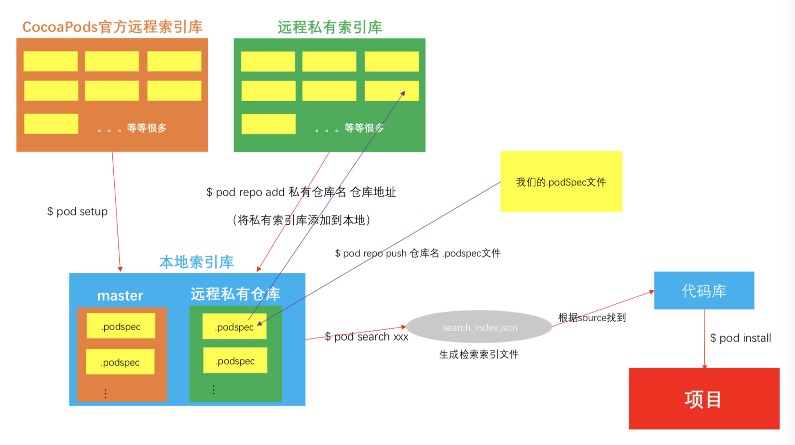

# cocoapods私有库的封装

## 创建索引库

- 在origin创建私有索引库

  

- 将创建的私有索引库clone到本地

  ```shell
  # wbSpecs 私有索引库名字
  # https://github.com/AllenSWB/wbSpecs.git 私有索引库origin路径
  pod repo add wbSpecs https://github.com/AllenSWB/wbSpecs.git
  ```

  执行完命令可以在本地索引库看到 wbSpecs 已经添加进来了。本地索引库路径是`/Users/userNamexxx/.cocoapods/repos`

  

## 创建私有库

- 在origin创建一个空工程 TestVendor

	

	

- 在本地创建一个模板工程（会直接创建好`.podspec`文件），执行命令 `pod lib create TestVendor`


```shell
wenbosundeMBA:Desktop wenbo.sun$ pod lib create TestVendor
Cloning `https://github.com/CocoaPods/pod-template.git` into `TestVendor`.
Configuring TestVendor template.

------------------------------

To get you started we need to ask a few questions, this should only take a minute.

If this is your first time we recommend running through with the guide:
 - https://guides.cocoapods.org/making/using-pod-lib-create.html
 ( hold cmd and click links to open in a browser. )


What platform do you want to use?? [ iOS / macOS ]
 > ios

What language do you want to use?? [ Swift / ObjC ]
 > objc

Would you like to include a demo application with your library? [ Yes / No ]
 > yes

Which testing frameworks will you use? [ Specta / Kiwi / None ]
 > none

Would you like to do view based testing? [ Yes / No ]
 > no

What is your class prefix?
 > TV

Running pod install on your new library.

Analyzing dependencies
Fetching podspec for `TestVendor` from `../`
Downloading dependencies
Installing TestVendor (0.1.0)
Generating Pods project
Integrating client project

[!] Please close any current Xcode sessions and use `TestVendor.xcworkspace` for this project from now on.
Sending stats
Pod installation complete! There is 1 dependency from the Podfile and 1 total pod installed.

 Ace! you're ready to go!
 We will start you off by opening your project in Xcode
  open 'TestVendor/Example/TestVendor.xcworkspace'

To learn more about the template see `https://github.com/CocoaPods/pod-template.git`.
To learn more about creating a new pod, see `http://guides.cocoapods.org/making/making-a-cocoapod`.
wenbosundeMBA:Desktop wenbo.sun$
```

模板工程如下：


把私有库的代码放到`ReplaceMe.m`文件所在的目录，删掉`ReplaceMe.m`文件

- 将本地的模板工程和origin repo关联起来

  ```shell
  # 执行以下两条命令
  git remote add origin https://github.com/AllenSWB/TestVendor.git
  git push -u origin master 
  ```

- 将私有库代码加进来

  

- 打tag，将本地更改推送到origin

  ```shell
  git tag 0.1.0
  git add .
  git commit -m '添加私有库代码'
  git push
  ```

- 编辑`TestVendor.podspec`文件

  ```ruby
  #
  # Be sure to run `pod lib lint TestVendor.podspec' to ensure this is a
  # valid spec before submitting.
  #
  # Any lines starting with a # are optional, but their use is encouraged
  # To learn more about a Podspec see https://guides.cocoapods.org/syntax/podspec.html
  #
  
  Pod::Spec.new do |s|
    s.name             = 'TestVendor'
    s.version          = '0.1.0'
    s.summary          = '简介 TestVendor.'
    s.description      = '一定要比简介长 哈哈哈哈哈哈哈哈'
    s.homepage         = 'https://github.com/allenswb/TestVendor'
    s.license          = { :type => 'MIT', :file => 'LICENSE' }
    s.author           = { 'allenswb' => 'wenbo.sun@ucarinc.com' }
    s.source           = { :git => 'https://github.com/allenswb/TestVendor.git', :tag => s.version.to_s }
    # s.social_media_url = 'https://twitter.com/<TWITTER_USERNAME>'
  
    s.ios.deployment_target = '8.0'
  
    s.source_files = 'TestVendor/Classes/**/*'
    
    # s.resource_bundles = {
    #   'TestVendor' => ['TestVendor/Assets/*.png']
    # }
  
    # s.public_header_files = 'Pod/Classes/**/*.h'
    # s.frameworks = 'UIKit', 'MapKit'
    # s.dependency 'AFNetworking', '~> 2.3'
  end
  ```

- 本地校验`.podspec`文件

  ```shell
  # --allow-warnings 参数是忽略警告
  pod lib lint --allow-warnings
  
  # eg: 
  wenbosundeMBA:TestVendor wenbo.sun$ pod lib lint --allow-warnings
  
   -> TestVendor (0.1.0)
      - WARN  | url: The URL (https://github.com/allenswb/TestVendor) is not reachable.
      - NOTE  | xcodebuild:  note: Using new build system
      - NOTE  | [iOS] xcodebuild:  note: Planning build
      - NOTE  | [iOS] xcodebuild:  note: Constructing build description
      - NOTE  | [iOS] xcodebuild:  warning: Skipping code signing because the target does not have an Info.plist file. (in target 'App')
  
  TestVendor passed validation.
  ```

- 远端校验`.podspec`文件

  ```shell
  pod spec lint --allow-warnings
  
  # eg:
  wenbosundeMBA:TestVendor wenbo.sun$ pod spec lint --allow-warnings
  
   -> TestVendor (0.1.0)
      - WARN  | url: The URL (https://github.com/allenswb/TestVendor) is not reachable.
      - NOTE  | xcodebuild:  note: Using new build system
      - NOTE  | [iOS] xcodebuild:  note: Planning build
      - NOTE  | [iOS] xcodebuild:  note: Constructing build description
      - NOTE  | [iOS] xcodebuild:  warning: Skipping code signing because the target does not have an Info.plist file. (in target 'App')
  
  Analyzed 1 podspec.
  
  TestVendor.podspec passed validation.
  ```

- 上传`.podspec`文件到索引库

  ```shell
  # wbSpecs 索引库的名字
  # TestVendor.podspec 私有库.podspec文件
  pod repo push wbSpecs TestVendor.podspec
  
  # eg: 
  wenbosundeMBA:TestVendor wenbo.sun$ pod repo push wbSpecs TestVendor.podspec
  
  Validating spec
   -> TestVendor (0.1.0)
      - WARN  | url: The URL (https://github.com/allenswb/TestVendor) is not reachable.
      - NOTE  | xcodebuild:  note: Using new build system
      - NOTE  | [iOS] xcodebuild:  note: Planning build
      - NOTE  | [iOS] xcodebuild:  note: Constructing build description
      - NOTE  | [iOS] xcodebuild:  warning: Skipping code signing because the target does not have an Info.plist file. (in target 'App')
  
  Updating the `wbSpecs' repo
  
  Already up to date.
  
  Adding the spec to the `wbSpecs' repo
  
   - [Add] TestVendor (0.1.0)
  
  Pushing the `wbSpecs' repo
  
  wenbosundeMBA:TestVendor wenbo.sun$
  ```

  完成后可以看到本地索引库和origin索引库里已经有我们的私有库了

  

  可以搜索到了

  ```shell
  pod search TestVendor
  
  -> TestVendor (0.1.0)
     简介 TestVendor.
     pod 'TestVendor', '~> 0.1.0'
     - Homepage: https://github.com/allenswb/TestVendor
     - Source:   https://github.com/allenswb/TestVendor.git
     - Versions: 0.1.0 [wbSpecs repo]
  ```

## 使用私有库

这时候将 `pod 'TestVendor', '~> 0.1.0'`一行加入到工程的podfile文件里，然后`pod install`，会报错。


原因是默认从Cocoapods官方索引库里下载代码，我们需要把自己的索引库加上。

- 查看所有索引库

  ```shell
  pod repo
  
  # eg:
  wenbosundeMBA:TestVendor wenbo.sun$ pod repo 
  # cocoapods官方索引库
  master
  - Type: git (master)
  - URL:  https://github.com/CocoaPods/Specs.git
  - Path: /Users/wenbo.sun/.cocoapods/repos/master
  # 私有的索引库
  wbSpecs
  - Type: git (master)
  - URL:  https://github.com/AllenSWB/wbSpecs.git
  - Path: /Users/wenbo.sun/.cocoapods/repos/wbSpecs
  
  5 repos
  wenbosundeMBA:TestVendor wenbo.sun$
  ```

- 解决方案：添加上source

  ```ruby
  # Podfile文件
  use_frameworks!
  
  source 'https://github.com/CocoaPods/Specs.git'
  source 'https://github.com/AllenSWB/wbSpecs.git'
  
  platform :ios, '8.0'
  
  target 'TestVendor_Example' do
    pod 'TestVendor', '~> 0.1.0'
  end
  ```

  再`pod install`就可以成功了

  ```shell
  wenbosundeMBA:Example wenbo.sun$ pod install
  Analyzing dependencies
  Downloading dependencies
  Installing TestVendor (0.1.0)
  Generating Pods project
  Integrating client project
  Sending stats
  Pod installation complete! There is 1 dependency from the Podfile and 1 total pod installed.
  ```

## 命令总结

```shell
# 根据模板创建私有库
pod lib create TestVendor	# TestVendor 私有库名

# 将local repo 关联 origin repo
git remote add origin https://github.com/AllenSWB/TestVendor.git
git push -u origin master 

# 打tag
git tag 0.1.1
# 删除tag
git tag -d 0.1.1
# 将 0.1.1的tag push到origin
git push origin 0.1.1
# 上传本地所有tag到origin
git push origin --tags 

# 本地校验podspec文件
pod lib lint --allow-warnings
# 远端校验podspec文件
pod spec lint --allow-warnings

# 上传podspec文件
# wbSpecs 索引库的名字
# TestVendor.podspec 私有库.podspec文件
pod repo push wbSpecs TestVendor.podspec
```

## cocoapods原理

+ 它是将所有依赖库都放到一个名为**Pods**的项目中。

+ **Pods**项目最终会编译成一个名为`libPods.a`的文件，主项目只要依赖这个`.a`文件即可。这样，依赖库源码管理工作就从主项目移到了**Pods**项目中。

+ 对于资源文件，CocoaPods 提供了一个名为`Pods-resources.sh` 的 bash 脚本，该脚本在每次项目编译的时候都会执行，将第三方库的各种资源文件复制到目标目录中。

+ CocoaPods 通过一个名为 `Pods.xcconfig` 的文件来在编译时设置所有的依赖和参数。

  

  

## 参考链接

+ 创建三方库 https://www.jianshu.com/p/a57b696510e9
+ 常见私有库 https://www.jianshu.com/p/558dd48273d0