- [lldb常用命令](#lldb%e5%b8%b8%e7%94%a8%e5%91%bd%e4%bb%a4)
- [chisel](#chisel)
- [链接](#%e9%93%be%e6%8e%a5)

## lldb常用命令

1. 最常用的几个命令

   + `po`： 打印

        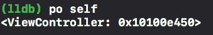

    + `breakpoint`： 打断点

        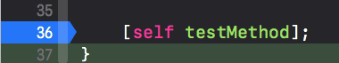
    
2. 控制流快捷键对应的命令

    

    + `c`： 继续，程序恢复执行
    + `n`： step over，单步执行 
    + `s`： step in，进入执行。eg: 断点打在方法调用处，执行step in操作，进入方法内部

        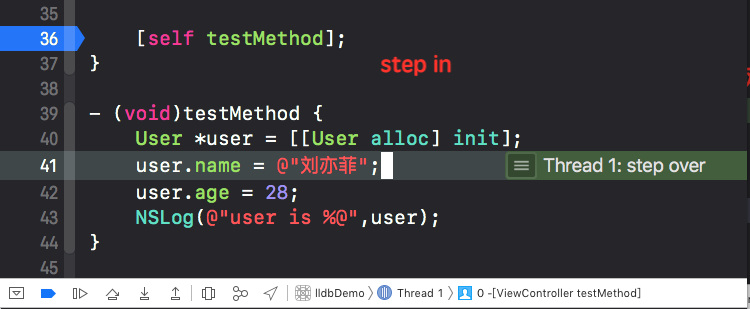

    + `finish`： step out，跳出。eg: 在方法内部，执行step out操作，跳出当前方法

        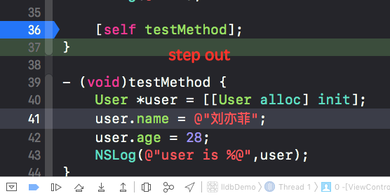

    查看帮助

    + `help`：查看所有可用的`lldb`命令
    + `help xx`：查看`xx`命令的帮助。类似终端中的`man`命令。eg: `help po`

        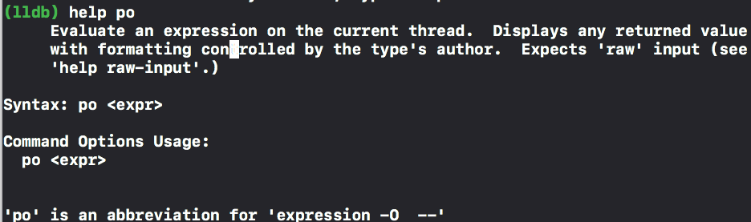

3. 调试过程中自动创建标签页

    如果当前停留在A页面，断点打在了B页面，开启这个功能。走过断点的时候Xcode会自动为B页面创建一个新的tab。

    设置 -> Behaviors -> Runing -> Pause - 选中 show Tab Name xxx in active window

    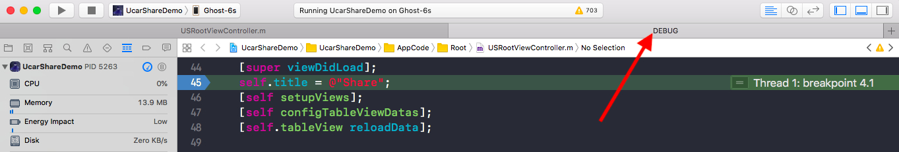

4. 修改状态: `expr` 命令

    走到第30行代码的时候，在控制台输入命令`expr`，修改news.author为"林肯"，最后打印出来的就是我们修改后的值

    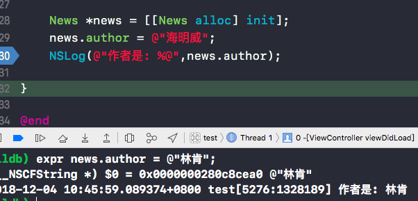

5. 断点编辑功能

    1> 打断点，右键，Edit Breakpoint

    

    2> 输入条件 `condition`；在 `action` 一栏输入一些调试命令

    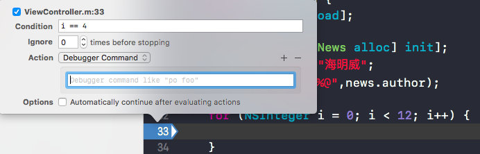

    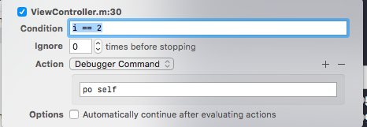

    3> 执行

    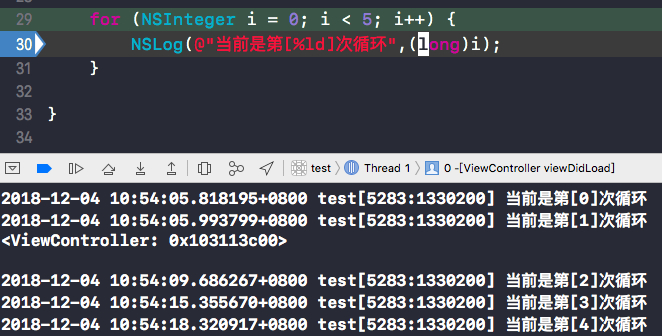

6. `Symbolic Breakpoint`

    1> 增加全局断点 

    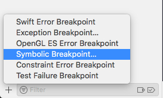

    2> 设置`Symbol`

    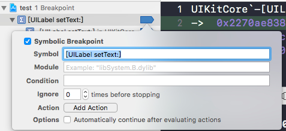

    3> 程序走到断点位置

    `po $arg1` ; `po $arg2` 打印

    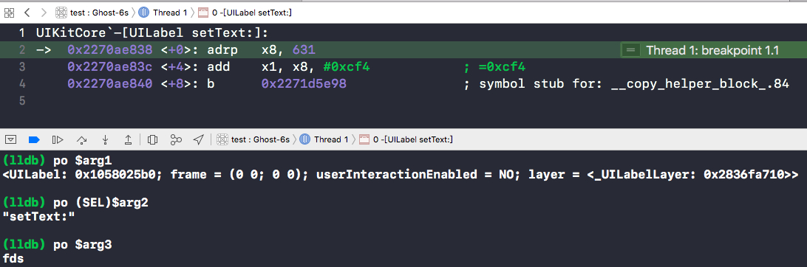

## chisel

+ [chisel by facebook](https://github.com/facebook/chisel) 

lldb还支持Python脚本扩展，chisel就是facebook团队开源的一个lldb扩展集，提供了一些很方便的操作接口。
    
安装步骤：

+ `brew install chisel`

+ `cd ~`切到home目录下，查看有没有`.lldbinit`这个文件，如果没有的话创建一个`touch .lldbinit`。

+ 执行`open .lldbinit`，打开`.lldbinit`文件。

+ 把下面两行添加到文件末尾，保存退出。下次打开Xcode就可以使用chisel里的扩展命令了~

        command script import /usr/local/opt/chisel/libexec/fblldb.py
        command script import /path/to/fblldb.py

使用：

  + `pviews`：打印当前视图层级。

      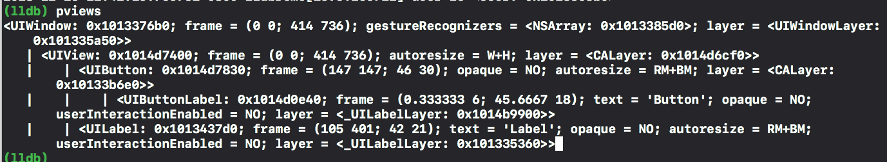

      使用lldb命令能达到同样的效果 `po [[[UIApplication sharedApplication] keyWindow] recursiveDescription]`

      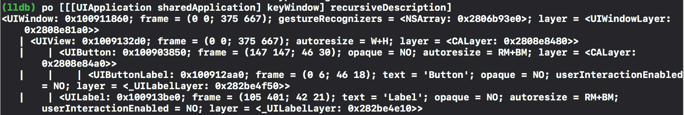
  
  + `flicker`：闪烁视图，以便开发者能快速找到它。

      eg: `flicker 0x100903850`，执行这个命令，看到手机上对应的UIButton按钮闪烁了一下。

      另，此时我用一个image view挡住了这个button，执行这个命令是看不到闪烁的，因为被挡住了😅

  + `hide` & `show`： 隐藏或者显示一个view/layer

      eg: 执行`hide 0x1005136d0`，可以看到手机上这个image view被隐藏了，露出来了它下面的button按钮。
      执行`show 0x1005136d0`又显示出来了。

  + `mask` & `unmask`：`mask`是给view加个框。`unmask`相反效果。

      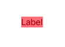
  
  + `pbundlepath`：打印main bundle路径

     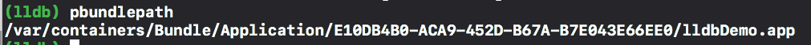

  + `plass`：打印一个实例的继承关系

      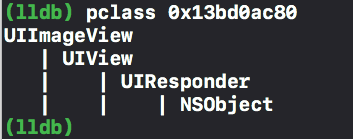

  + `caflush`：强制刷新界面. force Core Animation flush

      示例：将当前控制器的背景色改成红色。

      - `pviews`：打印当前视图层级。得到self.view的ID是`0x13be12330`
      - `expr id $tempView = (id)0x13be12330`：将self.view绑定到tempView
      - `expr (void)[$tempView setBackgroundColor:[UIColor redColor]]`：设置tempView的背景色为红色
      - `caflush`：强制刷新界面。可以看到此时手机背景色成了红色了。

      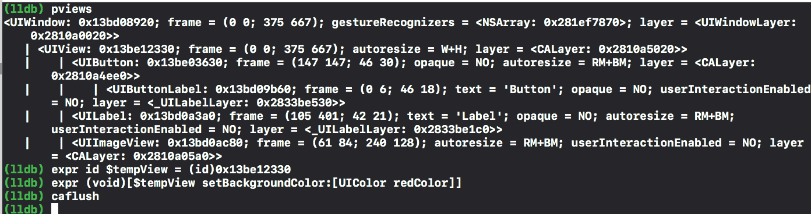

      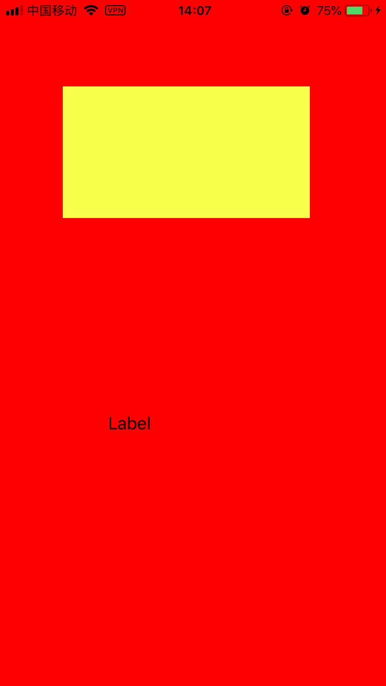

## 链接

+ [lldb tutorial](https://lldb.llvm.org/tutorial.html)
+ [WWDC 2018：效率提升爆表的 Xcode 和 LLDB 调试技巧](https://juejin.im/post/5b1cd870e51d4506dc0ac76c)

