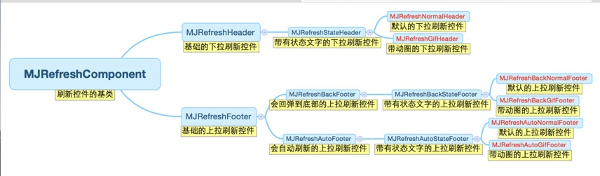
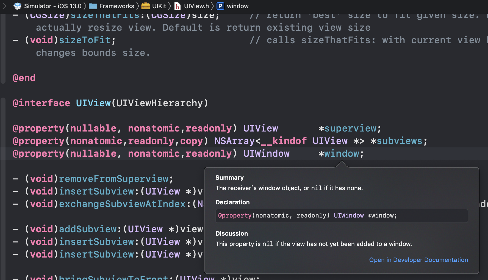

- [MJRefresh里的几个细节](#mjrefresh%e9%87%8c%e7%9a%84%e5%87%a0%e4%b8%aa%e7%bb%86%e8%8a%82)
  - [KVO的使用](#kvo%e7%9a%84%e4%bd%bf%e7%94%a8)
  - [`if (self.window) {}`的使用](#if-selfwindow-%e7%9a%84%e4%bd%bf%e7%94%a8)
  - [使用`msg_objSend`直接调用方法](#%e4%bd%bf%e7%94%a8msgobjsend%e7%9b%b4%e6%8e%a5%e8%b0%83%e7%94%a8%e6%96%b9%e6%b3%95)
# MJRefresh里的几个细节



## KVO的使用

```objc
// MJRefreshConst.h

NSString *const MJRefreshKeyPathContentOffset = @"contentOffset";
NSString *const MJRefreshKeyPathContentInset = @"contentInset";
NSString *const MJRefreshKeyPathContentSize = @"contentSize";
```

```objc
// MJRefreshComponent.m

#pragma mark - KVO监听
- (void)addObservers
{
    NSKeyValueObservingOptions options = NSKeyValueObservingOptionNew | NSKeyValueObservingOptionOld;
    [self.scrollView addObserver:self forKeyPath:MJRefreshKeyPathContentOffset options:options context:nil];
    [self.scrollView addObserver:self forKeyPath:MJRefreshKeyPathContentSize options:options context:nil];
    self.pan = self.scrollView.panGestureRecognizer;
    [self.pan addObserver:self forKeyPath:MJRefreshKeyPathPanState options:options context:nil];
}
```

Q: 为什么这里可以要用kvo的方法监听contentOffset，而不是用scrollview的代理方法

A: 避免影响到正常业务代码对scrollView.delegate的使用

## `if (self.window) {}`的使用
```objc
// MJRefreshComponent.m

#pragma mark 进入刷新状态
- (void)beginRefreshing
{
    [UIView animateWithDuration:MJRefreshFastAnimationDuration animations:^{
        self.alpha = 1.0;
    }];
    self.pullingPercent = 1.0;
    // 只要正在刷新，就完全显示
    if (self.window) {
        self.state = MJRefreshStateRefreshing;
    } else {
        // 预防正在刷新中时，调用本方法使得header inset回置失败
        if (self.state != MJRefreshStateRefreshing) {
            self.state = MJRefreshStateWillRefresh;
            // 刷新(预防从另一个控制器回到这个控制器的情况，回来要重新刷新一下)
            [self setNeedsDisplay];
        }
    }
}
```

这里用了`self.window`来判断调用beginRefresh方法的时候是否在当前tableView所在的页面了 ！ 

window的声明见下图。 



Q1: 怎么判断一段controller里的方法执行的时候，这个controller是否已经可见了

A1: 用 self.window 来判断！如果self.window已经存在了，就是说当前页面已经可见了！


Q2: 一个controller被加入和移除到`[UIApplication sharedApplication].keyWindow`上的时机是？

A2: 实测无论这个controller是push还是pop出来的，时机都是`viewDidAppear`和`viewDidDisappear`


## 使用`msg_objSend`直接调用方法

```objc
// MJRefreshConst.h

// 运行时objc_msgSend
#define MJRefreshMsgSend(...) ((void (*)(void *, SEL, UIView *))objc_msgSend)(__VA_ARGS__)
#define MJRefreshMsgTarget(target) (__bridge void *)(target)
```

```objc
// MJRefreshComponent.m

// 执行刷新方法
- (void)executeRefreshingCallback
{
    MJRefreshDispatchAsyncOnMainQueue({
        if (self.refreshingBlock) {
            self.refreshingBlock();
        }
        if ([self.refreshingTarget respondsToSelector:self.refreshingAction]) {
            MJRefreshMsgSend(MJRefreshMsgTarget(self.refreshingTarget), self.refreshingAction, self);
        }
        if (self.beginRefreshingCompletionBlock) {
            self.beginRefreshingCompletionBlock();
        }
    })
}
```

Q: 为甚么要用`objc_msgSend`的方式调用`refreshingAction`

A: `self.refreshingTarget`就是当前这个`tableView`，`refreshingAction`是`refreshHeader`(继承自`MJRefreshComponent`)的一个属性，他们两个并没有直接的关联，所以要用这种方式调用。

```objc
// MJRefreshComponent.h

/** 回调对象 */
@property (weak, nonatomic) id refreshingTarget;
/** 回调方法 */
@property (assign, nonatomic) SEL refreshingAction;
```
