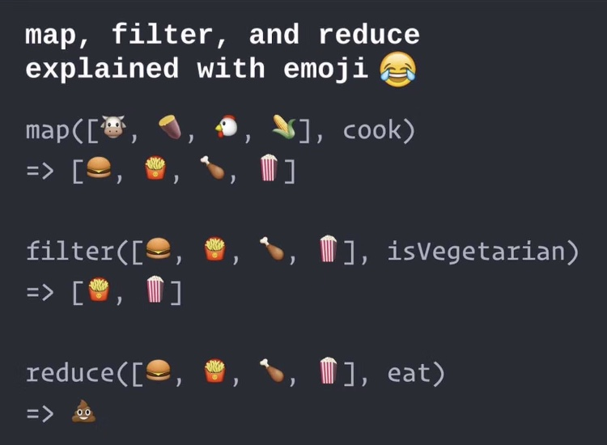
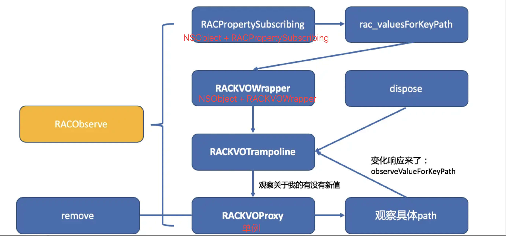

- [函数响应式编程](#函数响应式编程)
- [RAC](#rac)
- [RAC中的主要类](#rac中的主要类)
- [冷信号 热信号](#冷信号-热信号)
- [副作用](#副作用)
- [`map`、`fliter` ...](#mapfliter-)
- [RACObserve 宏](#racobserve-宏)
- [RAC双向绑定](#rac双向绑定)
- [RAC里的设计模式](#rac里的设计模式)
- [RAC使用注意内存问题](#rac使用注意内存问题)
- [RACObserve宏为什么会报 `Unknown warning group '-Wreceiver-is-weak', ignored`](#racobserve宏为什么会报-unknown-warning-group--wreceiver-is-weak-ignored)
- [`@weakify(...)` 和 `@strongify(...)` 两个宏的定义](#weakify-和-strongify-两个宏的定义)
- [rac中的 `materialize` && `dematerialize`](#rac中的-materialize--dematerialize)
- [RAC通知监听的移除](#rac通知监听的移除)
- [链接](#链接)

## 函数响应式编程

常见编程范式

  + 命令式
  + 函数式
  + 逻辑式
  + 响应式
  + ...
      
**函数式编程**中的`函数`，不是计算机中的函数，而是数学上的函数。即自变量映射。函数式强调的函数：
      
   + 不改变外部状态
   + 不依赖外部状态

函数是一等公民，可以在任何地方定义，在函数内或函数外，可以作为函数的参数和返回值，可以对函数进行组合。

函数式语言特点
   
   + 高阶函数
   + 偏应用函数
   + 柯里化 ？
   + 闭包

**纯函数：**  就是返回值只由输入值决定，而且没有可见副作用的函数或者表达式。纯函数的调用在相同参数下的返回值第二次不需要计算。

**响应式**是一个专注于数据流和变化传递的异步编程范式。这意味着可以在编程语言中很方便地表达静态或动态的数据流，而相关的计算模型会自动将变化的值通过数据流进行传播。  

## RAC
  
rac是函数响应式编程框架。

rac统一了kvo、UIevent、网络请求、async异步工作

+ `RACObserve(self.viewModel, inputPhoneNumber);`
+ `textfield.rac_textSignal`
+ 一个异步网络请求，可以返回一个`RACSubject`，然后将`RACSubject`绑定到一个subscriber或信号

任何的信号转换即是对原有信号进行订阅从而产生新的信号。

## RAC中的主要类

  ```objc
  RACStream 
  ----RACSignal 
  ------- RACSubject
  RACSequence
  ```

+ `RACStream`： 抽象类
  + RACSignal：一个随着时间改变值得信号。最常用的。 
    + `RACSubject`：RACSubject是继承自RACSignal，并且它还遵守RACSubscriber协议。这就意味着它既能订阅信号，也能发送信号。（网络失败）
  + `RACSequence`
+ `RACCommand`： 封装网络请求的时候用这个类
+ `RACSubscriber`

RACSubject使用的时候需要注意内存泄漏，RACSignal可以放心的使用。
 
## 冷信号 热信号 

+ [ReactiveCocoa 中 RACSignal 冷信号和热信号底层实现分析](https://www.jianshu.com/p/21beb4c59bcc)

**冷信号**

+ 冷信号是被动的，只有订阅的时候才会完整的发布消息。
+ 冷信号只能一对一，当有不同的订阅者，消息重新完整发送。

```objc
// 冷信号 eg:
RACSignal *signal = [[RACSignal createSignal:^RACDisposable * _Nullable(id<RACSubscriber>  _Nonnull subscriber) {
    // 触发信号
    [subscriber sendNext:@"hahaha"];
    [subscriber sendNext:@"hahahaee3"];
    [subscriber sendCompleted];
    
    return nil;
}] replay];

[signal subscribeNext:^(id  _Nullable x) {
    NSLog(@"订阅 %@",x);
}];

dispatch_after(dispatch_time(DISPATCH_TIME_NOW, (int64_t)(2 * NSEC_PER_SEC)), dispatch_get_main_queue(), ^{
    [signal subscribeNext:^(id  _Nullable x) {
           NSLog(@"新的订阅者 %@",x);
    }];
});
```
  
**热信号** RAC中所有的热信号都属于一个类RACSubject

+ 热信号是主动的，尽管你没有订阅事件，它会时刻推送；
+ 可以有多个订阅者，是一对多，集合可以与订阅者共享信息
  
```objc
// 1. 继承自RACSignal，且遵循协议RACSubscriber。意味着RACSubject既可以发送信号，也能订阅信号
@interface RACSubject<ValueType> : RACSignal<ValueType> <RACSubscriber>
@end


//2. RACSubject 把它的所有订阅者全部都保存到了NSMutableArray的数组里。既然保存了所有的订阅者，那么sendNext，sendError，sendCompleted时候遍历数组里的元素然后发送信号。
#pragma mark Subscription
- (RACDisposable *)subscribe:(id<RACSubscriber>)subscriber {
	NSCParameterAssert(subscriber != nil);

	RACCompoundDisposable *disposable = [RACCompoundDisposable compoundDisposable];
	subscriber = [[RACPassthroughSubscriber alloc] initWithSubscriber:subscriber signal:self disposable:disposable];

	NSMutableArray *subscribers = self.subscribers;
	@synchronized (subscribers) {
		[subscribers addObject:subscriber];
	}
	
	[disposable addDisposable:[RACDisposable disposableWithBlock:^{
		@synchronized (subscribers) { 
			NSUInteger index = [subscribers indexOfObjectWithOptions:NSEnumerationReverse passingTest:^ BOOL (id<RACSubscriber> obj, NSUInteger index, BOOL *stop) {
				return obj == subscriber;
			}];

			if (index != NSNotFound) [subscribers removeObjectAtIndex:index];
		}
	}]];

	return disposable;
}
 ``` 

RACSubject满足了热信号的特点，它即使没有订阅者，因为自己继承了RACSubscriber协议，所以自己本身就可以发送信号。冷信号只能被订阅了才能发送信号。

RACSubject可以有很多订阅者，它也会把这些订阅者都保存到自己的数组里。RACSubject之后再发送信号，订阅者就如同一起看电视，播放过的节目就看不到了，发送过的信号也接收不到了。接收信号。而RACSignal发送信号，订阅者接收信号都只能从头开始接受，如同看点播节目，每次看都从头开始看。


**冷信号如何转化为热信号**

+ 冷信号转换成热信号需要用到`RACMulticastConnection 广播`这个类。 

    冷信号和热信号的本质区别在于是否保持状态。冷信号的多次订阅是不保持状态的，而热信号的多次订阅可以保持状态。
    
    一种将冷信号转为热信号的方法就是，将冷信号订阅，订阅到的每一个时间通过RACSubject发送出去，其他订阅者只订阅这个RACSubject。

## 副作用

RACMulticastConnection 用于当一个信号，被多次订阅时，为了保证创建信号时，避免多次调用创建信号中的block，造成副作用，可以使用这个类处理。

 以下几个副作用的场景: 

  + 函数的处理过程中，修改了外部的变量，例如全局变量。
  + 函数的处理过程中，触发了一些额外的动作，例如发送了一个全局的Notification，在console里输入了一行信息，保存了文件，触发了网络，更新了屏幕等。
  + 函数的处理过程中，受到外部变量的影响，例如全局变量，方法中用到的成员变量。block中捕获的外部变量也算副作用。
  + 函数的处理过程中，受到线程锁的影响算副作用。


## `map`、`fliter` ...



## RACObserve 宏

+ [RAC 中的 RACObserve 监听流程分析](https://www.jianshu.com/p/dbeb0b45fdc8)

> demo的源码里有注释，RACObserve一路点下去 [demo](../../code/racDemo20191120/Pods/ReactiveObjC/ReactiveObjC/NSObject+RACPropertySubscribing.m)

```objc
#define _RACObserve(TARGET, KEYPATH) \
({ \
	__weak id target_ = (TARGET); \
	[target_ rac_valuesForKeyPath:@keypath(TARGET, KEYPATH) observer:self]; \
})

#if __clang__ && (__clang_major__ >= 8)
#define RACObserve(TARGET, KEYPATH) _RACObserve(TARGET, KEYPATH)
#else
#define RACObserve(TARGET, KEYPATH) \
({ \
	_Pragma("clang diagnostic push") \
	_Pragma("clang diagnostic ignored \"-Wreceiver-is-weak\"") \
	_RACObserve(TARGET, KEYPATH) \
	_Pragma("clang diagnostic pop") \
})
```  
 

```objc
NSLock *lock = [[NSLock alloc] init]; 
dispatch_async(dispatch_get_global_queue(DISPATCH_QUEUE_PRIORITY_DEFAULT, 0), ^{ 
    static void (^RecursiveMethod)(int); 
    RecursiveMethod = ^(int value) { 
        [lock lock];
        if (value > 0) { 
            NSLog(@"value = %d", value);
            sleep(2);
            RecursiveMethod(value - 1); // 递归的调用了这个block，上次的还没解锁，所以它需要等待锁被解除，这样就导致了死锁，线程被阻塞住了。
        }
        [lock unlock];
    }; 
    RecursiveMethod(5);
});

// 这个case里会造成死锁，终端里只会打印出 5 。
// 解决办法是换成递归锁 NSRecursiveLock
 NSRecursiveLock *lock = [[NSRecursiveLock alloc] init]; // 终端里会打印出 5 4 3 2 1
```

## RAC双向绑定 

+ [RAC双向绑定](https://www.jianshu.com/p/3bd2d3ca6210)

```objc
// 常见使用
RACChannelTo(self.viewModel, username) = self.usernameTextField.rac_newTextChannel;
```

```objc 
/* 
    1. RACChannelTermianl
    2. RACChannel -> leadingTerminal & followlingTerminal
    3. 直接使用RACChannel实现双向绑定，会出现堆栈溢出的错误。解决方案在RACKVOChannel
*/
#define RACChannelTo(TARGET, ...) \
    metamacro_if_eq(1, metamacro_argcount(__VA_ARGS__)) \
        (RACChannelTo_(TARGET, __VA_ARGS__, nil)) \
        (RACChannelTo_(TARGET, __VA_ARGS__))
 
#define RACChannelTo_(TARGET, KEYPATH, NILVALUE) \
    [[RACKVOChannel alloc] initWithTarget:(TARGET) keyPath:@keypath(TARGET, KEYPATH) nilValue:(NILVALUE)][@keypath(RACKVOChannel.new, followingTerminal)]
```

## RAC里的设计模式

+ [从ReactiveCocoa中能学到什么？不用此库也能学以致用](https://www.jianshu.com/p/39e27fef38fa)

  
  
  

## RAC使用注意内存问题

**RACObserve**

这个宏里面已经引用了self，使用的时候注意加上weakify strongify

**RACSubject**

+ 对subject进行map这样的操作，这时就需要sendCompleted
+ subject会持有订阅者
 
    + RACSubject
        - RACSubject和RACSignal虽然都是信号，但是他们有个本质的区别。
        - RACSubject会持有订阅者，而RACSignal不会持有订阅者。

**使用RAC必须保证信号SendError或者SendComplete**

 
## RACObserve宏为什么会报 `Unknown warning group '-Wreceiver-is-weak', ignored`


在之前的Xcode中如果消息接受者是一个weak对象，clang编译器会报receiver-is-weak警告，所以加了这段push&pop，最新的clang已经把这个警告给移除，所以没必要加push&pop了。

```objc
  #define RACObserve(TARGET, KEYPATH) \
({ \
_Pragma("clang diagnostic push") \
_Pragma("clang diagnostic ignored \"-Wreceiver-is-weak\"") \
__weak id target_ = (TARGET); \
[target_ rac_valuesForKeyPath:@keypath(TARGET, KEYPATH) observer:self]; \
_Pragma("clang diagnostic pop") \
})

  // 修改后的observe宏
  #define MTObserve(TARGET, KEYPATH) \
  ({ \
  __weak id target_ = (TARGET); \
  [target_ rac_valuesForKeyPath:@keypath(TARGET, KEYPATH) observer:self]; \
  })
```

## `@weakify(...)` 和 `@strongify(...)` 两个宏的定义

```objc

#define weakify(...) \
    rac_keywordify \
    metamacro_foreach_cxt(rac_weakify_,, __weak, __VA_ARGS__)

#define strongify(...) \
      rac_keywordify \
      _Pragma("clang diagnostic push") \
      _Pragma("clang diagnostic ignored \"-Wshadow\"") \
      metamacro_foreach(rac_strongify_,, __VA_ARGS__) \
      _Pragma("clang diagnostic pop")


  /**
      id foo = [[NSObject alloc] init];
      id bar = [[NSObject alloc] init];

      @weakify(foo, bar);

      // this block will not keep 'foo' or 'bar' alive
      BOOL (^matchesFooOrBar)(id) = ^ BOOL (id obj){
          // but now, upon entry, 'foo' and 'bar' will stay alive until the block has
          // finished executing
          @strongify(foo, bar);

          return [foo isEqual:obj] || [bar isEqual:obj];
      };
  */
```

## rac中的 `materialize` && `dematerialize`
   
 ```objc
 // .h文件

  1. materialize 将原signal的每个事件包装成RACEvent，通过返回的新signal的subscriber的sendNext:方法发送出去

  /// Converts each of the receiver's events into a RACEvent object.
  /// Returns a signal which sends the receiver's events as RACEvents, and
  /// completes after the receiver sends `completed` or `error`.
  - (RACSignal *)materialize;

  1. dematerialize 将RACEvent转为signal的事件

  /// Converts each RACEvent in the receiver back into "real" RACSignal events.
  /// Returns a signal which sends `next` for each value RACEvent, `error` for each
  /// error RACEvent, and `completed` for each completed RACEvent.
  - (RACSignal *)dematerialize;

  // .m文件

  - (RACSignal *)materialize {
      return [[RACSignal createSignal:^(id<RACSubscriber> subscriber) {
          return [self subscribeNext:^(id x) {
	    [subscriber sendNext:[RACEvent eventWithValue:x]];
   	} error:^(NSError *error) {
	    [subscriber sendNext:[RACEvent eventWithError:error]];
	    [subscriber sendCompleted];
    } completed:^{
	    [subscriber sendNext:RACEvent.completedEvent];
	    [subscriber sendCompleted];
    }];
   }] setNameWithFormat:@"[%@] -materialize", self.name];
  }
  
  - (RACSignal *)dematerialize {
   return [[self bind:^{
    return ^(RACEvent *event, BOOL *stop) {
	    switch (event.eventType) {
	    	case RACEventTypeCompleted:
		    	*stop = YES;
		    	return [RACSignal empty];
		    case RACEventTypeError:
		    	*stop = YES;
		    	return [RACSignal error:event.error];
		    case RACEventTypeNext:
		    	return [RACSignal return:event.value];
	    }
    };
   }] setNameWithFormat:@"[%@] -dematerialize", self.name];
  }
 ```

## RAC通知监听的移除
  
+ [RAC中监听通知的坑](https://juejin.im/post/5a30974ef265da433562bec2)

一个实例：

点击车控先去校验实名状态，因为实名状态可能会在后台被更改，所以要请求后台实时的数据。请求完最新实名状态后，再继续后面的操作。

  ```objc
  // UserRealNameAuthTool类
  - (void)commanVerifyRealNameWithDic:(NSDictionary *)params {

    RACSignal *ss = [[NSNotificationCenter defaultCenter] rac_addObserverForName:@"UserSyncVerifyInfoWithServerSuccessNoti" object:nil];
    
    self.disposableObj = [ss subscribeNext:^(id  _Nullable x) {
        NSLog(@"更新认证信息成功~!!!!!!");

        NSNotification *noti = (NSNotification *)x;
        BOOL syncSuccess = ((NSNumber *)noti.object).boolValue;
        if (syncSuccess) {
            NSLog(@"同步后台成功 - 更新认证信息成功~!!!!!");
        } else {
            NSLog(@"同步后台失败");
        }
        
        [UserRealNameAuthTool _handleToRealNameAuth:params];
        [self.disposableObj dispose];//rac 移除通知监听。这里如果不移除的话， 第n次调用commanVerifyRealNameWithDic的时候，就会打印n遍 "更新认证信息成功~!!!!!!""
    }];
    
    // 更新个人信息
    NSNotification *noti = [NSNotification notificationWithName:@"UserNeedUpadteUserVerifyInfoNoti" object:nil];
    [[NSNotificationCenter defaultCenter] postNotification:noti];
  } 

  // ------------------- 分割线 --------------------

  // UserHomePageViewController类
  @weakify(self)
  [[[NSNotificationCenter defaultCenter] rac_addObserverForName:@"UserNeedUpadteUserVerifyInfoNoti" object:nil] subscribeNext:^(NSNotification * _Nullable x) {
      @strongify(self)
      [self.viewModel requestApiSuccess:^{
          dispatch_async(dispatch_get_main_queue(), ^{
              NSNotification *noti = [NSNotification notificationWithName:@"UserSyncVerifyInfoWithServerSuccessNoti" object:@(YES)];
              [[NSNotificationCenter defaultCenter] postNotification:noti];
          });
          
          
          @strongify(self)
          [self _updateUserHeaderView];
          [self.myTableView reloadData];
      } fail:^(NSError * _Nonnull error) {
          dispatch_async(dispatch_get_main_queue(), ^{
              NSNotification *noti = [NSNotification notificationWithName:@"UserSyncVerifyInfoWithServerSuccessNoti" object:@(NO)];
              [[NSNotificationCenter defaultCenter] postNotification:noti];
          });
      }];
  }]; 
  ```


<!-- 
 RAC vs rxSwift  
 -->  


## 链接

+ [ReactiveCocoaStudy](https://github.com/AllenSWB/ReactiveCocoaStudy)  
+ [iOS函数响应式编程以及ReactiveCocoa的使用](http://www.starming.com/2016/08/09/how-to-use-reactivecocoa/)
+ [ReactiveCocoa v2.5 源码解析 之 架构总览](http://www.cocoachina.com/articles/14880)
+ [EasyReact](https://juejin.im/post/5d3fac90e51d4561ad654843)
+ iOS开发高手课 


<!--  
今天分享的重点：

    + 函数响应式编程？
    + rac里主要的类：racstream racsignal racsubject ；概念：冷信号、热信号、副作用
    + rac使用的注意事项 ：内存
    + 我接触rac的感受。 上手难度？难调试？为什么前端群react.js火，iOS里rac不是很火？
    + rac里的设计模式

Q&A: 
> 1. RAC中的冷信号和热信号是什么，有什么区别
> 2. RAC的双向绑定怎么做到的，为什么没有引起循环引用
> 3. RAC中如何监听方法调用的 
> 4. rac使用注意事项


#### [ReactiveCocoa与Functional Reactive Programming什么是Functional Reactive Programming](http://limboy.me/tech/2013/06/19/frp-reactivecocoa.html)

1. Functional Reactive Programming (FRC)

FRC提供了一种信号机制，通过信号记录值的变化。信号可以被叠加、分割、合并。通过对信号的组合，就不需要去监听某个值或事件。      
                                             
2. ReactiveCocoa (RAC)

RAC中信号是'RACSignal'，信号是数据流，可以绑定和传递

> 可以把信号想象成水龙头，只不过里面不是水，而是玻璃球(value)，直径跟水管的内径一样，这样就能保证玻璃球是依次排列，不会出现并排的情况(数据都是线性处理的，不会出现并发情况)。水龙头的开关默认是关的，除非有了接收方(subscriber)，才会打开。这样只要有新的玻璃球进来，就会自动传送给接收方。可以在水龙头上加一个过滤嘴(filter)，不符合的不让通过，也可以加一个改动装置，把球改变成符合自己的需求(map)。也可以把多个水龙头合并成一个新的水龙头(combineLatest:reduce:)，这样只要其中的一个水龙头有玻璃球出来，这个新合并的水龙头就会得到这个球。                                
                                                                                    
3. RAC的大统一

RAC统一了KVO、UI Event、网络请求、异步的处理，因为它们本质上都是值的变化。

- KVO 

        //  KVO
        -observeValueForKeyPath:ofObject:change:context:
        //  RAC
        [RACAble(self.username) subscribeNext:^(NSString *newName) {
             NSLog(@"%@", newName);
        }];

- UI Event

        为系统UI提供了很多category
        
- 网络请求 & 异步

        通过自定义信号, 也就是RACSubject(继承自RACSignal，可以理解为自由度更高的signal)
        
        //比如一个异步网络操作，可以返回一个subject，然后将这个subject绑定到一个subscriber或另一个信号。
        
        - (void)doTest
        {
            RACSubject *subject = [self doRequest];
            
            [subject subscribeNext:^(NSString *value){
                NSLog(@"value:%@", value);
            }];
        }
        
        - (RACSubject *)doRequest
        {
            RACSubject *subject = [RACSubject subject];
        	// 模拟2秒后得到请求内容
        	// 只触发1次
        	// 尽管subscribeNext什么也没做，但如果没有的话map是不会执行的
        	// subscribeNext就是定义了一个接收体
            [[[[RACSignal interval:2] take:1] map:^id(id _){
                // the value is from url request
                NSString *value = @"content fetched from web";
                [subject sendNext:value];
                return nil;
            }] subscribeNext:^(id _){}];
            return subject;
        }

#### [说说ReactiveCocoa 2](http://limboy.me/tech/2013/12/27/reactivecocoa-2.html)

1. Signal & Subscriber

> 这是RAC最核心的内容，这里我想用插头和插座来描述，插座是Signal，插头是Subscriber。想象某个遥远的星球，他们的电像某种物质一样被集中存储，且很珍贵。插座负责去获取电，插头负责使用电，而且一个插座可以插任意数量的插头。当一个插座(Signal)没有插头(Subscriber)时什么也不干，也就是处于冷(Cold)的状态，只有插了插头时才会去获取，这个时候就处于热(Hot)的状态。

'RACOberve'使用'KVO'监听属性变化。但不是所有属性都可以被'RACObserve'，该属性必须支持'KVO'。比如'NSURLCache'的'currentDiskUsage'就不能被'RACObserve'。

’Signal‘可以被修改(map)、过滤(filter)、叠加(combine)、串联(chain)

2. 冷信号Cold、热信号Hot

冷信号默认什么也不干。创建一个信号Signal，没有被订阅Subscrible，就是一个冷信号，什么也不会发生，block里不会走。

           RACSignal *signal = [RACSignal createSignal:^RACDisposable * _Nullable(id<RACSubscriber>  _Nonnull subscriber) {
       
        NSLog(@"触发信号");
        [subscriber sendNext:@"hahaha"];
        [subscriber sendCompleted];
        
        return nil;
    }];

增加一个订阅，就变成Hot

          [signal subscribeNext:^(id  _Nullable x) {
              NSLog(@"订阅 %@",x);
          }];
          
          //console log
          2018-01-17 11:34:18.756355+0800 ReactiveCocoaDemo[2974:47797] 触发信号
        2018-01-17 11:34:18.756466+0800 ReactiveCocoaDemo[2974:47797] 订阅 hahaha
    
再增加一个订阅
        
        [signal subscribeNext:^(id  _Nullable x) {
        NSLog(@"新的订阅者 %@",x);
    }];
        //console log
        2018-01-17 11:44:41.920599+0800 ReactiveCocoaDemo[3146:54809] 触发信号
    2018-01-17 11:44:41.920717+0800 ReactiveCocoaDemo[3146:54809] 订阅 hahaha
    2018-01-17 11:44:41.920837+0800 ReactiveCocoaDemo[3146:54809] 触发信号
    2018-01-17 11:44:41.920929+0800 ReactiveCocoaDemo[3146:54809] 新的订阅者 hahaha
    
    信号的block走了两次，打印了两次"触发信号"。这种情况叫做 Side Effects
    
3. 副作用 Side Effects 
         
如果一个Signal有多个Subscriber，想要signal只触发一次。使用'replay'方法。它的作用是保证signal只触发一次，然后把sendNext的值存起来，下次有新的subcriber，直接发送缓存的数据。

         RACSignal *signal = [[RACSignal createSignal:^RACDisposable * _Nullable(id<RACSubscriber>  _Nonnull subscriber) {
        
        NSLog(@"触发信号");
        [subscriber sendNext:@"hahaha"];
        [subscriber sendCompleted];
        
        return nil;
    }] replay]; //replay方法
    
    [signal subscribeNext:^(id  _Nullable x) {
        NSLog(@"订阅 %@",x);
    }];
    
    [signal subscribeNext:^(id  _Nullable x) {
        NSLog(@"新的订阅者 %@",x);
    }]; 
    
    //console log
    2018-01-17 11:50:19.512999+0800 ReactiveCocoaDemo[3185:57451] 触发信号
    2018-01-17 11:50:19.513126+0800 ReactiveCocoaDemo[3185:57451] 订阅 hahaha
    2018-01-17 11:50:19.513365+0800 ReactiveCocoaDemo[3185:57451] 新的订阅者 hahaha
    
4. RAC常用的Cocoa Categories

##### UIView Categories

    //UIActionSheet (RACSignalSupport)
    - (RACSignal<NSNumber *> *)rac_buttonClickedSignal;
    
    //UIAlertView (RACSignalSupport)
    - (RACSignal<NSNumber *> *)rac_buttonClickedSignal;
    - (RACSignal<NSNumber *> *)rac_willDismissSignal;
    
    //UIBarButtonItem (RACCommandSupport)
    @property (nonatomic, strong, nullable) RACCommand<__kindof UIBarButtonItem *, id> *rac_command;
    
    //UIButton (RACCommandSupport)
    @property (nonatomic, strong, nullable) RACCommand<__kindof UIButton *, id> *rac_command;
    
    //UICollectionReusableView (RACSignalSupport)
    @property (nonatomic, strong, readonly) RACSignal<RACUnit *> *rac_prepareForReuseSignal;
    
    //UIControl (RACSignalSupport)
    - (RACSignal<__kindof UIControl *> *)rac_signalForControlEvents:(UIControlEvents)controlEvents;
    
    //UIControl (RACSignalSupportPrivate)- (RACChannelTerminal *)rac_channelForControlEvents:(UIControlEvents)controlEvents key:(NSString *)key nilValue:(nullable id)nilValue;

    //UIDatePicker (RACSignalSupport)
    - (RACChannelTerminal<NSDate *> *)rac_newDateChannelWithNilValue:(nullable NSDate *)nilValue;

    //UIGestureRecognizer (RACSignalSupport)
    - (RACSignal<__kindof UIGestureRecognizer *> *)rac_gestureSignal;

    //UIImagePickerController (RACSignalSupport)
    - (RACSignal<NSDictionary *> *)rac_imageSelectedSignal;

    //UIRefreshControl (RACCommandSupport)
    @property (nonatomic, strong, nullable) RACCommand<__kindof UIRefreshControl *, id> *rac_command;
    
    //UISegmentedControl (RACSignalSupport)
    - (RACChannelTerminal<NSNumber *> *)rac_newSelectedSegmentIndexChannelWithNilValue:(nullable NSNumber *)nilValue;

    //UISlider (RACSignalSupport)
    - (RACChannelTerminal<NSNumber *> *)rac_newValueChannelWithNilValue:(nullable NSNumber *)nilValue;

    //UISwitch (RACSignalSupport)
    - (RACChannelTerminal<NSNumber *> *)rac_newOnChannel;
    
    //UITableViewCell (RACSignalSupport)
    @property (nonatomic, strong, readonly) RACSignal<RACUnit *> *rac_prepareForReuseSignal;

    //UITableViewHeaderFooterView (RACSignalSupport)
    @property (nonatomic, strong, readonly) RACSignal<RACUnit *> *rac_prepareForReuseSignal
    
    //UITextField (RACSignalSupport)
    - (RACSignal<NSString *> *)rac_textSignal;
   
    //UITextView (RACSignalSupport)
    - (RACSignal<NSString *> *)rac_textSignal;

##### Data Structure Categories

常用数据结构的Category

    //NSArray<__covariant ObjectType> (RACSequenceAdditions)
    @property (nonatomic, copy, readonly) RACSequence<ObjectType> *rac_sequence;
    
    //NSData (RACSupport)
    + (RACSignal<NSData *> *)rac_readContentsOfURL:(nullable NSURL *)URL options:(NSDataReadingOptions)options scheduler:(RACScheduler *)scheduler;
    
    //NSDictionary<__covariant KeyType, __covariant ObjectType> (RACSequenceAdditions)
    @property (nonatomic, copy, readonly) RACSequence<RACTwoTuple<KeyType, ObjectType> *> *rac_sequence;
    @property (nonatomic, copy, readonly) RACSequence<KeyType> *rac_keySequence;
    @property (nonatomic, copy, readonly) RACSequence<ObjectType> *rac_valueSequence;
    
    //NSEnumerator<ObjectType> (RACSequenceAdditions)
    @property (nonatomic, copy, readonly) RACSequence<ObjectType> *rac_sequence;
    
    //NSIndexSet (RACSequenceAdditions)
    @property (nonatomic, copy, readonly) RACSequence<NSNumber *> *rac_sequence;

    //NSOrderedSet<__covariant ObjectType> (RACSequenceAdditions)
    @property (nonatomic, copy, readonly) RACSequence<ObjectType> *rac_sequence;
    
    // NSSet<__covariant ObjectType> (RACSequenceAdditions)
    @property (nonatomic, copy, readonly) RACSequence<ObjectType> *rac_sequence;
    
    // NSString (RACKeyPathUtilities)
    - (NSArray *)rac_keyPathComponents;
    - (NSString *)rac_keyPathByDeletingLastKeyPathComponent;
    - (NSString *)rac_keyPathByDeletingFirstKeyPathComponent;

    //NSString (RACSequenceAdditions)
    @property (nonatomic, copy, readonly) RACSequence<NSString *> *rac_sequence;
    
    //NSString (RACSupport)
    + (RACSignal<NSString *> *)rac_readContentsOfURL:(NSURL *)URL usedEncoding:(NSStringEncoding *)encoding scheduler:(RACScheduler *)scheduler;

##### NotificationCenter Category

    //NSNotificationCenter (RACSupport) 不用担心移除observer的问题。
    - (RACSignal<NSNotification *> *)rac_addObserverForName:(nullable NSString *)notificationName object:(nullable id)object;

##### NSObject Category

    //NSObject (RACDeallocating)
    - (RACSignal *)rac_willDeallocSignal;
    @property (atomic, readonly, strong) RACCompoundDisposable *rac_deallocDisposable;
        
    //NSObject (RACKVOWrapper)
    - (RACDisposable *)rac_observeKeyPath:(NSString *)keyPath options:(NSKeyValueObservingOptions)options observer:(__weak NSObject *)observer block:(void (^)(id value, NSDictionary *change, BOOL causedByDealloc, BOOL affectedOnlyLastComponent))block;

    //NSObject (RACLifting) 满足一定条件时候
    - (RACSignal *)rac_liftSelector:(SEL)selector withSignals:(RACSignal *)firstSignal, ... NS_REQUIRES_NIL_TERMINATION;

    //NSObject (RACSelectorSignal)
    - (RACSignal<RACTuple *> *)rac_signalForSelector:(SEL)selector;
    - (RACSignal<RACTuple *> *)rac_signalForSelector:(SEL)selector fromProtocol:(Protocol *)protocol;


5. MVVM

ViewModel直接和View绑定，且对View一无所知。
Controller，在MVVM中，ViewController已经成了View的一部分。主要工作是处理布局、动画、接受系统事件、展示UI

6. Others

signal被一个subcriber subcribe后，subscriber的移除时机是：当subscriber被sendComplete或sendError时，或者手动调用[disposable dispose]
    
signal是线性的，不会出现并发情况(查看👆的水龙头举例)，除非显示的指定Scheduler。

errors有优先权，如果多个signals被同时监听，只要其中一个signal sendError，那么error就会立即传给subscriber，并导致signals终止执行，相当于exception。

生成signal时候，指定name，方便调试 -setNameWithFormat:

block代码中不要阻塞
    
#### [基于AFNetworking2.0和ReactiveCocoa2.1的iOS REST Client](http://limboy.me/tech/2014/01/05/ios-rest-client-implementation.html)

#### [ReactiveCocoa2实战](http://limboy.me/tech/2014/06/06/deep-into-reactivecocoa2.html)

1. Signal

一个signal可以被多个subscriber订阅，但每次被新的subscriber订阅时，都会导致数据源的处理逻辑被触发一次，这很有可能导致意想不到的结果，需要注意一下。 ==> Side Effects 副作用 (replay)

数据从signal传到subscriber时，可用通过'doXXX'做点事情

把signal左右局部变量时，如果没有被subscribe，方法执行完，该变量就会dealloc。但是如果signal被subscribe了，subscriber会持有该signal，直到signal sendComplete / sendError，才会解除持有关系，signal才会dealloc


2. RACCommand

[深入理解RACCommand](http://codeblog.shape.dk/blog/2013/12/05/reactivecocoa-essentials-understanding-and-using-raccommand/)

RACCommand通常表示某个Action的执行。以下几个重要属性

+ 'executionSignals' 是signal of signals，如果直接subscribe的话会直接得到一个signal，而不是value，所以一般配合switchToLatest使用
+ 'errors'  RACCommand不同于RACSignal，错误不通过SendErrors来实现，而是通过errors属性传递出来
+ 'executing'表示该command当前是否正在执行


3. 常用模式

    #####map + switchToLatest
    
    'switchToLatest'作用是自动切换signal of signals到最后一个
    'map'作用是对'sendNext'的value做处理，返回我们想要的值
    
    
    #####takeUntil
    
    'takeUntil:someSignal'作用是当someSignal sendNext时，当前signal就sendCompleted。
    
    一个常用的场景是cell上button点击事件
        
        //如果不加takeUntil，每次cell被重用，button都会被添加addTareget
        [[[cell.detailButton
            	rac_signalForControlEvents:UIControlEventTouchUpInside]
            	takeUntil:cell.rac_prepareForReuseSignal]
            	subscribeNext:^(id x) {
            		// generate and push ViewController
            }];
       
       
    #####替换Delegate
    
    #####[ReactiveViewModel](https://github.com/ReactiveCocoa/ReactiveViewModel.git)的didBecomActiveSignal
            
    #####RACSubject的使用场景
     
     一般不推荐使用，因为它太灵活。不过也有场景使用它比较方便。
     
4. MVVM

    ViewModel中signal property command的使用
    
    一般来说可以使用property就直接用，外部用RACObserve即可。
    使用signal的场景，一般涉及到多个property或多个signal合并为一个signal。
    command往往与UIControl、网络请求相关。

5. 常见场景
6. 注意事项

- ReactiveCocoaLayout最好不用或少用，性能不好，容易造成卡顿。
- 多写注释，方便调试
- strongify、weakify 循环引用问题。eg: RACObserve(thing,keypath)，总会引用self，即使target不是self。所以只要有RACObserve都要用weakify、strongify
 
        
#### [MVVM without ReactiveCocoa](http://limboy.me/tech/2015/09/27/ios-mvvm-without-reactivecocoa.html)

- ViewController 尽量不涉及业务逻辑，让 ViewModel 去做这些事情。
- ViewController 只是一个中间人，接收 View 的事件、调用 ViewModel 的方法、响应 ViewModel 的变化。
- ViewModel 不能包含 View，不然就跟 View 产生了耦合，不方便复用和测试。
- ViewModel 之间可以有依赖。
- ViewModel 避免过于臃肿，不然维护起来也是个问题。


 -->