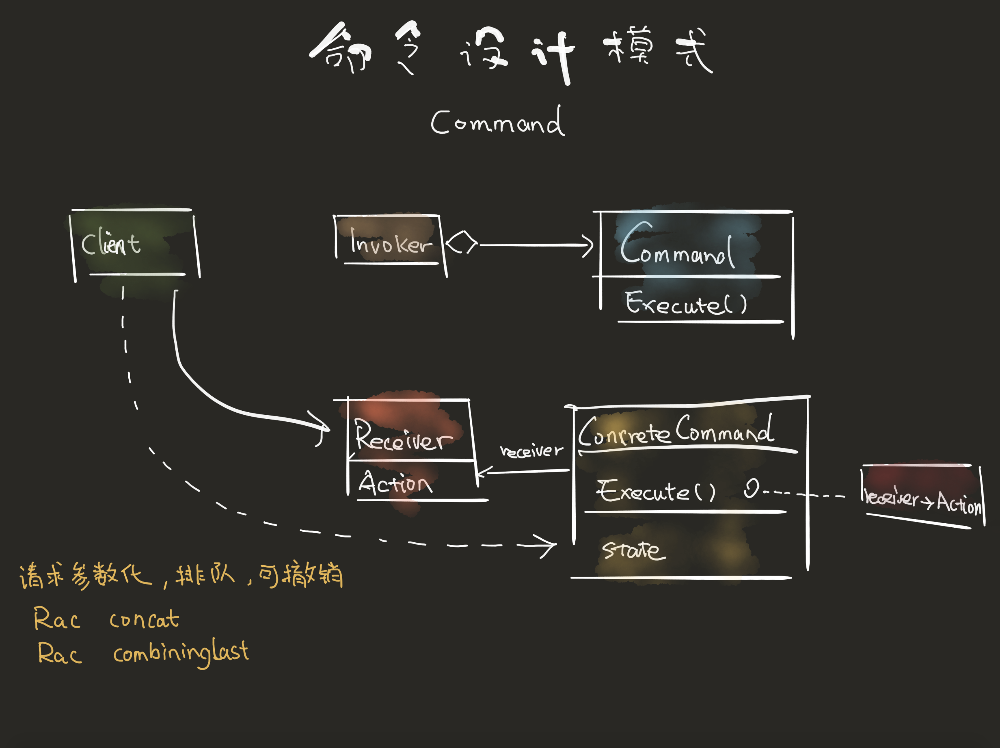
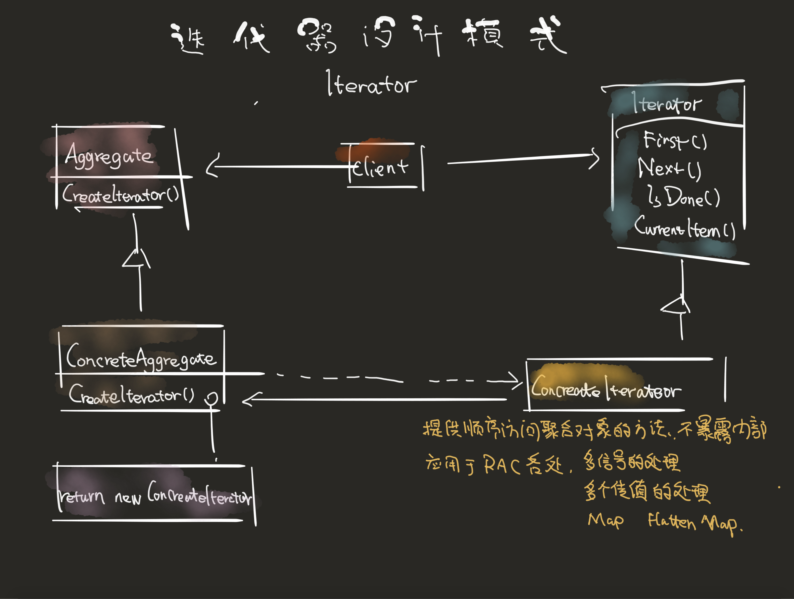
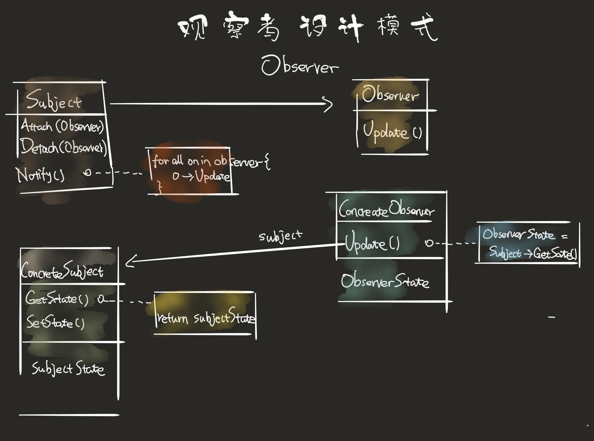

- [函数响应式编程](#%e5%87%bd%e6%95%b0%e5%93%8d%e5%ba%94%e5%bc%8f%e7%bc%96%e7%a8%8b)
  - [编程范式有哪些](#%e7%bc%96%e7%a8%8b%e8%8c%83%e5%bc%8f%e6%9c%89%e5%93%aa%e4%ba%9b)
- [RAC](#rac)
- [副作用](#%e5%89%af%e4%bd%9c%e7%94%a8)
- [RAC里的设计模式](#rac%e9%87%8c%e7%9a%84%e8%ae%be%e8%ae%a1%e6%a8%a1%e5%bc%8f)
- [RAC通知监听的移除](#rac%e9%80%9a%e7%9f%a5%e7%9b%91%e5%90%ac%e7%9a%84%e7%a7%bb%e9%99%a4)

## 函数响应式编程

### 编程范式有哪些    
  + 命令式
  + 函数式
  + 逻辑式
  + 响应式
      
**函数式编程**中的`函数`，不是计算机中的函数，而是数学上的函数。即自变量映射。函数式强调的函数：
      
   + 不改变外部状态
   + 不依赖外部状态

函数是一等公民，可以在任何地方定义，在函数内或函数外，可以作为函数的参数和返回值，可以对函数进行组合。

函数式语言特点
   
   + 高阶函数
   + 偏应用函数
   + 柯里化 ？
   + 闭包


**响应式**是一个专注于数据流和变化传递的异步编程范式。这意味着可以在编程语言中很方便地表达静态或动态的数据流，而相关的计算模型会自动将变化的值通过数据流进行传播。  

## RAC

+ [ReactiveCocoaStudy](https://github.com/AllenSWB/ReactiveCocoaStudy)

<!-- RAC中的冷信号和热信号是什么，有什么区别
RAC的双向绑定怎么做到的，为什么没有引起循环引用
RAC中如何监听方法调用的 -->

rac统一了kvo、UIevent、网络请求、async异步工作

+ racobserve
+ textfield.rac_textSignal
+ 一个异步网络请求，可以返回一个racsubject，然后将racsubject绑定到一个subscriber或信号

rac是函数响应式编程框架。

## 副作用

## RAC里的设计模式

+ [从ReactiveCocoa中能学到什么？不用此库也能学以致用](https://www.jianshu.com/p/39e27fef38fa)

  
  
  

## RAC通知监听的移除
  
  ```objc
  // https://juejin.im/post/5a30974ef265da433562bec2

  RACSignal *ss = [[NSNotificationCenter defaultCenter] rac_addObserverForName:@"UserSyncVerifyInfoWithServerSuccessNoti" object:nil];
  
  self.disposableObj = [ss subscribeNext:^(id  _Nullable x) {
      NSLog(@"更新认证信息成功~!!!!!!");
      [vcObjc.view bw_hiddenLoading];

      NSNotification *noti = (NSNotification *)x;
      BOOL syncSuccess = ((NSNumber *)noti.object).boolValue;
      if (syncSuccess) {
          NSLog(@"同步后台成功 - 更新认证信息成功~!!!!!");
      } else {
          NSLog(@"同步后台失败");
      }
      
      [UserRealNameAuthTool _handleToRealNameAuth:params];
      [self.disposableObj dispose];//rac 移除通知监听  
  }];
  ```


  <!-- 
   iOS开发高手课 22讲
   RAC vs rxSwift 
   -->