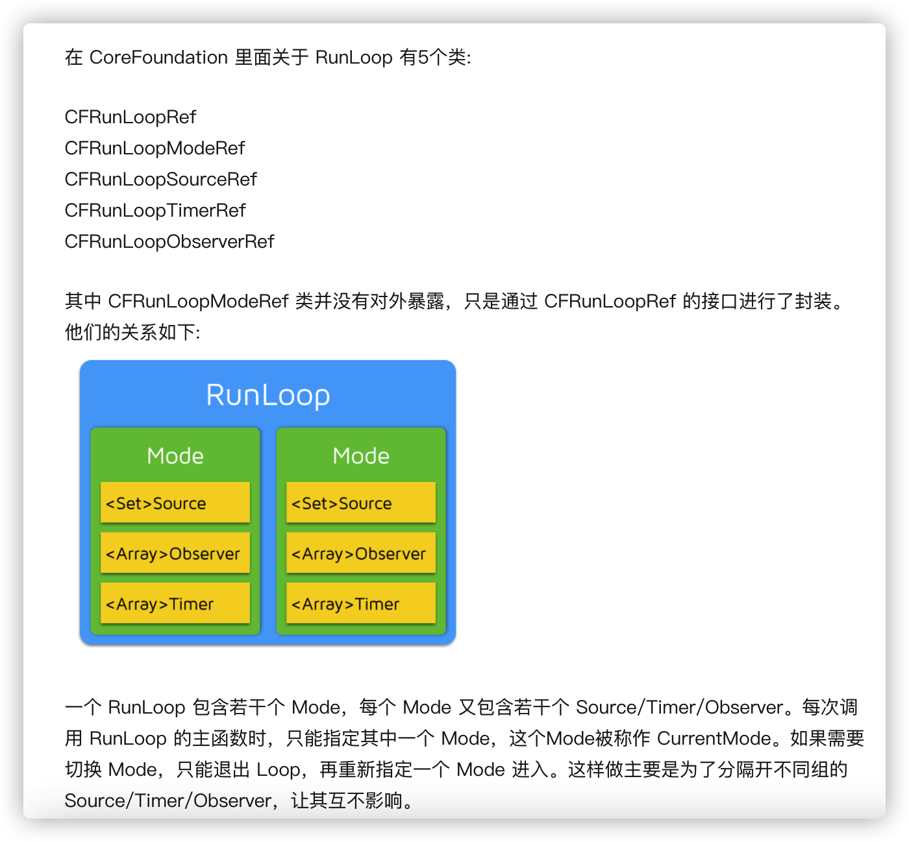

- [Runloop](#runloop)
  - [参考链接](#参考链接)

# Runloop

OSX/iOS 系统中，提供了两个这样的对象：NSRunLoop 和 CFRunLoopRef。
- CFRunLoopRef 是在 CoreFoundation 框架内的，它提供了纯 C 函数的 API，所有这些 API 都是线程安全的。
- NSRunLoop 是基于 CFRunLoopRef 的封装，提供了面向对象的 API，但是这些 API 不是线程安全的。

苹果不允许直接创建 RunLoop，它只提供了两个自动获取的函数：CFRunLoopGetMain() 和 CFRunLoopGetCurrent()。 

线程和 RunLoop 之间是一一对应的，其关系是保存在一个全局的 Dictionary 里。线程刚创建时并没有 RunLoop，如果你不主动获取，那它一直都不会有。RunLoop 的创建是发生在第一次获取时，RunLoop 的销毁是发生在线程结束时。你只能在一个线程的内部获取其 RunLoop（主线程除外）。

## 参考链接

- [深入理解 runloop](https://blog.ibireme.com/2015/05/18/runloop/)
- [runloop 视频 by 孙源](https://www.bilibili.com/video/BV1FJ41117kZ)