## iOS 开发随手记 

- [iOS开发随手记 - 简书](https://www.jianshu.com/p/cb80ad438057)
## 多 target

 >  BWCMT 项目架构:
 >
 >  - 基础库 pod 集成（封装好的 UI；网络库；三方库等）
 >  - 每个业务线是一个 project，最后主工程依赖各个业务线 framework，业务线间通信通过平台层platform 里的路由完成（不能跨业务线直接调用）
 >
 >  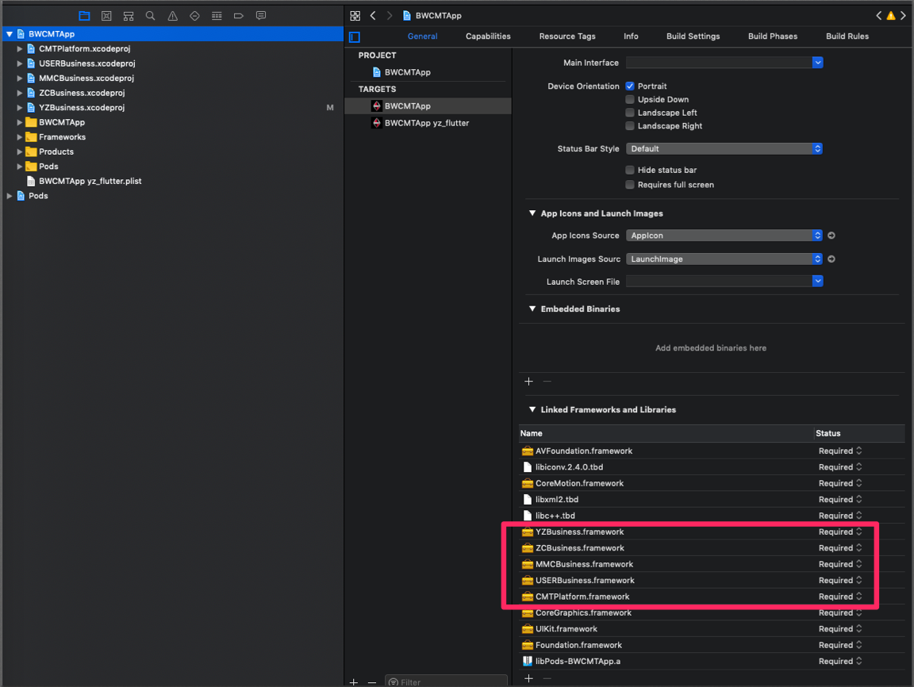
 >
 >  产生的问题：主工程依赖所有的业务线的framework，但是各个业务线之间不一定有依赖，我开发某一个业务线的时候，如果需要编译整个工程的话，时间会很长。
 >
 >  解决方案是：为一个单独的业务线创建一个target，以节省工程build时间。


**创建多 target 方法**

  创建target的步骤参考这个链接：[iOS 一套代码多APP／多渠道／多target+自动打包脚本](https://www.jianshu.com/p/73343b4fc42b)

  [创建多target](./add_more_targets_to_your_project.md)

**创建一个新 target 的注意点：**

  + 依赖
    
    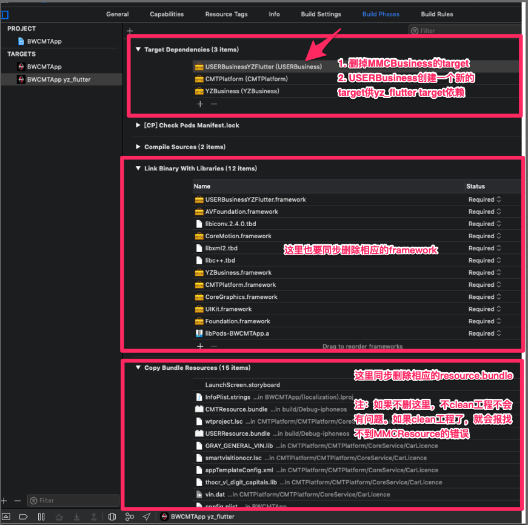
  + 宏：判断当前run的那个target
  
    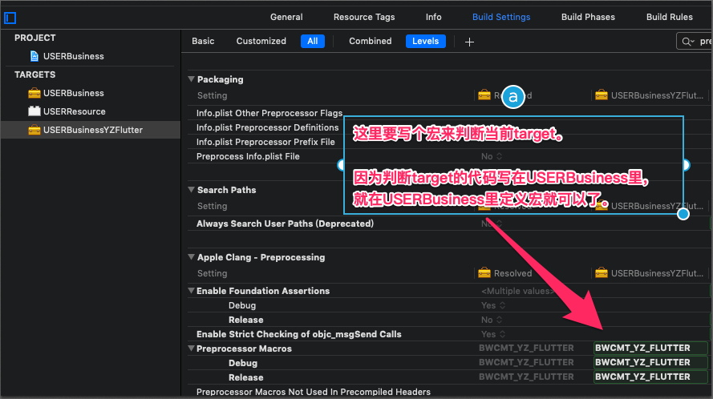
    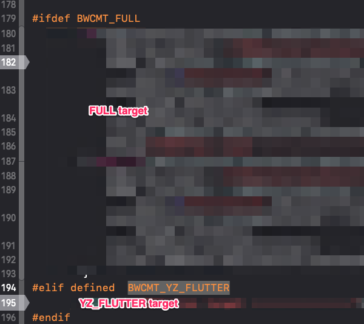

    设置`$(inherited)`

    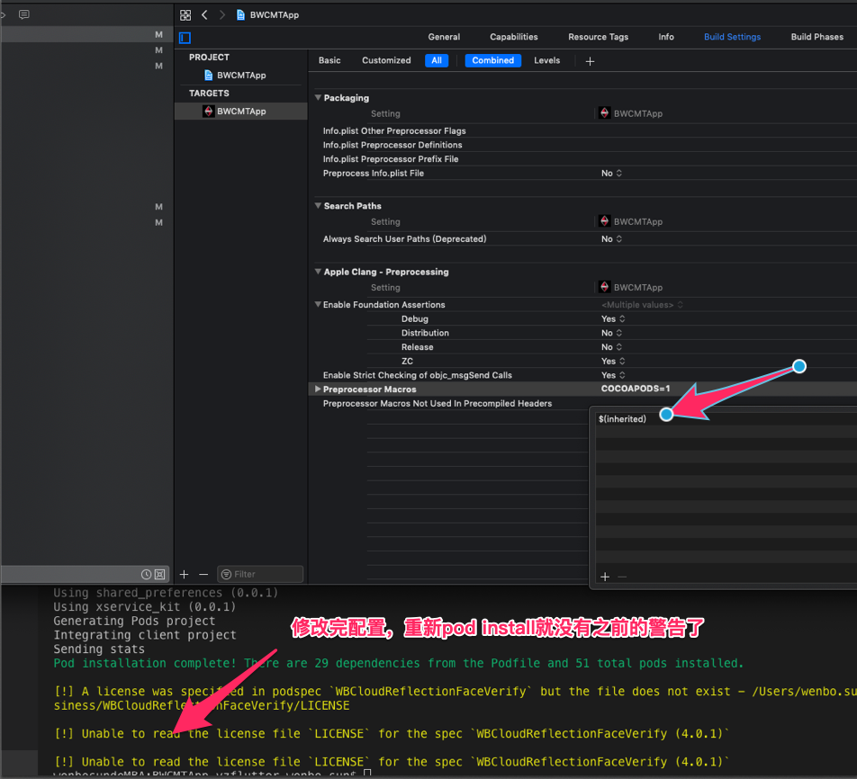
  + Pods库：新的target也要记得依赖pod库

    ```ruby
      # Podfile 文件
      targetsArray = ['BWCMTApp','BWCMTAppYZFlutter']

      targetsArray.each  do |t|

         target t do
             pod 'YYModel', '~>1.0.4'
             pod 'DoraemonKit/Core', :git => 'http://gitlab.10101111.com:8888/p2p/udoraemonkit.git', :configurations => ['Debug','ZC','Distribution']
         end
      end
    ```

**多 target 设置 `GCC_PREPROCESSOR_DEFINITIONS` 引起的问题**

前面说了，为了用代码判断当前run的是那个target，设置了两个宏`BWCMT_FULL`和`BWCMT_YZ_FLUTTER`。这时候使用`pod install`会有下面的提示（pod没有出错，只是会给个警告⚠️）。

  ```shell
    [!] The `BWCMTApp [Release]` target overrides the `GCC_PREPROCESSOR_DEFINITIONS` build setting defined in `Pods/Target Support Files/Pods-BWCMTApp/Pods-BWCMTApp.release.xcconfig'. This can lead to problems with the CocoaPods installation
     - Use the `$(inherited)` flag, or
     - Remove the build settings from the target.
  ```

   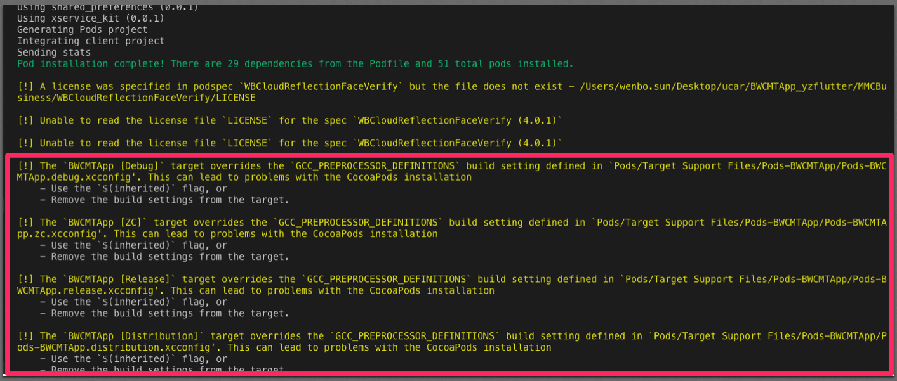

   解决办法是在`GCC_PREPROCESSOR_DEFINITIONS`里加上`$(inherited)`。再次`pod install`警告会消失。

   

## 加快编译速度

从源码到二进制可执行文件整个流程去考虑

1. 修改`Optimization Level`的值

    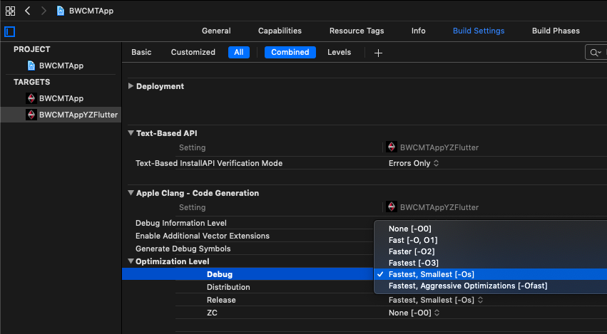

2. `.h`文件引入头文件，`#import`改成`@class`


## 扩大 button 响应区域

```objc
/// .h

@interface UIButton (EnlargeHitArea)

@property (nonatomic, assign) UIEdgeInsets hitTestEdgeInsets;

@end

/// .m

#import "UIButton+EnlargeHitArea.h"
static const NSString *KEY_HIT_TEST_EDGE_INSETS = @"HitTestEdgeInsets";

@implementation UIButton (EnlargeHitArea)

-(void)setHitTestEdgeInsets:(UIEdgeInsets)hitTestEdgeInsets {
    NSValue *value = [NSValue value:&hitTestEdgeInsets withObjCType:@encode(UIEdgeInsets)];
    objc_setAssociatedObject(self, &KEY_HIT_TEST_EDGE_INSETS, value, OBJC_ASSOCIATION_RETAIN_NONATOMIC);
}

-(UIEdgeInsets)hitTestEdgeInsets {
    NSValue *value = objc_getAssociatedObject(self, &KEY_HIT_TEST_EDGE_INSETS);
    if(value) {
        UIEdgeInsets edgeInsets; [value getValue:&edgeInsets]; return edgeInsets;
    }else {
        return UIEdgeInsetsZero;
    }
}

- (BOOL)pointInside:(CGPoint)point withEvent:(UIEvent *)event {
    if(UIEdgeInsetsEqualToEdgeInsets(self.hitTestEdgeInsets, UIEdgeInsetsZero) || !self.enabled || self.hidden) {
        return [super pointInside:point withEvent:event];
    }
    
    CGRect relativeFrame = self.bounds;
    CGRect hitFrame = UIEdgeInsetsInsetRect(relativeFrame, self.hitTestEdgeInsets);
    
    return CGRectContainsPoint(hitFrame, point);
}

@end

```

## UILabel 文本靠左上角

```objc

// .h
@interface BWLeftTopLabel : UILabel
@end

// .m
@implementation BWLeftTopLabel
- (id)initWithFrame:(CGRect)frame {
    return [super initWithFrame:frame];
}

- (CGRect)textRectForBounds:(CGRect)bounds limitedToNumberOfLines:(NSInteger)numberOfLines {
    CGRect textRect = [super textRectForBounds:bounds limitedToNumberOfLines:numberOfLines];
    textRect.origin.y = bounds.origin.y;
    return textRect;    
}

-(void)drawTextInRect:(CGRect)requestedRect {
    CGRect actualRect = [self textRectForBounds:requestedRect limitedToNumberOfLines:self.numberOfLines];
    [super drawTextInRect:actualRect];   
}
@end

```

## UILabel 设置行间隙

```objc
/**
 设置固定行间距文本
 
 @param lineSpace 行间距
 @param text 文本内容
 @param label 要设置的label
 */
-(void)setLineSpace:(CGFloat)lineSpace withText:(NSString *)text inLabel:(UILabel *)label{
    if (!text || !label) {
        return;
    }
    NSMutableParagraphStyle *paragraphStyle = [[NSMutableParagraphStyle alloc] init];
    paragraphStyle.lineSpacing = lineSpace;  //设置行间距
    paragraphStyle.lineBreakMode = label.lineBreakMode;
    paragraphStyle.alignment = label.textAlignment;
    
    NSMutableAttributedString *attributedString = [[NSMutableAttributedString alloc] initWithString:text];
    [attributedString addAttribute:NSParagraphStyleAttributeName value:paragraphStyle range:NSMakeRange(0, [text length])];
    label.attributedText = attributedString;
}

// 使用
  [self setLineSpace:5 withText:row.descStr inLabel:self.descLabel];

```

## 去除 String 中的空格

1. 仅去除前后的空格

```objc
    NSString *str  = [NSString stringWithFormat:@"    sda  sda    "];
    str = [str stringByTrimmingCharactersInSet:[NSCharacterSet whitespaceCharacterSet]];
    NSLog(@"%@", str);  // sda  sda
```

2. 去除所有空格

```objc
    NSString *str = [NSString stringWithFormat:@"   你 好 嘛  ， 跟谁 俩 呢 ！  "];
    str = [str stringByReplacingOccurrencesOfString:@" " withString:@""];
    NSLog(@"%@", str);  // 你好嘛，跟谁俩呢!
```

## UILabel 部分文字可点击

```objc
// .h 


@protocol RichTextDelegate <NSObject>
@optional
/**
 *  RichTextDelegate
 *
 *  @param string  点击的字符串
 *  @param range   点击的字符串range
 *  @param index   点击的字符在数组中的index
 */
- (void)didClickRichText:(NSString *)string
                   range:(NSRange)range
                   index:(NSInteger)index;
@end

@interface UILabel (RichLabel)


/**
 *  是否打开点击效果，默认是打开
 */
@property (nonatomic, assign) BOOL enabledClickEffect;

/**
 *  点击效果颜色 默认lightGrayColor
 */
@property (nonatomic, strong) UIColor *clickEffectColor;

/**
 *  给文本添加Block点击事件回调
 *
 *  @param strings  需要添加的字符串数组
 *  @param clickAction 点击事件回调
 */
- (void)clickRichTextWithStrings:(NSArray <NSString *> *)strings
                     clickAction:(void (^) (NSString *string, NSRange range, NSInteger index))clickAction;

/**
 *  给文本添加点击事件delegate回调
 *
 *  @param strings  需要添加的字符串数组
 *  @param delegate 富文本代理
 */
- (void)clickRichTextWithStrings:(NSArray <NSString *> *)strings
                        delegate:(id <RichTextDelegate> )delegate;

@end
```

```objc
// .m


//
//  UILabel+RichLabel.m
//  BWApp
//
//  Created by wenbo.sun on 2019/9/7.
//  Copyright © 2019 UCAR. All rights reserved.
//

#import "UILabel+RichLabel.h"

#import <objc/runtime.h>
#import <CoreText/CoreText.h>
#import <Foundation/Foundation.h>


#define weakSelf(type)      __weak typeof(type) weak##type = type;

@interface RichTextModel : NSObject

@property (nonatomic, copy) NSString *str;

@property (nonatomic, assign) NSRange range;

@end

@implementation RichTextModel

@end


@implementation UILabel (RichLabel)


#pragma mark - AssociatedObjects

- (NSMutableArray *)attributeStrings {
    
    return objc_getAssociatedObject(self, _cmd);
}

- (void)setAttributeStrings:(NSMutableArray *)attributeStrings {
    
    objc_setAssociatedObject(self, @selector(attributeStrings), attributeStrings, OBJC_ASSOCIATION_RETAIN_NONATOMIC);
}

- (NSMutableDictionary *)effectDic {
    
    return objc_getAssociatedObject(self, _cmd);
}

- (void)setEffectDic:(NSMutableDictionary *)effectDic {
    
    objc_setAssociatedObject(self, @selector(effectDic), effectDic, OBJC_ASSOCIATION_RETAIN_NONATOMIC);
}

- (BOOL)isClickAction {
    
    return [objc_getAssociatedObject(self, _cmd) boolValue];
}

- (void)setIsClickAction:(BOOL)isClickAction {
    
    objc_setAssociatedObject(self, @selector(isClickAction), @(isClickAction), OBJC_ASSOCIATION_ASSIGN);
}

- (void (^)(NSString *, NSRange, NSInteger))clickBlock {
    
    return objc_getAssociatedObject(self, _cmd);
}

- (void)setClickBlock:(void (^)(NSString *, NSRange, NSInteger))clickBlock {
    
    objc_setAssociatedObject(self, @selector(clickBlock), clickBlock, OBJC_ASSOCIATION_COPY_NONATOMIC);
}

- (id<RichTextDelegate>)delegate {
    
    return objc_getAssociatedObject(self, _cmd);
}

- (BOOL)enabledClickEffect {
    
    return [objc_getAssociatedObject(self, _cmd) boolValue];
}

- (void)setEnabledClickEffect:(BOOL)enabledClickEffect {
    
    objc_setAssociatedObject(self, @selector(enabledClickEffect), @(enabledClickEffect), OBJC_ASSOCIATION_ASSIGN);
    //    self.isClickEffect = enabledClickEffect;
}

- (UIColor *)clickEffectColor {
    
    UIColor *obj = objc_getAssociatedObject(self, _cmd);
    if(obj == nil) {obj = [UIColor lightGrayColor];}
    return obj;
}

- (void)setClickEffectColor:(UIColor *)clickEffectColor {
    
    objc_setAssociatedObject(self, @selector(clickEffectColor), clickEffectColor, OBJC_ASSOCIATION_RETAIN_NONATOMIC);
}

- (BOOL)isClickEffect {
    
    return [objc_getAssociatedObject(self, _cmd) boolValue];
}

- (void)setIsClickEffect:(BOOL)isClickEffect {
    
    objc_setAssociatedObject(self, @selector(isClickEffect), @(isClickEffect), OBJC_ASSOCIATION_ASSIGN);
}

- (void)setDelegate:(id<RichTextDelegate>)delegate {
    
    objc_setAssociatedObject(self, @selector(delegate), delegate, OBJC_ASSOCIATION_ASSIGN);
}

#pragma mark - mainFunction
- (void)clickRichTextWithStrings:(NSArray<NSString *> *)strings clickAction:(void (^)(NSString *, NSRange, NSInteger))clickAction {
    
    [self richTextRangesWithStrings:strings];
    
    if (self.clickBlock != clickAction) {
        self.clickBlock = clickAction;
    }
}

- (void)clickRichTextWithStrings:(NSArray<NSString *> *)strings delegate:(id<RichTextDelegate>)delegate {
    
    [self richTextRangesWithStrings:strings];
    
    if ([self delegate] != delegate) {
        
        [self setDelegate:delegate];
    }
}

#pragma mark - touchAction
- (void)touchesBegan:(NSSet<UITouch *> *)touches withEvent:(UIEvent *)event
{
    if (!self.isClickAction) {
        return;
    }
    
    if (objc_getAssociatedObject(self, @selector(enabledClickEffect))) {
        self.isClickEffect = self.enabledClickEffect;
    }
    
    UITouch *touch = [touches anyObject];
    
    CGPoint point = [touch locationInView:self];
    
    weakSelf(self);
    [self richTextFrameWithTouchPoint:point result:^(NSString *string, NSRange range, NSInteger index) {
        
        if (weakself.clickBlock) {
            weakself.clickBlock (string , range , index);
        }
        
        if ([weakself delegate] && [[weakself delegate] respondsToSelector:@selector(didClickRichText:range:index:)]) {
            [[weakself delegate] didClickRichText:string range:range index:index];
        }
        
        if (weakself.isClickEffect) {
            
            [weakself saveEffectDicWithRange:range];
            
            [weakself clickEffectWithStatus:YES];
        }
    }];
}

- (UIView *)hitTest:(CGPoint)point withEvent:(UIEvent *)event {
    
    if((self.isClickAction) && ([self richTextFrameWithTouchPoint:point result:nil])) {
        
        return self;
    }
    return [super hitTest:point withEvent:event];
}

#pragma mark - getClickFrame
- (BOOL)richTextFrameWithTouchPoint:(CGPoint)point result:(void (^) (NSString *string , NSRange range , NSInteger index))resultBlock
{
    CTFramesetterRef framesetter = CTFramesetterCreateWithAttributedString((CFAttributedStringRef)self.attributedText);
    
    CGMutablePathRef Path = CGPathCreateMutable();
    
    CGPathAddRect(Path, NULL, CGRectMake(0, 0, self.bounds.size.width, self.bounds.size.height));
    
    CTFrameRef frame = CTFramesetterCreateFrame(framesetter, CFRangeMake(0, 0), Path, NULL);
    
    CFRange range = CTFrameGetVisibleStringRange(frame);
    
    if (self.attributedText.length > range.length) {
        
        UIFont *font ;
        
        if ([self.attributedText attribute:NSFontAttributeName atIndex:0 effectiveRange:nil]) {
            
            font = [self.attributedText attribute:NSFontAttributeName atIndex:0 effectiveRange:nil];
            
        }else if (self.font){
            font = self.font;
            
        }else {
            font = [UIFont systemFontOfSize:17];
        }
        
        CGPathRelease(Path);
        
        Path = CGPathCreateMutable();
        
        CGPathAddRect(Path, NULL, CGRectMake(0, 0, self.bounds.size.width, self.bounds.size.height + font.lineHeight));
        
        frame = CTFramesetterCreateFrame(framesetter, CFRangeMake(0, 0), Path, NULL);
    }
    
    CFArrayRef lines = CTFrameGetLines(frame);
    
    if (!lines) {
        CFRelease(frame);
        CFRelease(framesetter);
        CGPathRelease(Path);
        return NO;
    }
    
    CFIndex count = CFArrayGetCount(lines);
    
    CGPoint origins[count];
    
    CTFrameGetLineOrigins(frame, CFRangeMake(0, 0), origins);
    
    CGAffineTransform transform = [self transformForCoreText];
    
    CGFloat verticalOffset = 0;
    
    for (CFIndex i = 0; i < count; i++) {
        CGPoint linePoint = origins[i];
        
        CTLineRef line = CFArrayGetValueAtIndex(lines, i);
        
        CGRect flippedRect = [self getLineBounds:line point:linePoint];
        
        CGRect rect = CGRectApplyAffineTransform(flippedRect, transform);
        
        rect = CGRectInset(rect, 0, 0);
        
        rect = CGRectOffset(rect, 0, verticalOffset);
        
        NSParagraphStyle *style = [self.attributedText attribute:NSParagraphStyleAttributeName atIndex:0 effectiveRange:nil];
        
        CGFloat lineSpace;
        
        if (style) {
            lineSpace = style.lineSpacing;
        }else {
            lineSpace = 0;
        }
        
        CGFloat lineOutSpace = (self.bounds.size.height - lineSpace * (count - 1) -rect.size.height * count) / 2;
        
        rect.origin.y = lineOutSpace + rect.size.height * i + lineSpace * i;
        
        if (CGRectContainsPoint(rect, point)) {
            
            CGPoint relativePoint = CGPointMake(point.x - CGRectGetMinX(rect), point.y - CGRectGetMinY(rect));
            
            CFIndex index = CTLineGetStringIndexForPosition(line, relativePoint);
            
            CGFloat offset;
            
            CTLineGetOffsetForStringIndex(line, index, &offset);
            
            if (offset > relativePoint.x) {
                index = index - 1;
            }
            
            NSInteger link_count = self.attributeStrings.count;
            
            for (int j = 0; j < link_count; j++) {
                
                RichTextModel *model = self.attributeStrings[j];
                
                NSRange link_range = model.range;
                if (NSLocationInRange(index, link_range)) {
                    if (resultBlock) {
                        resultBlock (model.str , model.range , (NSInteger)j);
                    }
                    CFRelease(frame);
                    CFRelease(framesetter);
                    CGPathRelease(Path);
                    return YES;
                }
            }
        }
    }
    CFRelease(frame);
    CFRelease(framesetter);
    CGPathRelease(Path);
    return NO;
}

- (void)touchesEnded:(NSSet<UITouch *> *)touches withEvent:(UIEvent *)event
{
    if (self.isClickEffect) {
        
        [self performSelectorOnMainThread:@selector(clickEffectWithStatus:) withObject:nil waitUntilDone:NO];
    }
}

- (void)touchesCancelled:(NSSet<UITouch *> *)touches withEvent:(UIEvent *)event
{
    if (self.isClickEffect) {
        
        [self performSelectorOnMainThread:@selector(clickEffectWithStatus:) withObject:nil waitUntilDone:NO];
    }
}

- (CGAffineTransform)transformForCoreText
{
    return CGAffineTransformScale(CGAffineTransformMakeTranslation(0, self.bounds.size.height), 1.f, -1.f);
}

- (CGRect)getLineBounds:(CTLineRef)line point:(CGPoint)point
{
    CGFloat ascent = 0.0f;
    CGFloat descent = 0.0f;
    CGFloat leading = 0.0f;
    CGFloat width = (CGFloat)CTLineGetTypographicBounds(line, &ascent, &descent, &leading);
    CGFloat height = ascent + fabs(descent) + leading;
    
    return CGRectMake(point.x, point.y , width, height);
}

#pragma mark - clickEffect
- (void)clickEffectWithStatus:(BOOL)status
{
    if (self.isClickEffect) {
        NSMutableAttributedString *attStr = [[NSMutableAttributedString alloc] initWithAttributedString:self.attributedText];
        
        NSMutableAttributedString *subAtt = [[NSMutableAttributedString alloc] initWithAttributedString:[[self.effectDic allValues] firstObject]];
        
        NSRange range = NSRangeFromString([[self.effectDic allKeys] firstObject]);
        
        if (status) {
            [subAtt addAttribute:NSBackgroundColorAttributeName value:self.clickEffectColor range:NSMakeRange(0, subAtt.string.length)];
            
            [attStr replaceCharactersInRange:range withAttributedString:subAtt];
        }else {
            
            [attStr replaceCharactersInRange:range withAttributedString:subAtt];
        }
        self.attributedText = attStr;
    }
}

- (void)saveEffectDicWithRange:(NSRange)range
{
    self.effectDic = [NSMutableDictionary dictionary];
    
    NSAttributedString *subAttribute = [self.attributedText attributedSubstringFromRange:range];
    
    [self.effectDic setObject:subAttribute forKey:NSStringFromRange(range)];
}

#pragma mark - getRange
- (void)richTextRangesWithStrings:(NSArray <NSString *>  *)strings
{
    if (self.attributedText == nil) {
        self.isClickAction = NO;
        return;
    }
    
    self.isClickAction = YES;
    
    self.isClickEffect = YES;
    
    __block  NSString *totalStr = self.attributedText.string;
    
    self.attributeStrings = [NSMutableArray array];
    
    weakSelf(self);
    [strings enumerateObjectsUsingBlock:^(NSString * _Nonnull obj, NSUInteger idx, BOOL * _Nonnull stop) {
        
        NSRange range = [totalStr rangeOfString:obj];
        
        if (range.length != 0) {
            
            totalStr = [totalStr stringByReplacingCharactersInRange:range withString:[weakself getStringWithRange:range]];
            
            RichTextModel *model = [[RichTextModel alloc]init];
            
            model.range = range;
            
            model.str = obj;
            
            [weakself.attributeStrings addObject:model];
        }
    }];
}

- (NSString *)getStringWithRange:(NSRange)range
{
    NSMutableString *string = [NSMutableString string];
    
    for (int i = 0; i < range.length ; i++) {
        
        [string appendString:@" "];
    }
    return string;
}


@end
```

```objc
// 使用


- (void)cellWillAppear {
    [super cellWillAppear];
    
    CKBindVehicleTipCellRow *row = (CKBindVehicleTipCellRow *)self.tableViewRow;
    
    self.tiplabel.text = row.tipStr;
    
    NSString *text = row.tipStr;
    
    NSRange phoneRange = [row.tipStr rangeOfString:row.phoneStr];
    
    NSMutableAttributedString *string = [[NSMutableAttributedString alloc] initWithString:text];

    [string addAttributes:@{NSStrikethroughStyleAttributeName:@"",NSForegroundColorAttributeName:UCAR_ColorFromHexString(@"2D72D9")}  range:phoneRange];
    self.tiplabel.userInteractionEnabled = true;
    self.tiplabel.attributedText = string;

    [self.tiplabel clickRichTextWithStrings:@[row.phoneStr] clickAction:^(NSString *string, NSRange range, NSInteger index) {
        
        NSString *str = [row.phoneStr stringByReplacingOccurrencesOfString:@" " withString:@""];
        NSLog(@"电话 ：%@", str);
        
    }];
}
```

## 找到所有 subviewClass 类
```objc
- (NSMutableArray *)_findSubViews:(UIView *)currentView subViewClass:(NSString *)subviewClass array:(NSMutableArray *)array {
    if (currentView.subviews.count == 0) {
        return array;
    }
    if (!array) {
        array = [NSMutableArray arrayWithCapacity:0];
    } 
    for (NSInteger i = 0; i < currentView.subviews.count; i++) {
        UIView *subb = currentView.subviews[i];
       if ([subb isKindOfClass:NSClassFromString(subviewClass)]) {
           [array addObject:subb];
        }
        
        [self _findSubViews:subb subViewClass:subviewClass array:array];
    }
    return array;
}
```

## 找到 subviewClass 这个类的父视图
```objc

- (UIView *)_findParentView:(UIView *)currentView subViewClass:(NSString *)subviewClass{
    // 深度优先查找
    for (NSInteger i = 0; i < currentView.subviews.count; i++) {
        UIView *subb = currentView.subviews[i];
       if ([subb isKindOfClass:NSClassFromString(subviewClass)]) {
           return currentView;
           break;
        }
        UIView *n = [self _findParentView:subb subViewClass:subviewClass];
        if (n) {
            return n;
            break;
        }
    }
    return nil;
}
```

## iOS13 适配

1. present出来的控制器默认不是全屏

```swift
    let v = WBTestViewController()
    v.modalPresentationStyle = .fullScreen // 加上这句话
    self.present(v, animated: true, completion: nil)
```

2. Dark Mode适配

## RAC 通知的移除

+ [参考链接](https://juejin.im/post/5a30974ef265da433562bec2)
  
```objc
    RACSignal *ss = [[NSNotificationCenter defaultCenter] rac_addObserverForName:@"UserSyncVerifyInfoWithServerSuccessNoti" object:nil];
    
    self.disposableObj = [ss subscribeNext:^(id  _Nullable x) {
        NSLog(@"更新认证信息成功~!!!!!!");
        [vcObjc.view bw_hiddenLoading];

        NSNotification *noti = (NSNotification *)x;
        BOOL syncSuccess = ((NSNumber *)noti.object).boolValue;
        if (syncSuccess) {
            NSLog(@"同步后台成功 - 更新认证信息成功~!!!!!");
        } else {
            NSLog(@"同步后台失败");
        }
        
        [UserRealNameAuthTool _handleToRealNameAuth:params];
        [self.disposableObj dispose];//rac 移除通知监听  
    }];
```

## 类方法里使用 self

```objc
@interface CKTool : NSObject 

+ (void)test0;
+ (void)test1;

@end

@implementation CKTool

+ (void)test0 {
    [self test1]; //效果和👇一样一样
    // [CKTool test1];
}

+ (void)test1 {
    NSLog(@"test 1");
}
@end
```

## 拍照后修复图片方向 `fixOrientation` & 剪切图片 `imageByCroppingWithRect`

```objc
// .h

@interface UIImage (BWCrop)
+ (UIImage *)fixOrientation:(UIImage *)aImage;
- (UIImage *)imageByCroppingWithRect:(CGRect)rect;
@end

// .m 
@implementation UIImage (BWCrop)

+ (UIImage *)fixOrientation:(UIImage *)aImage; {
    if  (aImage.imageOrientation  ==  UIImageOrientationUp)
    return  aImage;
    CGAffineTransform  transform  =  CGAffineTransformIdentity;
    switch  (aImage.imageOrientation)  {
                case  UIImageOrientationDown:
                case  UIImageOrientationDownMirrored:
                        transform  =  CGAffineTransformTranslate(transform,  aImage.size.width,  aImage.size.height);
                        transform  =  CGAffineTransformRotate(transform,  M_PI);
                        break;
                            
                case  UIImageOrientationLeft:
                case  UIImageOrientationLeftMirrored:
                        transform  =  CGAffineTransformTranslate(transform,  aImage.size.width,  0);
                        transform  =  CGAffineTransformRotate(transform,  M_PI_2);
                        break;
                            
                case  UIImageOrientationRight:
                case  UIImageOrientationRightMirrored:
                        transform  =  CGAffineTransformTranslate(transform,  0,  aImage.size.height);
                        transform  =  CGAffineTransformRotate(transform,  -M_PI_2);
                        break;
                default:
                        break;
        }
            
        switch  (aImage.imageOrientation)  {
                case  UIImageOrientationUpMirrored:
                case  UIImageOrientationDownMirrored:
                        transform  =  CGAffineTransformTranslate(transform,  aImage.size.width,  0);
                        transform  =  CGAffineTransformScale(transform,  -1,  1);
                        break;
                            
                case  UIImageOrientationLeftMirrored:
                case  UIImageOrientationRightMirrored:
                        transform  =  CGAffineTransformTranslate(transform,  aImage.size.height,  0);
                        transform  =  CGAffineTransformScale(transform,  -1,  1);
                        break;
                default:
                        break;
        }
            
        //  Now  we  draw  the  underlying  CGImage  into  a  new  context,  applying  the  transform
        //  calculated  above.
        CGContextRef  ctx  =  CGBitmapContextCreate(NULL,  aImage.size.width,  aImage.size.height,
                                                                                          CGImageGetBitsPerComponent(aImage.CGImage),  0,
                                                                                          CGImageGetColorSpace(aImage.CGImage),
                                                                                          CGImageGetBitmapInfo(aImage.CGImage));
        CGContextConcatCTM(ctx,  transform);
        switch  (aImage.imageOrientation)  {
                case  UIImageOrientationLeft:
                case  UIImageOrientationLeftMirrored:
                case  UIImageOrientationRight:
                case  UIImageOrientationRightMirrored:
                        //  Grr...
                        CGContextDrawImage(ctx,  CGRectMake(0,0,aImage.size.height,aImage.size.width),  aImage.CGImage);
                        break;
                            
                default:
                        CGContextDrawImage(ctx,  CGRectMake(0,0,aImage.size.width,aImage.size.height),  aImage.CGImage);
                        break;
        }
            
        //  And  now  we  just  create  a  new  UIImage  from  the  drawing  context
        CGImageRef  cgimg  =  CGBitmapContextCreateImage(ctx);
        UIImage  *img  =  [UIImage  imageWithCGImage:cgimg];
        CGContextRelease(ctx);
        CGImageRelease(cgimg);
        return  img;
}

- (UIImage *)imageByCroppingWithRect:(CGRect)rect { 
    CGImageRef imageRef = self.CGImage;
    CGImageRef imagePartRef = CGImageCreateWithImageInRect(imageRef, rect);
    UIImage *cropImage = [UIImage imageWithCGImage:imagePartRef];
    CGImageRelease(imagePartRef); 
    return cropImage;
}
@end

```
## 设置APP支持的文件类型 eg:PDF

+ [Core Foundation Keys](https://developer.apple.com/library/archive/documentation/General/Reference/InfoPlistKeyReference/Articles/CoreFoundationKeys.html#//apple_ref/doc/uid/20001431-101685)
+ [System-Declared Uniform Type Identifiers
](https://developer.apple.com/library/archive/documentation/Miscellaneous/Reference/UTIRef/Articles/System-DeclaredUniformTypeIdentifiers.html)

// todo

## `Bundle.main.paths(forResourcesOfType: "pdf", inDirectory: "swift_lang")` 方法获取不到文件解决

导入文件的时候选取create folder references

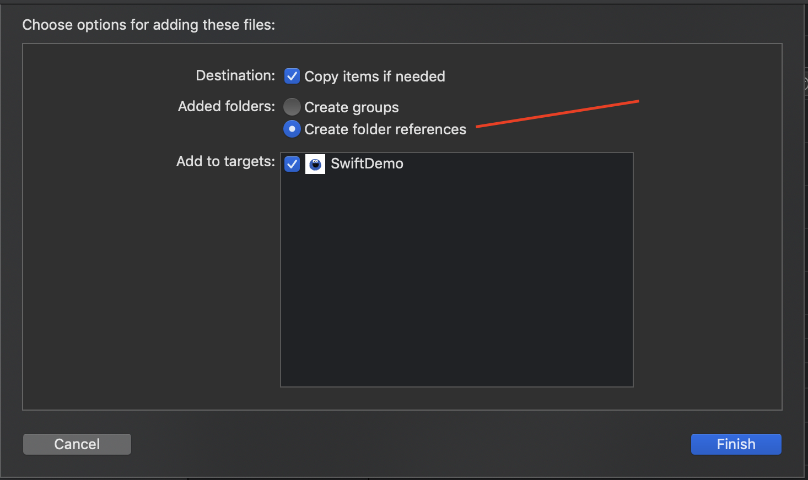

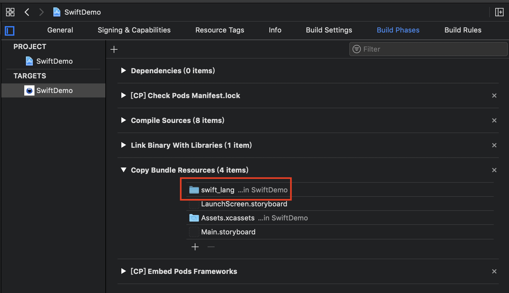

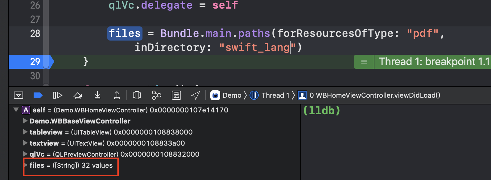

## Xcode11 新建项目，去除 SceneDelegate.swift

 - 删除 SceneDelegate.swift 文件
 - info.plist 中移除 `Application Scene Manifest` 项
    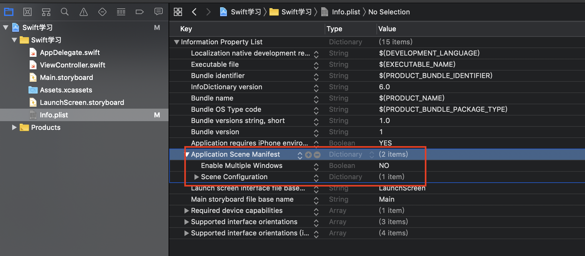
 - 注释掉相关代码
   ```swift
   func application(_ application: UIApplication, configurationForConnecting connectingSceneSession: UISceneSession, options: UIScene.ConnectionOptions) -> UISceneConfiguration { 
   }

   func application(_ application: UIApplication, didDiscardSceneSessions sceneSessions: Set<UISceneSession>) { 
   }
   ```
 - 新增window属性
   ```swift
   var win: UIWindow?

   func application(_ application: UIApplication, didFinishLaunchingWithOptions launchOptions: [UIApplication.LaunchOptionsKey: Any]?) -> Bool { 
       win = UIWindow.init(frame: UIScreen.main.bounds)
        win?.rootViewController = UIStoryboard.init(name: "Main", bundle: nil).instantiateInitialViewController()
        win?.makeKeyAndVisible()
       return true
     } 
   ```
## Xcode 报错
**编译报错：xxx.modulemap' has been modified since the precompiled header 'xxx.pch.pch' was built**

解决：clean下工程


## 旋转动画
```objc
CABasicAnimation *animation = [CABasicAnimation animationWithKeyPath:@"transform.rotation.z"];
  // 默认是顺时针效果，若将fromValue和toValue的值互换，则为逆时针效果
  animation.fromValue = [NSNumber numberWithFloat:0.f];
  animation.toValue = [NSNumber numberWithFloat: M_PI *2];
  animation.duration = 1;
  animation.autoreverses = NO;
  animation.fillMode = kCAFillModeForwards;
  // 如果这里想设置成一直自旋转，可以设置为MAXFLOAT，否则设置具体的数值则代表执行多少次
  animation.repeatCount = MAXFLOAT;
  [self.indicatorView.layer addAnimation:animation forKey:nil];


  // [self.indicatorView.layer removeAllAnimations];
```

## 方法废弃

```objc
- (instancetype)initWithVin:(NSString *)vin;
- (instancetype)init DEPRECATED_MSG_ATTRIBUTE("使用 initWithVin");
```

## NSURL 的 query 、path 等方法
```objc
NSURL *url = [NSURL URLWithString:@"http://www.testurl.com:8080/subpath/subsubpath?uid=123&gid=456"];  
[url scheme]  // http  
[url host]  // www.testurl.com  
[url port]  // 8080  
[url path]  // /subpath/subsubpath  
[url lastPathComponent]  // subsubpath  
[url query]     // uid=123&gid=456  
```

## 修改 UIPickerView 中的文字大小
```objc
- (UIView *)pickerView:(UIPickerView *)pickerView viewForRow:(NSInteger)row forComponent:(NSInteger)component reusingView:(UIView *)view { 
    NSString *titleString = self.typeArray[row]; 
    
    UILabel *itemlabel = [[UILabel alloc] init];
    itemlabel.attributedText = [[NSAttributedString alloc] initWithString:titleString
                                                               attributes:@{
                                                                   NSFontAttributeName: [UIFont systemFontOfSize:16],
                                                                   NSForegroundColorAttributeName: UCAR_ColorFromHexStringAndAlpha(@"#333333", (1))}];
        
    return itemlabel;
}
```
 

## 深拷贝
```objc
// .h
@interface NSObject (UCARDeepCopy)
- (void)deepCopy:(NSObject *)originObj;
@end

// .m
#import <objc/runtime.h>
@implementation NSObject (UCARDeepCopy)

- (void)deepCopy:(NSObject *)originObj {
    unsigned int property_count = 0;
    objc_property_t * propertys = class_copyPropertyList([originObj class], &property_count);
    for (int i = 0; i < property_count; i++) {
        objc_property_t property = propertys[i];
        const char * property_name = property_getName(property);
        NSString * property_name_string = [NSString stringWithUTF8String:property_name];
        [self setValue:[originObj valueForKey:property_name_string] forKey:property_name_string];
    }
    free(propertys);
}
@end
```

## [Application] The app delegate must implement the window property if it wants to use a main storyboard file.

终端log出上面一段话，解决方式是添加 window 属性

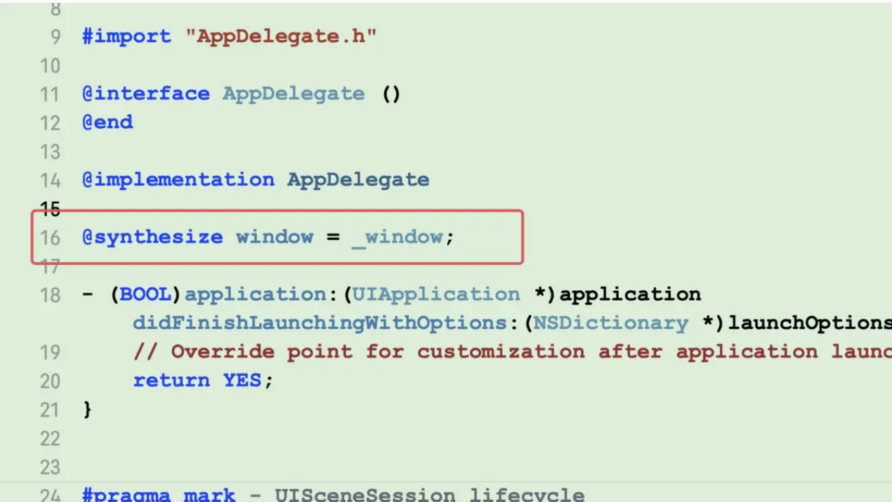
```swift
var window: UIWindow?

func application(_ application: UIApplication, didFinishLaunchingWithOptions launchOptions: [UIApplication.LaunchOptionsKey: Any]?) -> Bool { 
    window = UIWindow.init(frame: UIScreen.main.bounds)
    window?.rootViewController = UIStoryboard.init(name: "Main", bundle: nil).instantiateInitialViewController()
    window?.makeKeyAndVisible() 
    return true
}
```
## 秒数转成 00:00:00 格式  eg: 60s -> 00:01:00
```objc 
+ (NSString *)timeStringWithDuration:(NSTimeInterval)duration {
    NSInteger seconds ;
    NSInteger mins ;
    NSInteger hours ;
    
    if (duration < 60) {
        seconds = duration;
        mins = 0;
        hours = 0;
    } else if (duration >= 60 && duration < 3600) {
        seconds = (int)duration % 60;
        mins = duration / 60;
        hours = 0;
    } else {
        hours = (int)duration / 3600;
        mins = ((int)duration % 3600) / 60;
        seconds = ((int)duration % 3600) % 60;
    }
    
    NSString *hourString = hours < 10 ? [NSString stringWithFormat:@"0%ld", (long)hours] : [NSString stringWithFormat:@"%ld", (long)hours];
    NSString *minString = mins < 10 ? [NSString stringWithFormat:@"0%ld", (long)mins] : [NSString stringWithFormat:@"%ld", (long)mins];
    NSString *secondString = seconds < 10 ? [NSString stringWithFormat:@"0%ld", (long)seconds] : [NSString stringWithFormat:@"%ld",(long)seconds];
    NSString *result = [NSString stringWithFormat:@"%@:%@:%@", hourString, minString, secondString];
    
    return result;
}s
```

## 添加 pch 文件时候路径怎么写
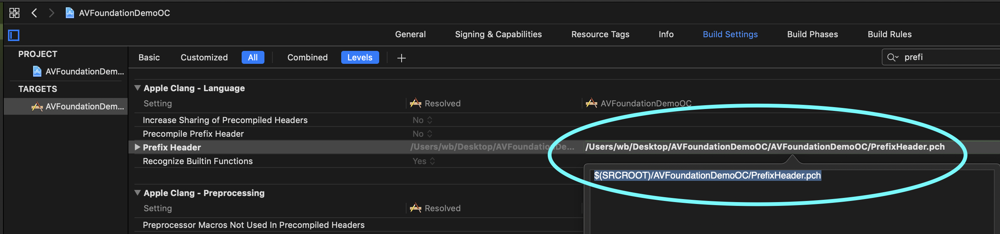

## iOS 添加点击效果，方便录屏时候看触点
```objc
//
//  UIWindow+UCARRobot.m
//  UCARRobot
//
//  Created by wb on 2020/4/3.
//

#import "UIWindow+UCARRobot.h" 
#import <objc/runtime.h>

@implementation UIWindow (UCARRobot)

+ (void)load {
    Method m1 = class_getInstanceMethod([self class], @selector(sendEvent:));
    Method m2 = class_getInstanceMethod([self class], @selector(ucar_sendEvent:));
    method_exchangeImplementations(m1, m2);
}

- (void)ucar_sendEvent:(UIEvent *)event {
    [self ucar_sendEvent:event];
    [self dealTouch:event];
}

- (void)dealTouch:(UIEvent *)event {
    UITouch *touch = event.allTouches.anyObject;
    if (touch.phase == UITouchPhaseEnded) {
        return;
    }
    
   NSNumber *value = [[NSUserDefaults standardUserDefaults] valueForKey:@"UCARTouchAnimationOn_Key"];
    if (!value.boolValue) {
        return;
    }
    
    static CGFloat width = 20;
    if (event.type == UIEventTypeTouches) {
        
        CGPoint point = [event.allTouches.anyObject locationInView:self];
        
        CGFloat oringX = point.x - width / 2;
        CGFloat oringY = point.y - width / 2;
        CGRect rect = CGRectMake(oringX, oringY, width, width);
        UIView *blackV = [[UIView alloc] initWithFrame:rect];
        blackV.alpha = 0.3;
        blackV.layer.cornerRadius = width / 2;
        blackV.backgroundColor = [UIColor purpleColor];
        [self addSubview:blackV];
        [self bringSubviewToFront:blackV];
        // 设置动画
        CABasicAnimation *animation = [CABasicAnimation animationWithKeyPath:@"transform.scale"];
        animation.duration = 0.3;
        animation.fromValue = @1;
        animation.toValue = @2;
        animation.fillMode = @"backwards";
        animation.removedOnCompletion = YES;
        [blackV.layer addAnimation:animation forKey:@"an1"];
        
        dispatch_after(dispatch_time(DISPATCH_TIME_NOW, (int64_t)(0.27 * NSEC_PER_SEC)), dispatch_get_main_queue(), ^{
            [blackV removeFromSuperview];
        });
    }
}

@end

```

## model类转字典
```objc

+ (NSDictionary*)getObjectData:(id)obj{
    NSMutableDictionary *dic = [NSMutableDictionary dictionary];
    unsigned int propsCount;
    objc_property_t *props = class_copyPropertyList([obj class], &propsCount);//获得属性列表
    for(int i = 0;i < propsCount; i++){
        objc_property_t prop = props[i];
        NSString *propName = [NSString stringWithUTF8String:property_getName(prop)];//获得属性的名称
        id value = [obj valueForKey:propName];//kvc读值
        if(value == nil){
            value = [NSNull null];
        }else{
            value = [self getObjectInternal:value];//自定义处理数组，字典，其他类
        }
        [dic setObject:value forKey:propName];
    }
    return dic;
}

+ (id)getObjectInternal:(id)obj{
    if([obj isKindOfClass:[NSString class]] || [obj isKindOfClass:[NSNumber class]] || [obj isKindOfClass:[NSNull class]]) {
        return obj;
    }
    if([obj isKindOfClass:[NSArray class]]) {
        NSArray *objarr = obj;
        NSMutableArray *arr = [NSMutableArray arrayWithCapacity:objarr.count];
        for(int i = 0;i < objarr.count; i++) {
            [arr setObject:[self getObjectInternal:[objarr objectAtIndex:i]] atIndexedSubscript:i];
        }
        return arr;
    }
    if([obj isKindOfClass:[NSDictionary class]]) {
        NSDictionary *objdic = obj;
        NSMutableDictionary *dic = [NSMutableDictionary dictionaryWithCapacity:[objdic count]];
        for(NSString *key in objdic.allKeys){
            [dic setObject:[self getObjectInternal:[objdic objectForKey:key]] forKey:key];
        }
        return dic;
    }
    return [self getObjectData:obj];
}
```

## iOS10上的 navgaitionBarItem 不显示问题

  要设置一个frame，否则10上显示不出来
  
```objc
    UIButton *historyBtn = [UIButton buttonWithType:(UIButtonTypeCustom)];
    historyBtn.frame = CGRectMake(0, 0, 24, 24); //  要设置一个frame，否则10上显示不出来
    [historyBtn setImage:[CKContext imageNamed:@"ck_charge_history"] forState:(UIControlStateNormal)];
    self.navigationItem.rightBarButtonItem = [[UIBarButtonItem alloc] initWithCustomView:historyBtn];
    [historyBtn addTarget:self action:@selector(toHistory) forControlEvents:(UIControlEventTouchUpInside)];
```

## class_copyPropertyList 不能复制父类的属性

- https://www.jianshu.com/p/bfe42b9cb37f

todo

## git 报错：refusing to merge unrelated histories

```shell
git pull origin master --allow-unrelated-histories
```

## 字符串某些变色
```objc
 NSAttributedString *attr0 = [[NSAttributedString alloc] initWithString:[NSString stringWithFormat:@"%d",textView.text.length] attributes:@{
            NSForegroundColorAttributeName: UCAR_ColorFromHexString(@"#F12E49"),
            NSFontAttributeName: [UIFont systemFontOfSize:14]
        }];
        NSAttributedString *attr1 = [[NSAttributedString alloc] initWithString:[NSString stringWithFormat:@"/%d",row.charactersLimit] attributes:@{
            NSForegroundColorAttributeName: UCAR_ColorFromHexString(@"#CCCCCC"),
            NSFontAttributeName: [UIFont systemFontOfSize:14]
        }];
        NSMutableAttributedString *att = [[NSMutableAttributedString alloc] init];
        [att appendAttributedString:attr0];
        [att appendAttributedString:attr1];
        self.countlabel.attributedText = att;
```

## 编译不过，storyboard 报错 : internal error.

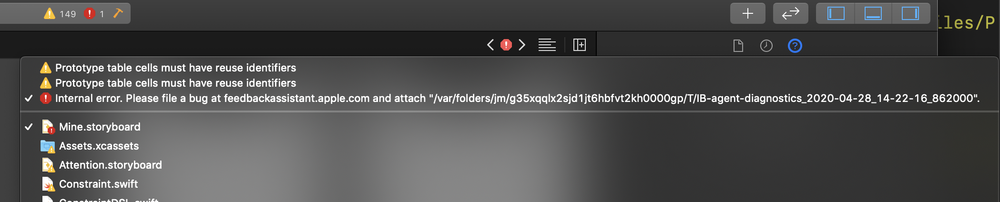

1. 试着把最近拖进来的视图删掉，配合 cmd + z
2. 试着把视图的宽度约束由<按比例 >改成<固定值>

## UITableView haader 悬浮效果

- plain 样式 header 悬浮
- group 样式取消 section 之间间隔：设置 footer 高度 0.01
```swift
override func tableView(_ tableView: UITableView, heightForFooterInSection section: Int) -> CGFloat {
    return 0.01     
}
```
## 让 UITableViewController 的 tableview 内容在状态栏下
```objc
// 如果iOS的系统是11.0，会有这样一个宏定义“#define __IPHONE_11_0  110000”；如果系统版本低于11.0则没有这个宏定义
  #ifdef __IPHONE_11_0
  if ([self.tableView respondsToSelector:@selector(setContentInsetAdjustmentBehavior:)]) {
      self.tableView.contentInsetAdjustmentBehavior = UIScrollViewContentInsetAdjustmentNever;
  }
  #endif
```
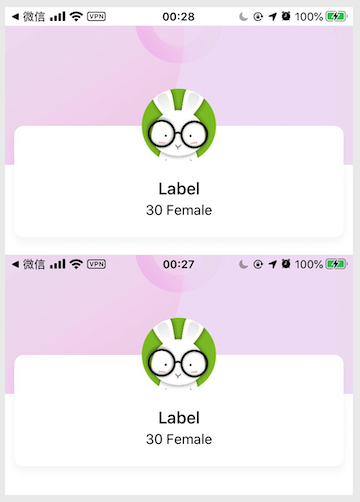

# xib & storyboard

## UIView xib 修改 frame 为 free 
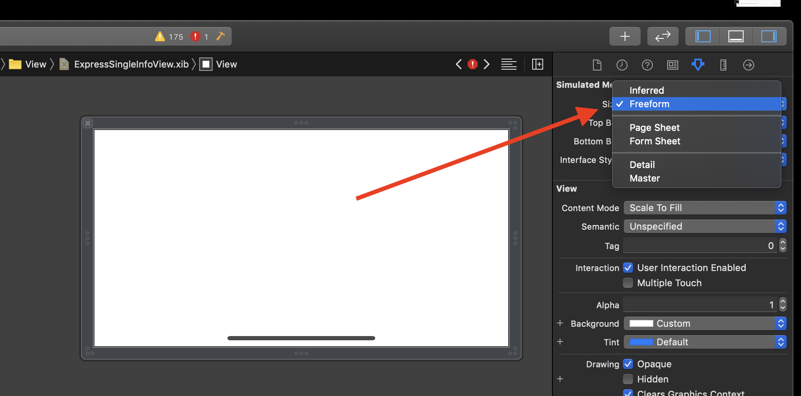

## UITableViewController 静态 cell 和动态 cell 混用

> 静态 cell 只能在 UITableViewController 中使用
- 动态section必须要保留1个cell
- cell的缩进级别代理方法，动态静态cell必须重写，否则会造成崩溃
```objc
- (NSInteger)tableView:(UITableView *)tableView numberOfRowsInSection:(NSInteger)section{
    if(section == SectionTypeSKU){// （动态cell）
        return self.pinModel.skuList.count;
    }
    if (section == SectionTypeLimit && !self.switchBtn.on) {
        return 0;
    }
    return [super tableView:tableView numberOfRowsInSection:section];
}

- (UITableViewCell *)tableView:(UITableView *)tableView cellForRowAtIndexPath:(NSIndexPath *)indexPath{
    if(SectionTypeSKU == indexPath.section){//（动态cell）
        SkuInputCell *cell = [SkuInputCell cellWithTableView:tableView];
        return cell;
    }
    return [super tableView:tableView cellForRowAtIndexPath:indexPath];
}

// MARK: - tableviewDelegate

- (CGFloat)tableView:(UITableView *)tableView heightForRowAtIndexPath:(NSIndexPath *)indexPath{
    if(SectionTypeSKU == indexPath.section){//（动态cell）
        return 154;
    }
    return [super tableView:tableView heightForRowAtIndexPath:indexPath];
}

//cell的缩进级别，动态静态cell必须重写，否则会造成崩溃
- (NSInteger)tableView:(UITableView *)tableView indentationLevelForRowAtIndexPath:(NSIndexPath *)indexPath{
    if(SectionTypeSKU == indexPath.section){// （动态cell）
        return [super tableView:tableView indentationLevelForRowAtIndexPath: [NSIndexPath indexPathForRow:0 inSection:indexPath.section]];
    }
    return [super tableView:tableView indentationLevelForRowAtIndexPath:indexPath];
}
```
