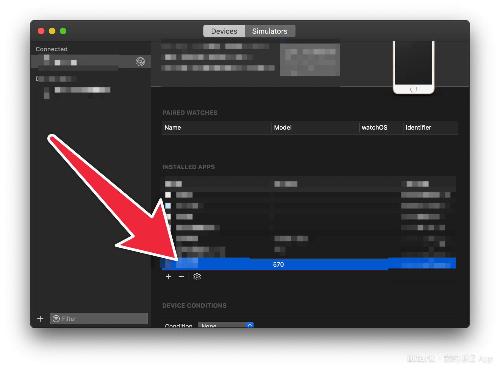

# Xcode 的 Device/Simulators 管理 Tips
  - [无线调试](#无线调试)
  - [Xcode 直接安装 ipa 包](#xcdoe-直接安装-ipa-包)
  - [个人开发者账号免费真机调试额度已满的解决方法](#个人开发者账号免费真机调试额度已满的解决方法)

进入 Device / Simulators 界面的路径

## 无线调试

在满足三个前提条件的情况下，我们可以通过无线使用真机调试 APP。

- Xcode 9 版本以上
- iPhone 和 Mac 连接同一个 wifi
- 至少 iOS 11 的系统

1. 第一次有线连接 iPhone，打开 Device 界面

2. 选中 Connect via network

   

3. 拔掉数据线，在左侧看到一个网络的标志，代表成功了

   

   这时候，点开设备列表，可以看到真机还在，并且右侧有一个小球

   

4. 如果 iPhone 和 Mac 不在同一个 wifi 下，可以稍微麻烦点，使用 IP 连接。

   

   

## Xcode 直接安装 ipa 包

今天产品同学来找，说是要装一个很久之前的测试包，刚好每次发版都会把 ipa 包留个备份。除了使用 fir 这类平台，我们可以直接用 Xcode 直接把 ipa 包装到测试机里。

打开 Device 界面后，点击加号，从 finder 了选择 ipa 包，或者直接把 ipa 拖入到该区域既可。

## 个人开发者账号免费真机调试额度已满的解决方法

当出现以下提示的时候，可以通过删除部分 APP 解决

解决：选中一个不再使用的测试 APP，点击减号删除

