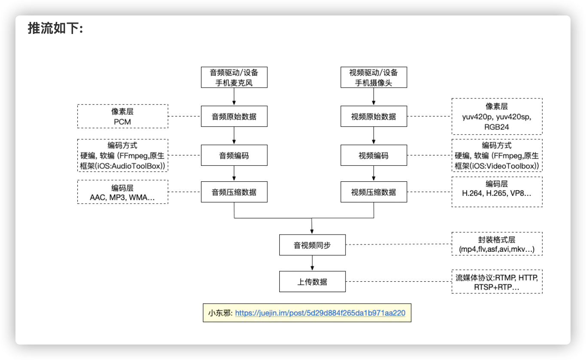
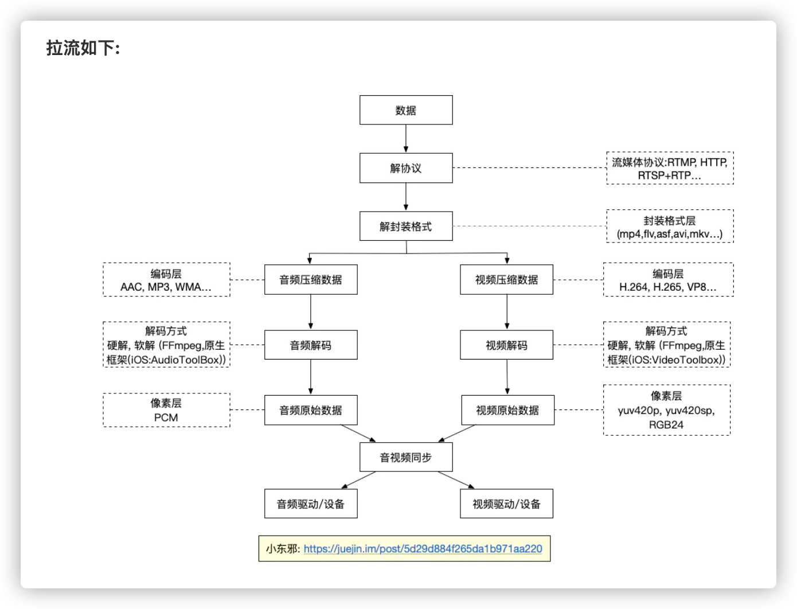
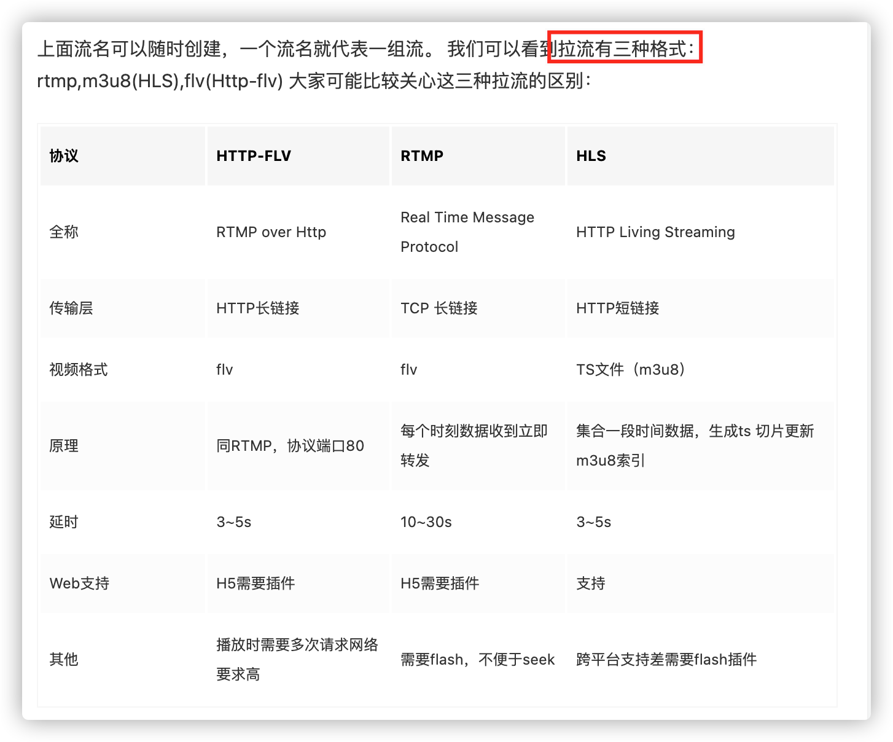

# 直播

- [直播](#直播)
  - [CDN 与直播](#cdn-与直播)

- [直播平台技术原理 哔哩哔哩](https://www.bilibili.com/video/BV1dv411C7vx)
- [移动端音视频从零到上手 by 快手小东邪](https://juejin.cn/post/6844903889007820813)
- [iOS动手做一个直播(原理篇)](https://juejin.cn/post/6844903526703824910)
- [直播技术原理：CDN 与直播](https://juejin.cn/post/6844903908163190791)

## CDN 与直播

大家使用CDN云厂商的一个基础就是云存储，云存储是对象存储。首先，一个文件包含了了属性（术语叫metadata，元数据，例如该文件的大小、修改时间、存储路径等）以及内容（以下简称数据）。对象存储区别于块存储（DAS，SAN）和文件存储（NAS系统，NFS，CIFS），核心是将数据通路(数据读或写)和控制通路(元数据)分离，构成键值对，访问时候通过key访问。所以云存储访问时候可以通过HTTP协议post,get请求通过key值去下载数据访问。

