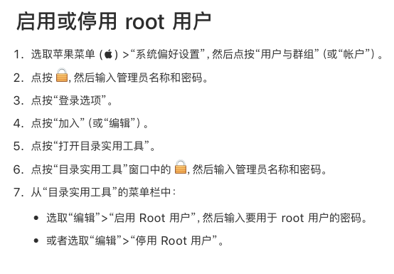
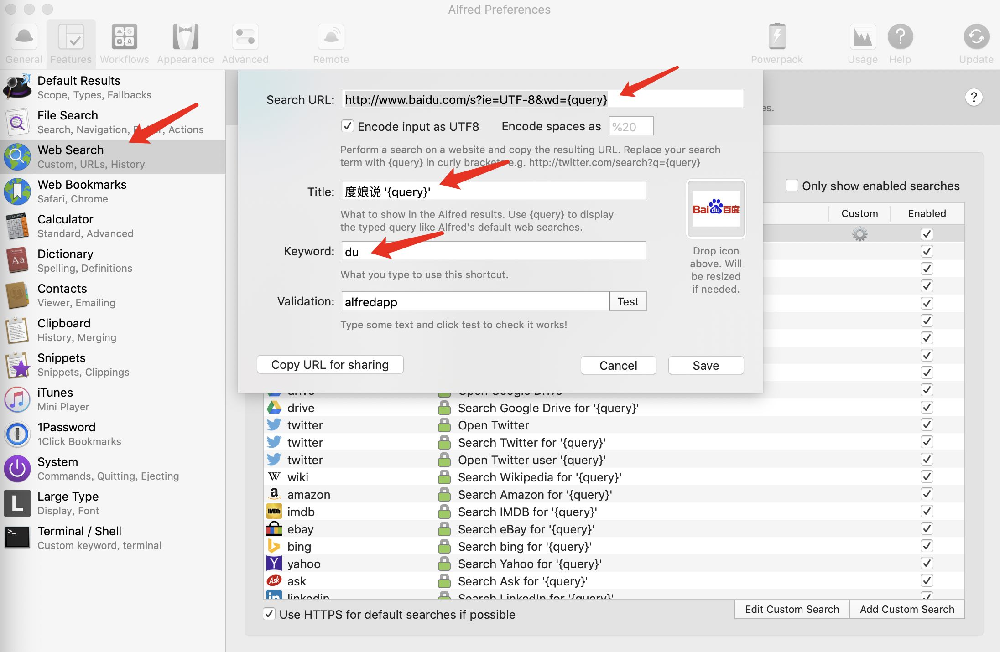
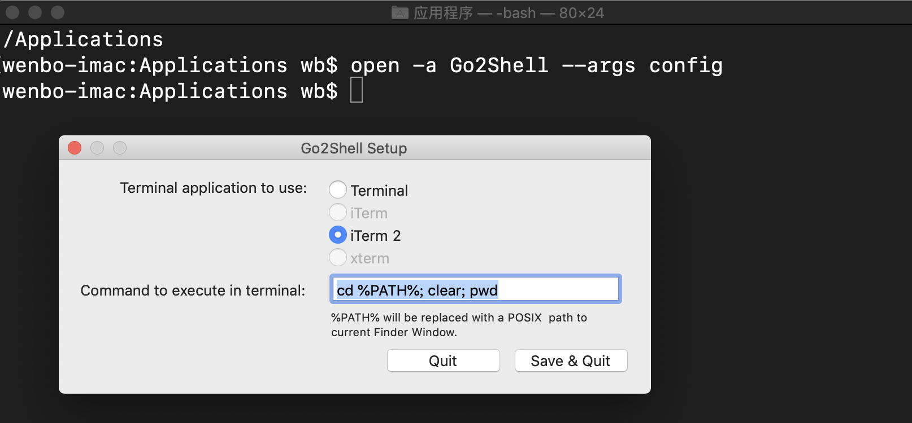
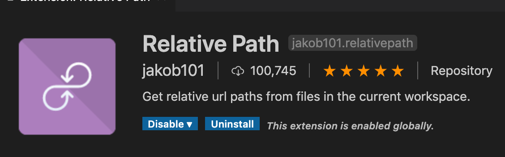
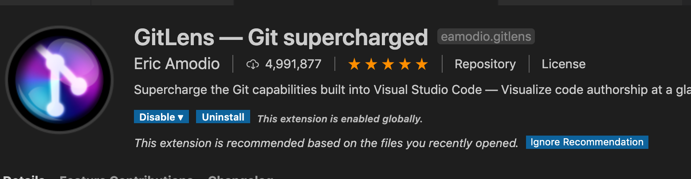
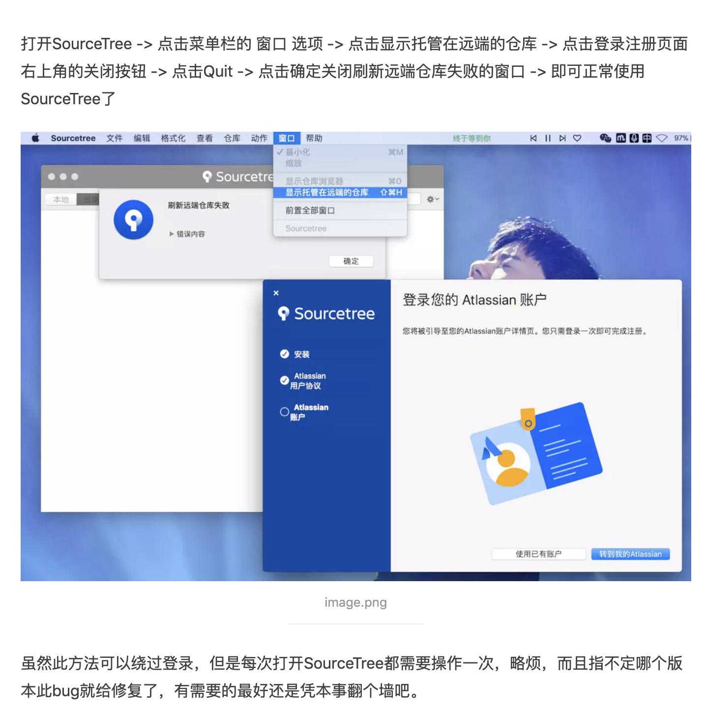
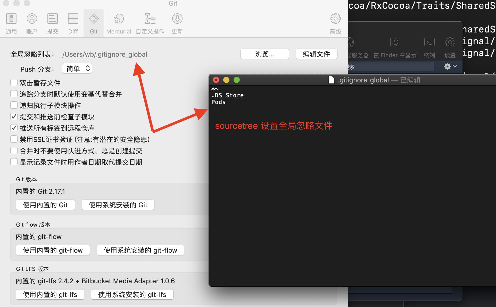

- [新Mac安装软件](#%e6%96%b0mac%e5%ae%89%e8%a3%85%e8%bd%af%e4%bb%b6)
- [启用 root 用户](#%e5%90%af%e7%94%a8-root-%e7%94%a8%e6%88%b7)
- [Alfred](#alfred)
  - [设置百度搜索](#%e8%ae%be%e7%bd%ae%e7%99%be%e5%ba%a6%e6%90%9c%e7%b4%a2)
  - [常用快捷键](#%e5%b8%b8%e7%94%a8%e5%bf%ab%e6%8d%b7%e9%94%ae)
- [go2shell](#go2shell)
  - [设置go2shell打开的终端为iterm2](#%e8%ae%be%e7%bd%aego2shell%e6%89%93%e5%bc%80%e7%9a%84%e7%bb%88%e7%ab%af%e4%b8%baiterm2)
- [VSCode 插件](#vscode-%e6%8f%92%e4%bb%b6)
- [SourceTree](#sourcetree)
  - [免登陆使用](#%e5%85%8d%e7%99%bb%e9%99%86%e4%bd%bf%e7%94%a8)
  - [sourcetree 设置全局忽略文件](#sourcetree-%e8%ae%be%e7%bd%ae%e5%85%a8%e5%b1%80%e5%bf%bd%e7%95%a5%e6%96%87%e4%bb%b6)
  - [sourcetree 每次 pull/push 都要输入密码解决方法](#sourcetree-%e6%af%8f%e6%ac%a1-pullpush-%e9%83%bd%e8%a6%81%e8%be%93%e5%85%a5%e5%af%86%e7%a0%81%e8%a7%a3%e5%86%b3%e6%96%b9%e6%b3%95)
- [Xcode 常用的快捷键](#xcode-%e5%b8%b8%e7%94%a8%e7%9a%84%e5%bf%ab%e6%8d%b7%e9%94%ae)
- [使用 soundflower 解决 QuickTime 录屏没有声音的问题](#%e4%bd%bf%e7%94%a8-soundflower-%e8%a7%a3%e5%86%b3-quicktime-%e5%bd%95%e5%b1%8f%e6%b2%a1%e6%9c%89%e5%a3%b0%e9%9f%b3%e7%9a%84%e9%97%ae%e9%a2%98)
- [微信小助手](#%e5%be%ae%e4%bf%a1%e5%b0%8f%e5%8a%a9%e6%89%8b)
- [macbook 外接显示器发虚问题](#macbook-%e5%a4%96%e6%8e%a5%e6%98%be%e7%a4%ba%e5%99%a8%e5%8f%91%e8%99%9a%e9%97%ae%e9%a2%98)
### 新Mac安装软件

- [x] 输入法
- [x] 百度网盘
- [x] CleanMyMac
- [x] 迅雷
- [ ] 1Password
- [ ] 全能解压 (Dr. Unarchiver)
- [ ] 微信
- [x] QQ
- [ ] 企业微信
- [x] IINA播放器
- [ ] 印象笔记-圈点
- [ ] Microsoft Word / WPS
- [ ] Proxyee-down
- [x] 有道词典 
- [x] Shadow[违规xxx]SocksX 
- [x] Alfred 
- [x] Chrome
- [x] Homebrew 
- [ ] mounty (brew cask install mounty)

- [x] Xcode
- [x] Cocoapods (sudo gem install cocoapods -v 1.6.1 另外 pod setup)
- [x] Postman
- [x] Visual Studio Code
- [x] SourceTree
- [ ] homebrew 
- [ ] Sketch
- [ ] 达芬奇
- [ ] PS
- [ ] `brew install annie` [视频下载](https://github.com/iawia002/annie#download-a-video) 
- [ ] listen1
- [ ] Ummy Video Downloader (YouTube视频下载)
- [ ] magnet 窗口速调辅助工具
- [ ] 打印目录结构 `brew install tree`    
    ```shell
    # https://www.jianshu.com/p/9411d60950bf
    
    tree -d -N 
    ```

——

- [x] 设置四个触发角
- [x] 设置Chrome为默认浏览器
- [x] MAC应用无法打开或文件损坏的处理方法 ： 设置允许任何来源的app  (打开终端，输入`sudo spctl --master-disable`然后按回车)
- [x] 切换输入法快捷键 系统输入法大写按钮
- [x] 命令行安装 `command line developer tool` : `xcode-select --install` 
- [ ] [JetBrains Mono 字体](https://www.jetbrains.com/lp/mono/)


——

- [软件资源站 xclient](xclient.info)  
- https://wxkxsw.com/link/Ce6mLeDTepd5W34C?mu=0

### 启用 root 用户



### Alfred 
#### 设置百度搜索



```shell
    # 百度搜索
    http://www.baidu.com/s?ie=UTF-8&wd={query}
    # github搜索
    https://github.com/search?q={query}&ref=opensearch
    # 掘金搜索
    https://juejin.im/search?query={query}
    # 百度翻译
    https://fanyi.baidu.com/#en/zh/{query}
    # pub.dev 搜索
    https://pub.dev/packages?q={query}
```
#### 常用快捷键

+ `command` + `option` + `c` 最近复制的内容

#### workflow 资源

- [workflow-collect](./src/../../workflow-collect/)
- https://pacmax.org


### go2shell

- App Store 下载 go2shell
- 在application目录下找到go2shell，按住 command 拖动 go2shell 到 finder 工具栏

#### 设置go2shell打开的终端为iterm2

- 在终端中输入 `open -a Go2Shell --args config`
- 选择iterm2，保存。

 

### VSCode 插件




### SourceTree 
#### 免登陆使用



#### sourcetree 设置全局忽略文件


#### sourcetree 每次 pull/push 都要输入密码解决方法

终端输入:(第一次需要输入账号密码，以后就不用了)
```shell
git config --global credential.helper osxkeychain  
```

### Xcode 常用的快捷键 

+ `Ctrl` + `command` + `上/下箭头` 切换`.h`和`.m`
+ `shift` + `command` + `O` 打开`quick open`
+ `option` + `command` + `[ / ]` 整行的上下移动代码

### 使用 soundflower 解决 QuickTime 录屏没有声音的问题

- https://www.jianshu.com/p/db035dad616a

### 微信小助手

- https://github.com/lmk123/oh-my-wechat

### macbook 外接显示器发虚问题

> 一些软件：[点我](../src/mac_extend_screen/)
[可能是目前解决Mac外接显示器字体发虚的最好方法](https://www.jianshu.com/p/6274253b78d8)
[0.15 公测版，关闭 SIP 后，还是无法将文件拷贝进 System 下](https://www.v2ex.com/t/579672)

```shell
# 开启和关闭 sip
csrutil disable
csrutil enable
csrutil status # 查看状态
```