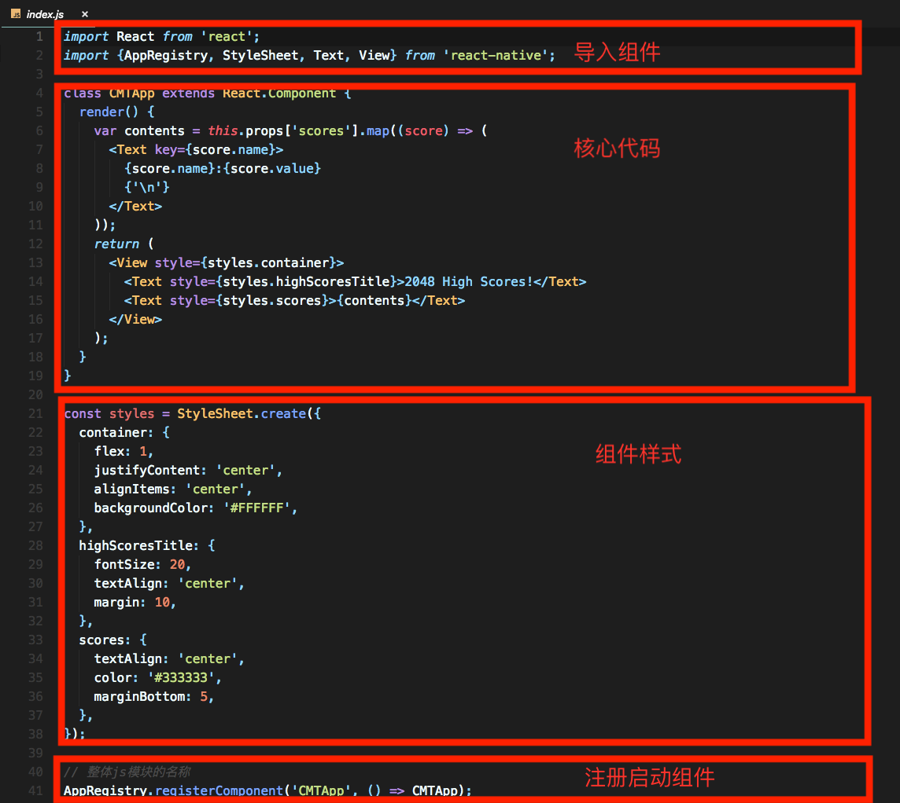
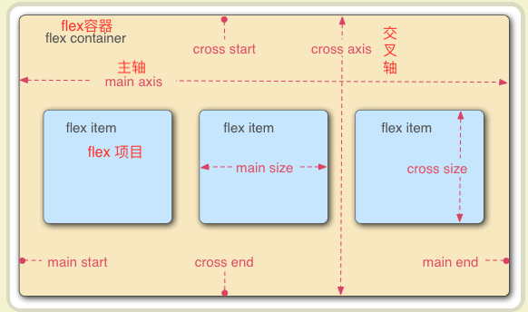
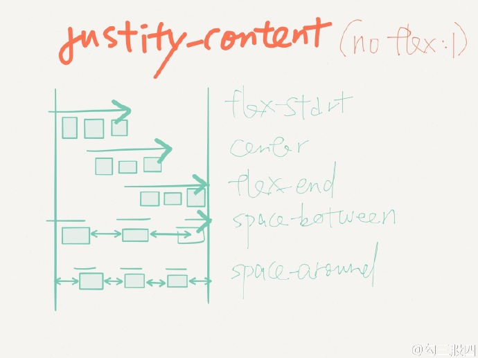
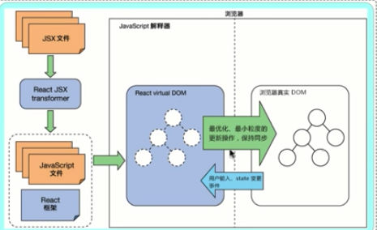
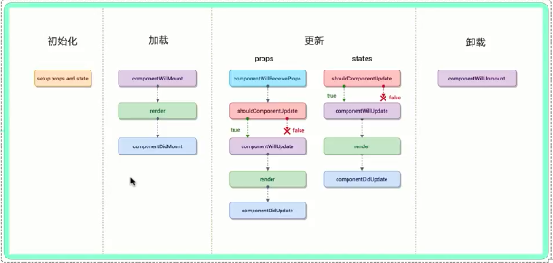

# React Native 开发 todo未完成

## React Native入门

[环境搭建、纯RN工程创建、集成RN到现有Native工程](https://github.com/AllenSWB/notes/blob/master/docs/reactnative_tutorial_0.md)

## 一些概念

> `index.js`入口文件、组件、props、state、flexbox布局、JSX

1. `index.js`入口文件

   

2. 常用组件  https://reactnative.cn/docs/components-and-apis/

   + 导航组件
     + [React Navigation](https://reactnative.cn/docs/navigation#react-navigation)
     + [NavigatorIOS](https://reactnative.cn/docs/navigation#navigatorios)：基于`UINavigationController`封装的

   + 图片

     - 静态图片

     ```javascript
     <Image source={require('./my-icon.png')} />
     ```

     - 网络图片

     ```javascript
     <Image source={{uri: 'https://facebook.github.io/react/logo-og.png'}}
            style={{width: 400, height: 400}} />
     
     // 缓存控制
     <Image
       source={{
         uri: 'https://facebook.github.io/react/logo-og.png',
         cache: 'only-if-cached',
       }}
       style={{width: 400, height: 400}}
     />
     ```

3. props

   > 使用两种数据控制一个组件，一个是`props`，一个是`state`。
   >
   > props在父组件中制定，而且一经指定，在被指定的组件的生命周期中则不再改变。

   ```javascript
   // style 样式属性
   <View style={styles.container}> 
   ```

4. state

   > 对于需要改变的数据，我们需要使用`state`

   - 一切的界面变化，都是`state`变化。

   - `state`修改必须通过`setState()`	

     `setState` 是一个 `merge` 合并操作，只修改指定属性，不影响其他属性

     `setState` 是异步操作，修改不会马上生效

5. flexbox

   全称是`Flexible Box` 弹性布局。https://reactnative.cn/docs/flexbox/

   

   > flex container：flex容器
   >
   > flex item：flex项目
   >
   > 主轴 main axis： 水平的
   >
   > main start ：主轴的起点
   >
   > main end：主轴的终点
   >
   > 交叉轴 cross axis：垂直的，又称做次轴。
   >
   > cross start：交叉轴的起点
   >
   > cross end：交叉轴的终点

   - `flexDirection`

     指定item排列方向：`row` 水平方向 or `colume`垂直方向

   - `justifyContent`

     决定其子元素沿着**主轴**的**排列方式**

     `flex-start`、`center`、`flex-end`、`space-around`、`space-between`以及`space-evenly`

   - `alignItems`

     决定其子元素沿着**次轴**（与主轴垂直的轴，比如若主轴方向为`row`，则次轴方向为`column`）的**排列方式**

   

   

   

   

   

   

6. JSX

   http://www.runoob.com/react/react-jsx.html

   JSX 是一个看起来很像 XML 的 JavaScript 语法扩展。

   - JSX 执行更快，因为它在编译为 JavaScript 代码后进行了优化。
   - 它是类型安全的，在编译过程中就能发现错误。
   - 使用 JSX 编写模板更加简单快速。

## 一些原理

1. React原理

   1. `diff`算法

   2. `JSX`

      

2. React Native生命周期

   

- 初始化

  - 配置props 和 status

- 加载

  - compentsWillMount
  - render
  - compentsDidMount

- 更新

  - props
    - componentWillReceiveProps
    - shouldCompentsUpdate
    - compentsWillUpdate
    - render
    - compentsDidUpdate
  - status
    - shouldCompentsUpdate
    - compentsWillUpdate
    - render
    - compentsDidUpdate

- 卸载

  compentsWillUnmount