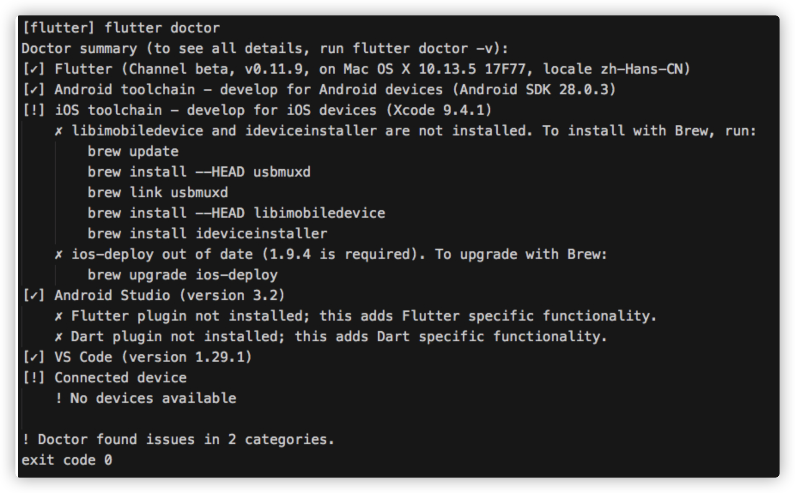
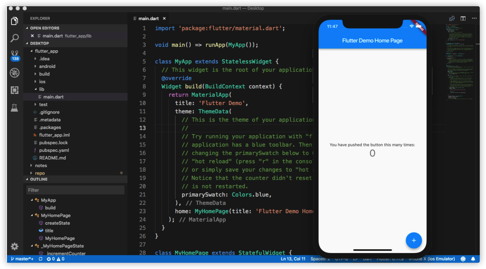

# 入门

## 开发环境配置

1. 安装`flutter` https://flutter.io/docs/get-started/install
2. 解压下载的文件，放到 `/Users/wenbo.sun/Documents/dev`路径下
3. 在当前路径，运行命令

        export PATH=`pwd`/flutter/bin:$PATH

4. 接着执行命令

        flutter doctor

### 更新环境变量

1. `cd ~`切到`home`目录下
2. 打开`.bash_profile`文件。如果没有就创建它`touch .bash_profile`
3. 编辑`.bash_profile`文件，添加以下三行。

        export PUB_HOSTED_URL=https://pub.flutter-io.cn  
        export FLUTTER_STORAGE_BASE_URL=https://storage.flutter-io.cn 
        export PATH=/Users/wenbo.sun/Documents/dev/flutter/bin:$PATH
        
        /Users/wenbo.sun/Documents/dev/flutter/ 是我的flutter路径，你们可以根据实际替换。

4. 运行`source $HOME/.bash_profile`刷新当前`terminal`
5. 通过运行`flutter/bin`命令验证目录是否在已经在PATH中:

        echo $PATH

### 配置VSCode作为开发工具

1. `Shift + Command + P` 打开命令模式
2. 输入`doctor`，选择`Flutter: Run flutter doctor`执行。查看输出有没有错误，如果有错根据提示修改。

### 创建第一个flutter工程

1. 打开VSCode命令模式，选择`Flutter: New Project`执行。
2. 根据提示输入工程名，选择存放工程的目录。最后会自动生成一个工程模板，并打开`main.dart`文件

### 遇到的问题

+ 执行`flutter doctor`时候，检查出如下问题。

    

    提示我没装`libimobiledevice`和`ideviceinstaller`。没关系，我们可以先用模拟器跑工程。

    

+ 运行命令`brew install --HEAD usbmuxd `报错如下

  
    ```shell
    ./configure: line 16735: syntax error near unexpected token `libplist,'
./configure: line 16735: `PKG_CHECK_MODULES(libplist, libplist >= $LIBPLIST_VERSION)'
    
    READ THIS: https://docs.brew.sh/Troubleshooting
    ```
    
    解决方法：
    
    执行命令
    
    ```shell
    brew link  pkg-config  
    ```
    
    之后再执行命令
    
    ```shell
    brew install --HEAD usbmuxd
    brew unlink usbmuxd
    brew link usbmuxd
    brew install --HEAD libimobiledevice
    brew install ideviceinstaller
    ```
    
    

## Dart 语言

0. [语言概览](https://www.dartlang.org/guides/language/language-tour)

1. 概念

    + 所有可以放到变量(var)里的值都是对象，所有对象都是一个类的实例。eg: `numbers` 函数 `null`这些都是`object`
    + 支持泛型 eg: `List<int>`
    + `_`开头的变量是私有变量。eg: `_suggestions`

2. 语法

+ 变量

      var name = 'Bob';
    
      int count; // 一个变量默认值是 null。就算是numbers类型的变量，默认值也是null。因为在Dart里，所有的都是对象。

+ 常量

        // final 一经赋值就不可再更改。
        final name = 'Jo';
    
        // Const variables are implicitly final.
        const name = 'Mike';

+ 基础类型

    + `numbers` (int double)
    + `string`
    + `booleans` (true false)
    + `lists` (数组)
    + `maps`  (key-value类型)
    + `runes` (for expressing Unicode characters in a string)
    + `symbols`

+ 函数

        // 返回值 函数名 参数
        Widget _buildList(WordPair pair) {
        return ...
        }

+ 单行函数使用 `=>` 符号

        void main() => runApp(MyApp()); 


## Flutter 的一些基本概念

1. 热重载(`hot-reloading`): 无需重启应用程序就能实时加载修改后的代码，并且不会丢失状态。

    以下几种类型的更改无法热重载

    + 全局变量初始化器
    + 静态字段初始化程序
    + `main()`方法

2. 支持设备和系统

    + iOS8以上，iPhone5s之后
    + Android Jelly Bean, ARM Android设备

3. 核心原则：一切皆 `Widget`

    `Widget`的主要工作是提供一个`build()`方法来描述如何根据其他较低级别的`Widget`来显示自己。

4. 可变不可变的`Widget`
   
    + `StatelessWidge` 不可变的Widget

    + `StatefulWidge` 持有的状态可能在`widget`生命周期中发生变化. 实现一个 stateful widget 至少需要两个类:

        - 一个 `StatefulWidget`类。
        - 一个 `State`类。 StatefulWidget类本身是不变的，但是 State类在widget生命周期中始终存在.

5. 基础 `Widget`

    [widget目录](https://flutterchina.club/widgets/)  以下是常用的几个`Widget`

        Container 
            一个拥有绘制、定位、调整大小的 widget。
        Row 
            在水平方向上排列子widget的列表
        Column 
            在垂直方向上排列子widget的列表
        Image 
            一个显示图片的widget
        Text 
            单一格式的文本
        Icon 
            A Material Design icon.
        RaisedButton 
            按钮，一个凸起的材质矩形按钮
        Scaffold 
            此类提供了用于显示drawer、snackbar和底部sheet的API
        Appbar
            一个Material Design应用程序栏，由工具栏和其他可能的widget（如TabBar和FlexibleSpaceBar）组成。
        FlutterLogo
            Flutter logo, 以widget形式. 这个widget遵从IconTheme
        Placeholder 
            一个绘制了一个盒子的的widget，代表日后有widget将会被添加到该盒子中
    
        Scaffold
            是 Material library 中提供的一个widget, 它提供了默认的导航栏、标题和包含主屏幕widget树的body属性。widget树可以很复杂。

6. `Widget`只是`UI`的描述。它本身是轻量的，因为它不是控件，也不会直接绘制。

7. 通过操作`State`来更新`Widget`

8. iOS中通常使用cocoapods管理三方库，对应的flutter中使用`podspec.ymal`中声明外部依赖，资源在[pub](https://pub.dartlang.org/flutter/packages/)。

# 学习资源

+ [Flutter Go开发规范](https://github.com/alibaba/flutter-go/blob/develop/Flutter_Go%20%E4%BB%A3%E7%A0%81%E5%BC%80%E5%8F%91%E8%A7%84%E8%8C%83.md)

+ Flutter社区  

  + [给iOS开发者的Flutter指南 上](https://mp.weixin.qq.com/s/PnLVvOuP7eDa-EjyXAvgdw)
  + [给iOS开发者的Flutter指南 下](https://mp.weixin.qq.com/s/59w9e3pdnT5-GqF98J0gYQ)

+ 闲鱼技术

  + [Flutter干活学堂 by 闲鱼技术](https://zhuanlan.zhihu.com/xytech)
  + [语雀文档](https://www.yuque.com/xytech/flutter)

+ 掘金
  + [Flutter tag](https://juejin.im/tag/Flutter?sort=hottest)
  + [Flutter | 通过 ServiceLocator 实现无 context 导航](https://juejin.im/post/5d1daadbe51d457759648755)
+ 马蜂窝
  + [Flutter 实现原理及在马蜂窝的跨平台开发实践](https://mp.weixin.qq.com/s?__biz=Mzg5MTA4Mzg5NA==&mid=2247483750&idx=1&sn=d018df8b4639f2ff3e6666021de694f5&chksm=cfd38c7ff8a40569d0ec29f00c70553d106a7e0403a5cb47d9d00b02cd86da7261875bc77e25&scene=21#wechat_redirect)

+ 搜狐技术
  + [Flutter编程指南 PDF](https://github.com/DeveloperErenLiu/Flutter-PDF)
  + [十分钟带你入坑Flutter](https://mp.weixin.qq.com/s/f9Ow954gBBK2Qpxj8Ifdxg)

+ 快手/百度/360 

+ 官方文档 [中](https://flutterchina.club/docs/) [英](https://flutter.io/docs/get-started/install) 
+ [闲鱼技术flutter](https://www.yuque.com/xytech/flutter)
+ [头条 Flutter iOS 混合工程实践 by 张星宇](https://xiaozhuanlan.com/topic/1538692074)
+ [flutter库](https://flutterawesome.com/)