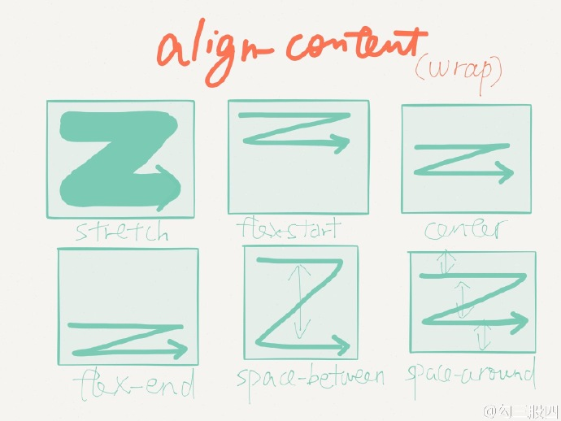

- [资料](#资料)
- [搭建开发环境](#搭建开发环境)
- [创建 rn 项目](#创建-rn-项目)
- [rn 设计思路](#rn-设计思路)
- [JSX](#jsx)
- [真机调试](#真机调试)
- [一些概念](#一些概念)
- [一些原理](#一些原理)
- [集成RN到原生App](#集成rn到原生app)
  - [安装依赖](#安装依赖)
  - [代码集成](#代码集成)

## 资料

+ [80节实战课精通RN开发](https://www.youtube.com/watch?v=PHnM1sD30dY&list=PLXbU-2B80FvDgo7wQjdu5zAJG2boO9q2C)
+ [es6入门 by 阮一峰](http://es6.ruanyifeng.com/)
+ [给所有开发者的React Native详细入门指南](https://juejin.im/post/5898388b128fe1006cb943e3#heading-6)
+ [React教程 by 菜鸟教程](http://www.runoob.com/react/react-tutorial.html)

## 搭建开发环境

> 必须安装的依赖有：Node、Watchman、RN命令行工具、Xcode（JDK和Android Studio）

- 安装 [node.js](https://nodejs.org/zh-cn/)
- 通过 homebrew 安装 watchman、flow
  + [Watchman](https://facebook.github.io/watchman)是由 Facebook 提供的监视文件系统变更的工具。安装此工具可以提高开发时的性能（packager 可以快速捕捉文件的变化从而实现实时刷新）
```shell
 brew install watcman
 brew install flow
```
+ 安装RN命令行工具：用于执行创建、初始化、更新项目、运行打包服务（packager）等任务
```shell
npm install -g react-native-cli
```
+ [Yarn](http://yarnpkg.com/)是 Facebook 提供的替代 npm 的工具，可以加速 node 模块的下载
```shell
# Yarn、RN命令行工具（react-native-cli）
npm install -g yarn react-native-cli
```
- 经常切换 node.js 版本，建议使用 NVM（node.js version manager) 管理版本

## 创建 rn 项目

```shell
# xxxName 工程名
react-native init xxxName # 默认创建最新版本的rn
# 创建指定版本的rn
react-native init testRN --version 0.44.3 # testRN 工程名
```

运行工程

```shell
To run your app on iOS:
   cd /Users/wenbo.sun/Desktop/testRN
   react-native run-ios
- or -
  Open ios/testRN.xcodeproj in Xcode
     Hit the Run button
To run your app on Android:
     cd /Users/wenbo.sun/Desktop/testRN
     Have an Android emulator running (quickest way to get started), or a device connected
     react-native run-android
```

## rn 设计思路

 

## JSX

> http://www.runoob.com/react/react-jsx.html

JSX 不是一门新的语言，而是一个语法糖，允许开发者在 JavaScript 中书写 HTML 语法。最后每个 HTML 标签都会转化为 JavaScript 语法来运行。是一个看起来很像 XML 的 JavaScript 语法扩展。
- JSX 执行更快，因为它在编译为 JavaScript 代码后进行了优化。
- 它是类型安全的，在编译过程中就能发现错误。
- 使用 JSX 编写模板更加简单快速。

## 真机调试


## 一些概念

- iOS ：打开 RCTWebSocketExecutor.mm 文件，修改 localhost 为电脑的 ip 地址


> `index.js`入口文件、组件、props、state、flexbox布局、JSX

1. `index.js`入口文件

   

2. 常用组件  https://reactnative.cn/docs/components-and-apis/

   + 导航组件
     + [React Navigation](https://reactnative.cn/docs/navigation#react-navigation)
     + [NavigatorIOS](https://reactnative.cn/docs/navigation#navigatorios)：基于`UINavigationController`封装的

   + 图片

     - 静态图片

     ```javascript
     <Image source={require('./my-icon.png')} />
     ```

     - 网络图片

     ```javascript
     <Image source={{uri: 'https://facebook.github.io/react/logo-og.png'}}
            style={{width: 400, height: 400}} />
     
     // 缓存控制
     <Image
       source={{
         uri: 'https://facebook.github.io/react/logo-og.png',
         cache: 'only-if-cached',
       }}
       style={{width: 400, height: 400}}
     />
     ```

3. props

   > 使用两种数据控制一个组件，一个是`props`，一个是`state`。
   >
   > props在父组件中制定，而且一经指定，在被指定的组件的生命周期中则不再改变。

   ```javascript
   // style 样式属性
   <View style={styles.container}> 
   ```

4. state

   > 对于需要改变的数据，我们需要使用`state`

   - 一切的界面变化，都是`state`变化。

   - `state`修改必须通过`setState()`	

     `setState` 是一个 `merge` 合并操作，只修改指定属性，不影响其他属性

     `setState` 是异步操作，修改不会马上生效

5. flexbox

   全称是`Flexible Box` 弹性布局。https://reactnative.cn/docs/flexbox/

   

   > flex container：flex容器
   >
   > flex item：flex项目
   >
   > 主轴 main axis： 水平的
   >
   > main start ：主轴的起点
   >
   > main end：主轴的终点
   >
   > 交叉轴 cross axis：垂直的，又称做次轴。
   >
   > cross start：交叉轴的起点
   >
   > cross end：交叉轴的终点

   - `flexDirection`

     指定item排列方向：`row` 水平方向 or `colume`垂直方向

   - `justifyContent`

     决定其子元素沿着**主轴**的**排列方式**

     `flex-start`、`center`、`flex-end`、`space-around`、`space-between`以及`space-evenly`

   - `alignItems`

     决定其子元素沿着**次轴**（与主轴垂直的轴，比如若主轴方向为`row`，则次轴方向为`column`）的**排列方式**

   

   

   

   

   

   
 
## 一些原理


1. React原理

   1. `diff`算法

   2. `JSX`

      

2. React Native生命周期

   

- 初始化

  - 配置props 和 status

- 加载

  - compentsWillMount
  - render
  - compentsDidMount

- 更新

  - props
    - componentWillReceiveProps
    - shouldCompentsUpdate
    - compentsWillUpdate
    - render
    - compentsDidUpdate
  - status
    - shouldCompentsUpdate
    - compentsWillUpdate
    - render
    - compentsDidUpdate

- 卸载

  compentsWillUnmount

## 集成RN到原生App 

+  [官方文档 集成RN到Native](https://reactnative.cn/docs/integration-with-existing-apps/)

> 主要步骤如下：
>
> 1. 配置好 React Native 依赖和项目结构。
> 2. 了解你要集成的 React Native 组件。
> 3. 使用 CocoaPods 把这些组件以依赖的形式加入到项目中。
> 4. 创建 js 文件，编写 React Native 组件的 js 代码。
> 5. 在应用中添加一个`RCTRootView`。这个`RCTRootView`正是用来承载你的 React Native 组件的容器。
> 6. 启动 React Native 的 Packager 服务，运行应用。
> 7. 验证这部分组件是否正常工作。

### 安装依赖

步骤如下：

1. 创建一个空目录，再在其中创建一个子目录`/ios`，把现有iOS工程拷贝进`/ios`目录底下

   ```shell
   # 创建一个空目录 rnJoinNative
   mkdir rnJoinNative
   cd rnJoinNative/
   # 创建一个子目录 ios
   mkdir ios
   # 把现有iOS工程拷贝进ios目录底下
   ```

2. 创建一个`package.json`文件，安装JavaScript依赖包

   ```shell
   touch package.json
   ```

   编辑`package.json`文件

   ```json
   {
   	"name": "rnJoinNative",
       // 这个字段意义不大，除非你要把项目发布到npm仓库
   	"version": "0.0.1",  
   	"private": true,
   	"scripts": {
       	// 用于启动 packager 服务的命令。   
   		"start": "node node_modules/react-native/local-cli/cli.js start"
   	}
   }
   ```

   使用yarn或者npm（二者都是node的包管理器）来安装React和React Native模块。

   终端运行一下命令，默认会安装最新版本的React Native。

   ```shell
   yarn add react-native
   
   # 会打印类似下面的警告信息，这是正常现象，意味着我们需要安装指定版本的React
   warning " > react-native@0.58.1" has unmet peer dependency "react@16.6.3".
   ```
   安装指定版本的react-native [yarn文档](https://yarn.bootcss.com/docs/)
   ```shell
    yarn add react-native@0.44.3
   ```

   安装React

   ```shell
   yarn add react@16.6.3 # 注意，这里的版本号要和上面warning提示的版本号一致！！！
   ```

   成功后，再去看`package.json`文件，会发现多出了`dependencies`字段

   ```json
   {
   	"name": "rnJoinNative",
   	"version": "0.0.1",
   	"private": true,
   	"scripts": {
   		"start": "node node_modules/react-native/local-cli/cli.js start"
   	},
   	"dependencies": {
   		"react": "16.6.3",
   		"react-native": "^0.58.1"
   	}
   }
   ```

3. 使用cocoapods将RN添加到原生app中

   在Podfile文件中加入以下代码

   ```ruby
   # React Native
   pod 'React', :path => '../../node_modules/react-native', :subspecs => [
       'Core',
       # 根据需要加入相应的组件
       'RCTText',
       'RCTNetwork',
       'CxxBridge', # 如果RN版本 >= 0.47则加入此行
       'DevSupport', # 如果RN版本 >= 0.43，则需要加入此行才能开启开发者菜单
   ]
   # 如果你的RN版本 >= 0.42.0，则加入下面这行
   pod 'yoga', :path => '../../node_modules/react-native/ReactCommon/yoga'
   # 如果RN版本 >= 0.45则加入下面三个第三方编译依赖
   pod 'DoubleConversion', :podspec => '../../node_modules/react-native/third-party-podspecs/DoubleConversion.podspec'
   pod 'glog', :podspec => '../../node_modules/react-native/third-party-podspecs/glog.podspec'
   pod 'Folly', :podspec => '../../node_modules/react-native/third-party-podspecs/Folly.podspec'
   ```

   然后执行`pod install`命令，全部配置没问题的话，就可以`Pod installation complete!`。

   

   遇到的问题：

   1. `pod install`时也有可能遇到如下问题：

      ```shell
      [!] No podspec found for `React` in `../node_modules/react-native`
      ```

      解决方法：[原因是路径写错了](https://github.com/react-native-community/react-native-maps/issues/1197)，把Podfile中路径改成 `path => '../../node_modules/react-native', `

   2. pod库装完后，我用Xcode打开工程，build出错

      

      ```
      'jsireact/JSIExecutor.h' file not found`
      ```

      解决办法：`JSIExecutor.h`这个文件是存在的，但是自动生成的路径不对。改成`#import 'JSIExecutor.h'`就好了。

    3. 错误提示:required a higher minimum deployment target.

        

        解决办法：
      
        

> 至此，所有的依赖都安装完成了。下面就可以进入编码阶段了。

### 代码集成

1. React Native 组件

   在根目录创建一个`index.js`文件，这个文件是RN应用在iOS上的入口文件（0.49 版本之前是 `index.ios.js` 文件）。 

   在`index.js`里写demo代码

   ```javascript
   import React from 'react';
   import {AppRegistry, StyleSheet, Text, View} from 'react-native';
   
   class CMTApp extends React.Component {
     render() {
       var contents = this.props['scores'].map((score) => (
         <Text key={score.name}>
           {score.name}:{score.value}
           {'\n'}
         </Text>
       ));
       return (
         <View style={styles.container}>
           <Text style={styles.highScoresTitle}>2048 High Scores!</Text>
           <Text style={styles.scores}>{contents}</Text>
         </View>
       );
     }
   }
   
   const styles = StyleSheet.create({
     container: {
       flex: 1,
       justifyContent: 'center',
       alignItems: 'center',
       backgroundColor: '#FFFFFF',
     },
     highScoresTitle: {
       fontSize: 20,
       textAlign: 'center',
       margin: 10,
     },
     scores: {
       textAlign: 'center',
       color: '#333333',
       marginBottom: 5,
     },
   });
   
   // 整体js模块的名称
   AppRegistry.registerComponent('CMTApp', () => CMTApp);
   ```

2. `RCTRootView`

   在原生的ViewController里`#import <React/RCTRootView.h>`

   ```objective-c
   - (void)btnAction {
       NSURL *jsCodeLocation = [NSURL URLWithString:@"http://localhost:8081/index.bundle?platform=ios"];
       RCTRootView *rootView =
       [[RCTRootView alloc] initWithBundleURL: jsCodeLocation
                                   moduleName: @"CMTApp" //注意：这里是工程名，要跟index.js中对应上！！！！
                            initialProperties:
        @{
          @"scores" : @[
                  @{
                      @"name" : @"Alex",
                      @"value": @"42"
                      },
                  @{
                      @"name" : @"Joel",
                      @"value": @"10"
                      }
                  ]
          }
                                launchOptions: nil];
       UIViewController *vc = [[UIViewController alloc] init];
       vc.view = rootView;
       [self presentViewController:vc animated:YES completion:nil];
   }
   ```

3. 测试集成结果

   运行工程：

   1. 在工程根目录下启动服务

      ```shell
      npm start
      ```

   2. 跑工程有两个方法，一个是执行命令，一个是用Xcode打开

      + 执行命令

        ```shell
        react-native run-ios
        ```

      + 用xcode打开

        打开`.xcworkspace`文件

   遇到问题：

   1. 链接js文件问题

      ```objective-c
      // 原来代码中，js文件的路径如下。
      NSURL *jsCodeLocation = [NSURL URLWithString:@"http://localhost:8081/index.bundle?platform=ios"];
      ```

      我用真机跑工程，发现找不到文件，需要把IP地址改下。改动后如下：

      ```objective-c
      NSURL *jsCodeLocation = [NSURL URLWithString:@"http://10.99.58.67:8081/index.bundle?platform=ios"];
      ```

   2. 内网IP问题

      确认链接js的路径没问题后，发现还是不行。这是因为我电脑连得是公司WiFi，`10.99.58.67`是公司内网IP，真机没连WiFi，所以找不到这个IP，还是不行，解决就是手机连上公司WiFi和电脑处于一个局域网内。

   3. native工程所在文件夹命名问题 `ios` or `CMTApp`

      如图所示，原来iOS native工程的根目录就叫做`CMTApp`，用Xcode跑工程的时候一切都没问题，但是如果想要用命令`react-native run-ios`跑工程是不行的。这是因为ReactNative是跨平台的，iOS工程需要放在`ios`目录下，安卓工程放在`android`目录下，它才能分辨出来。

      想要用命令跑工程的话，得改下native app的根目录名称。（记得改完目录名重新`pod install`下）

      


